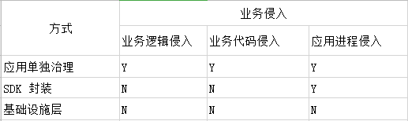
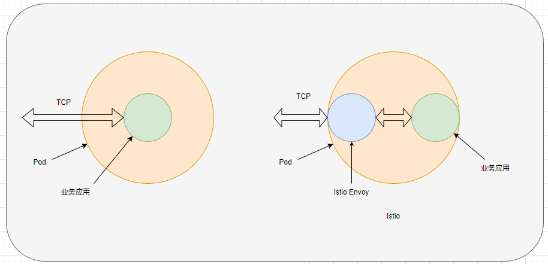
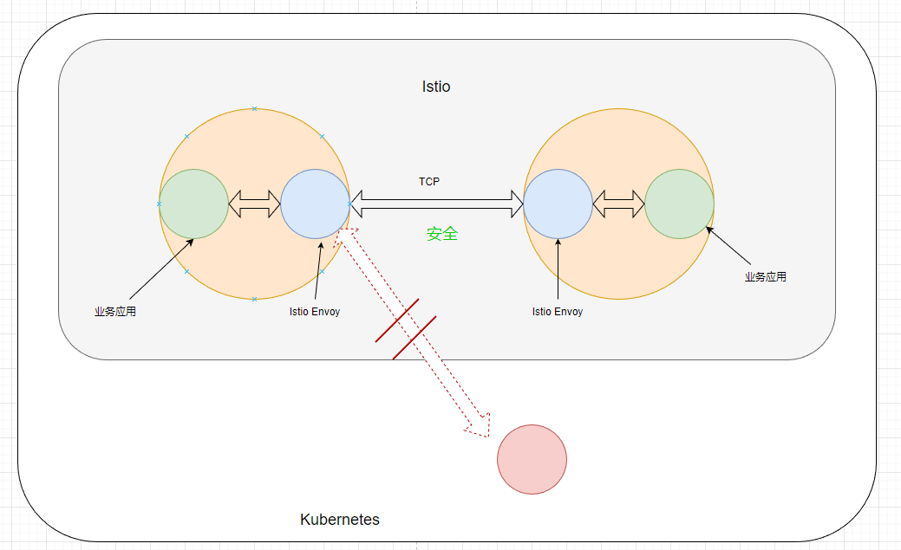

# 1，Istio 概述

### 🚩聊聊微服务设计

似乎用上 Kubernetes ，就是微服务系统了。

碰到很多人或公司盲目崇拜 Kubernetes ，一直喊着要上 Kubernetes，但是本身既没有技术储备，也没有规划方案。想着上了 Kubernetes 之后，就会变成分布式、高性能、高逼格的微服务系统。

从经验来看，很多公司用上 Kubernetes 之后，并不会显著改善旧系统的缺点，而由于项目中充斥着大量泥球般混乱的代码、随意使用数据库事务、几百行代码的函数、过度引用其它项目的接口等，无论在 Kubernetes 上放置多少个应用实例，速度总是提示不起来。

【图源互联网】

其实这种情况是挺常见的，例如你公司的项目，跟我公司的项目。

在笔者经历当中，碰到过很多中小公司开始从单体系统转型为使用 Kubernetes 设施的系统，然而大多数对 Kubernetes 的使用局限于表面，下面来聊聊几种常见的情况。

##### 🥇只使用 Kubernetes 部署容器，

只使用 Kubernetes 部署容器，其它方面几乎没有变化。

此类系统加入了 Jenkins 构建 CICD 容器，构建后部署到 Kubernetes 中，但是未考虑容错处理、内外部系统通讯、没有使用可观察性系统（监控、日志、链路追踪），也没有服务发现和负载均衡。整套系统仅仅是拆分成了多个服务部署，服务之间的通讯使用固定地址写死配置文件，或者应用修改配置很麻烦。

此类系统唯一亮点是使用了 Kubernetes，可能还用上了 Redis、Mongodb 之类的数据存储系统。

可是，由于缺少合理的架构设计，系统虽然拆分出来了，其带来的好处只不过是研发小组可以包干一个项目，方便管理研发工作。

可是其拆分后带来的弊端更多，服务拆分造成了数据隔离（一般是同一个数据库引擎，使用不同的数据库名称），每个服务都有自己的数据库，为了应对子服务通讯需要，只能不断在用户中心或其它服务增加一大套 API，以便子服务能够获取需要的信息。

由于其缺乏足够的基础设施支撑，当服务通讯出现错误时排查问题也会变得十分困难，该项目组可能需要跟不同的小组协调排查，有可能为了一个问题修改十多次代码，不断重新部署不断追加日志，以便查找问题修复 bug。

##### 🥈开始使用一些中间件，完善基础设施

为了解决微服务系统中的一些问题，研发团队引入了一些中间件。

**数据同步**：为了解决数据隔离问题，引入了 Canal 此类数据库同步工具，例如将用户中心的用户表同步到下游，子服务可以直接在自己的数据库 join 数据，聚合信息变得更加容易。为了更加容易查询聚合数据，还将 Mysql 数据消费后同步到 ES、Kafka 等系统进行二次处理。

**自动化部署与持续集成**：微服务的部署实现自动化，以减少人工干预和错误。

**监控与日志**：集群中使用了分布式监控和日志记录，以便于跟踪和诊断问题。**【Istio 可以帮到您】**

**服务发现与负载均衡**：使用了 Consul 等服务注册和发现中间件，解决了服务通讯地址耦合配置的问题，无需人工维护服务地址列表，还带有健康检查、负载均衡等功能。**【Istio 可以帮到您】**

**配置管理**：使用 Nacos、 Apollo 等配置中心，能够动态变更服务的配置。

**服务划分不合理**：在微服务架构中，将系统拆分成多个独立的服务是至关重要的，然而服务划分不合理可能导致服务过度拆分或功能耦合。

**数据一致性**：由于微服务使用独立的数据存储，可能导致数据一致性问题。

**高度耦合**：服务间过度耦合可能导致修改一个服务会影响到其他服务，降低了系统的可维护性。

**难以诊断与监控**：由于微服务的分布式特性，系统出现问题时可能难以诊断和监控。**【Istio 可以帮到您】**

**安全性问题**：微服务间的通信可能导致安全性问题，大多数系统没有考虑到外部通讯鉴权、内部系统通讯鉴权的问题。**【Istio 可以帮到您】**

此类系统可以解决在服务通讯和服务故障中出现的一些问题，也提供减轻研发人员负担的中间件。

但是此类系统，可能还有很多问题。笔者下面说说所接触到的实际例子。

首先是代码耦合了太多组件。例如为了支持链路追踪、日志收集，代码中引用了很多相关的类库并且需要进行复杂的配置。

**其实这些组件是可以下沉到基础设施的，这也正是笔者编写 Istio 教程的原因。**

.NET 中的 ABP 框架也许正是被批评的对象之一，因为 ABP 真的太 “重” 了，想想 ABP 这么多的组件，每个模块都需要添加代码配置使用，项目光是配置这些模块、扩展服务就得写多少代码，学习成本得有多高。

想想，项目这么多模块和配置，能记得多少，每次新建一个项目都要从别的项目那里复制一堆配置和代码过去，累不。

此外，微服务之间通过网络通信，没有好的故障处理方案，也是一个常见的情况。微服务通讯可能会出现网络延迟和故障，需要采取设施使用超时、重试、熔断等容错策略来降低网络问题的影响。

实际情况下，大多数研发团队并不会处理这些问题，一个子服务直接发出 HTTP 请求，如果请求失败就直接抛出异常，或者使用的方法是在代码中加入一些组件，当请求失败时程序自动处理故障，如重试、熔断等。

> 例如 C# 可以使用 Polly 组件，配置对 HTTP 请求的超时、重试等策略。可是配置是写死在代码中的，如果需要变化就需要修改代码，而且研发人员不一定能够预先配置好足有优秀的参数。多加一个组件，程序的 “重量” 增加一分，维护难度也会加大。

所以说，要设计一套微服务系统并不容易。

### ❓我为什么要学 Istio

首先是，Istio 能够将很多配置下沉到基础设施层面，我们的项目代码可以减少很多组件、代码和配置。

熟话说得好，架构设计决定了系统的上限，而实现细节决定了系统的下限。

想想，如果你使用 ABP 来开发业务，当你打开项目代码时，里面的配置还记得清楚吗？笔者看过不少使用 ABP 编写的项目，里面的配置实在太多了。况且涉及的依赖包很多，不同的项目模块更新时也很容易碰到组件版本不一致导致的冲突。

每次新建项目，都要从旧项目抄一堆代码和配置，还需要在各种中间件中增加相当多的配置。

前面说了，微服务通讯时，需要自动故障修复，能够自动重试、熔断，并且还需要支持服务的健康检查以及负载均衡。如果这些都在代码中配置，每个项目都需要重复劳动一次。

所以，我学习 Istio 主要原因有三点：

* 将代码中的东西丢到基础设施中去，减少代码量和复杂的配置。
* 可以学习到很多微服务设计思想。
* 更加合理地在 Kubernetes 上设计系统架构。

当然，按照公司的体量和业务支撑需求，并不一定用得上 Istio，而本身 Istio 也挺重的，学起来难度不比 Kubernetes 低。

在写本文之前，跟一个大佬聊天，他说大多数公司用不上 Istio，而用得上的公司会选择自研。其实用不用得上并不重要，重要的是你可以从学习 Isito 的时候，了解很多设计思想，了解 Istio 的这些组件解决了什么样的问题。之后，除了使用 Isito ，我们也可以使用其它方法来解决这些问题。

### 💡所以，Istio 是什么

Istio 是一个与 Kubernetes 紧密结合的服务网格(Service Mesh)，用于**服务治理**。

注意，Istio 是用于服务治理的，主要流量管理、服务间安全、可观测性这几种功能。在微服务系统中，会碰到很多棘手的问题，Istio 只能解决其中一小部分。

服务治理有三种方式，第一种是每个项目中包含单独的治理逻辑，这样比较简单；第二种是将逻辑封装到 SDK 中，每个项目引用 SDK 即可，不增加或只需要少量配置或代码即可；第三种是下沉到基础设施层。Istio 便是第三种方式。

Istio 是非侵入式的，完全不需要改动项目代码。

Istio 可以拦截 Kubernetes 部署 Pod 的事件，然后从 Pod 中注入一个名为 Envoy 的容器，这个容器会拦截外部到业务应用的流量。由于所有流量都被 Envoy “劫持” 了，所以 Istio 可以对流量进行分析例如收集请求信息，以及一系列的流量管理操作，也可以验证授权信息。当 Envoy 拦截流量并执行一系列操作之后，如果请求没问题，就会转发流量到业务应用中。

当然，由于 Envoy 需要拦截流量之后转发给业务应用，这样就多了一层，系统响应速度会有所下降，但是增加的响应速度几乎可以忽略不计。

由于 Pod 是通过1 Envoy 暴露端口的，所有进出口流量都需要经过 Envoy 的检查，所以很容易判断访问来源，如果请求方不是在 Istio 中的服务，那么 Envoy 便会拒绝访问。

每个 Pod 都有一个 Envoy 负责拦截、处理和转发进出 Pod 的所有网络流量，这种方式被称为 Sidecar。

以下是 Istio Sidecar 的一些主要功能：

* 流量管理：Envoy 代理可以根据 Istio 配置的路由规则（如 VirtualService 和 DestinationRule）实现流量的转发、分割和镜像等功能。

* 安全通信：Envoy 代理负责在服务之间建立安全的双向 TLS 连接，确保服务间通信的安全性。

* 遥测数据收集：Envoy 代理可以收集关于网络流量的详细遥测数据（如延迟、成功率等），并将这些数据上报给 Istio 的遥测组件，以便进行监控和分析。

* 策略执行：Envoy 代理可以根据 Istio 配置的策略规则（如 RateLimit 和 AuthorizationPolicy）执行限流、访问控制等策略。

在 Istio 中，Envoy 这一块称为数据平面，而负责管理集群的 istiod 组件称为控制平面。

> 注意，这里是 istiod ，是 Istio 负责管理集群的一种组件。

接下来介绍一下 Istio 的三个主要能力。

**⏩流量管理**

流量管理包括以下功能：

- 动态服务发现
- 负载均衡
- TLS 终端
- HTTP/2 与 gRPC 代理
- 熔断器
- 健康检查
- 基于百分比流量分割的分阶段发布
- 故障注入
- 丰富的指标

**⏩可观测性**

Istio 支持 Jaeger、Zipkin、Skywalking 等链路追踪中间件，支持 Prometheus 收集指标数据，然后日志功能没有上面亮点，只是记录了请求的 HTTP 地址之类。Istio 的可观测性帮助我们了解应用程序的性能和行为，使得故障检测、性能分析和容量规划变得更加简单。

**⏩安全性能**

主要特点是可以实现零信任网络中的服务之间通讯加密。Istio 通过自动为服务之间的通信提供双向 TLS 加密来增强安全性，同时 Istio 还提供了强大的身份验证、授权和审计功能。

对 Istio 的介绍就到这里为止，在后面的章节中，我们会通过实际使用 Istio ，来进一步深入了解 Istio 的功能和原理。