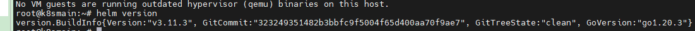
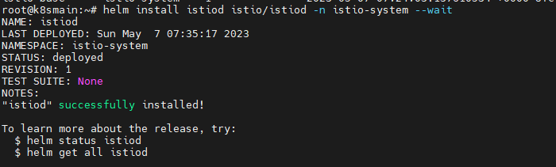
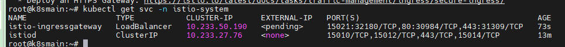

# 2，部署 Istio

在本章中，将会介绍如何快速部署 Istio。


Istio 的部署方式主要有两类，第一类是基于 Kubernetes 原生集群或虚拟机的安装。另一种是基于 Azure、KubeSphere 等公私有云或 Kubernetes 管理平台上的安装。而在本章中只会介绍基于 Kubernetes 的 Helm 安装。


Istio 官网关于这两类部署方式还有很多小细节，读者可根据实际需要从官方中获取部署资料。

https://istio.io/latest/zh/docs/setup/platform-setup/

https://istio.io/latest/zh/docs/setup/install/

<div>
    <div style="width:50%;float:left;">
        
    </div>
    <div style="width:50%;float:left;">
        
    </div>
</div>


### 安装 Helm

本安装手动只适合 Ubuntu。

首先添加 Helm 官方仓库地址到 apt 源中。

```bash
curl https://baltocdn.com/helm/signing.asc | sudo apt-key add -  
echo "deb https://baltocdn.com/helm/stable/debian/ all main" | sudo tee /etc/apt/sources.list.d/helm-stable-debian.list  
```


然后更新包索引。

```bash
apt-get update  
```


通过 apt 命令安装 Helm。

```bash
apt-get install helm
```

 

验证是否安装完成。

```bash
helm version  
```




### 部署 istio-base

在本文教程中，安装的 Istio 与官方使用 istiocli 部署的方式不同，本教程中是逐渐安装需要的组件，不会一次性安装完成所有组件。


首先在 Helm 中 添加 Istio 的仓库。

```bash
helm repo add istio https://istio-release.storage.googleapis.com/charts
helm repo update
```


接着提前为 Istio 组件创建命名空间 `istio-system`。

```bash
kubectl create namespace istio-system
```


接下来将使用 Helm 将 Istio 组件安装到 istio-system 命名空间中。


首先安装 Istio CRD：

```bash
helm install istio-base istio/base -n istio-system
```

```bash
root@k8smain:~# helm install istio-base istio/base -n istio-system
NAME: istio-base
LAST DEPLOYED: Tue May  2 07:19:15 2023
NAMESPACE: istio-system
STATUS: deployed
REVISION: 1
TEST SUITE: None
NOTES:
Istio base successfully installed!

To learn more about the release, try:
  $ helm status istio-base
  $ helm get all istio-base
```


> `istio-base` 是一个 Istio 基本核心，它包含了 Istio 控制平面和数据平面所需的基本资源定义和配置。在 Istio 的 Helm Chart 或者 Istio Operator 安装中，`istio-base` 为其他 Istio 组件（如 istiod、ingress 网关和 egress 网关）提供了基础设置。这些设置包括创建必要的自定义资源定义（CRDs）、命名空间和 RBAC 规则等。
>
> 也就是说，只有先安装 istio-base，才能接着安装其它 Istio 组件。


使用 `helm ls` 命令验证 Istio CRD 的安装情况：

```bash
root@k8smain:~# helm ls -n istio-system
NAME      	NAMESPACE   	REVISION	UPDATED                                	STATUS  	CHART      	APP VERSION
istio-base	istio-system	1       	2023-05-02 07:19:15.792125237 +0000 UTC	deployed	base-1.17.2	1.17.2     
```


### 部署 istiod

Istiod（ Istio Discovery） 是 Istio 服务网格的核心组件，负责控制平面功能。

istiod 具备了五大功能：

* 配置管理：负责分发和同步 Istio 配置到数据平面（Envoy 代理）。

* 服务发现：基于 Kubernetes 的 Service 和 Endpoint 信息生成服务发现数据，这些数据用于 Envoy Proxy 的负载均衡。

* 证书管理：为 Envoy Proxy 提供证书签发，以支持双向 TLS 身份验证。

* 验证和转换：验证 Istio 配置资源的正确性，并将它们转换为 Envoy Proxy 可以理解的格式。

* Envoy 代理注入：负责将 Envoy Proxy 注入到服务 Pod 中，以便进行流量拦截和路由。


新版本的 Istiod 将旧版本中零散的组件如 Mixer、Pilot、Citadel、Galley 等合并起来了。


在 Helm 中添加 Istiod 仓库。

```bash
helm install istiod istio/istiod -n istio-system --wait
```




验证 Istiod 的安装情况：

```bash
root@k8smain:~# helm ls -n istio-system
NAME      	NAMESPACE   	REVISION	UPDATED                                	STATUS  	CHART        	APP VERSION
istio-base	istio-system	1       	2023-05-02 07:19:15.792125237 +0000 UTC	deployed	base-1.17.2  	1.17.2     
istiod    	istio-system	1       	2023-05-02 07:21:07.791242626 +0000 UTC	failed  	istiod-1.17.2	1.17.2     
```


检查 `istiod` 服务是否安装成功，其 Pod 是否正在运行:

```bash
root@k8smain:~# kubectl get deployments -n istio-system --output wide
NAME     READY   UP-TO-DATE   AVAILABLE   AGE   CONTAINERS   IMAGES                         SELECTOR
istiod   1/1     1            1           10m   discovery    docker.io/istio/pilot:1.16.1   istio=pilot
```


### 部署 istio-ingressgateway

istio-ingressgateway （Istio Ingress Gateway ）类似 Kubernetes 的 Ingress ，是 Istio 控制外部流量进入 Kubernetes 的入口组件，istio-ingressgateway 作为一个入口点，允许从服务网格外部访问服务网格内部的服务，起到了类似 nginx、apisix 等入口网关的作用。

Istio Ingress Gateway 的主要包括以下作用：

* 接收集群外部的流量，并根据 Istio 的配置将请求路由到适当的内部服务（起到网关的作用）。

* 提供负载均衡和流量控制功能，包括请求路由、重试、超时、熔断等（流量治理）。

* 支持 TLS 配置，以便在流量进入服务网格之前进行加密（给域名配置证书）。
* 支持双向 TLS 身份验证，以提高服务网格的安全性（服务间通讯）。
* 提供 Metrics、Tracing 和 Logging 收集，以便更好地观察和监控流量（需要自己安装对应的组件）。


安装 istio-ingressgateway。

```bash
helm install istio-ingressgateway istio/gateway -n istio-system
```


实际上 istio-ingressgateway 是作为一个 Kubernetes Service 对外提供访问服务。





由于 Istio-ingressgateway 默认使用的是 LoadBalancer ，需要公有云平台支撑，不然会一直处于 `<pending>`，因此我们需要修改 Service ，将 istio-ingressway 的网络类型从 LoadBalancer 改成 NodePort，以便直接通过服务器的 IP 访问。

```bash
kubectl edit svc istio-ingressgateway -n istio-system  
```

> 找到 `type: LoadBalancer` ，修改为 `type: NodePort`。
>
> 因为 `LoadBalancer` 包含了 `NodePort`，其实不修改也行。


### 清除

如果有一天不需要 Istio 了，你可以通过当前命令清空部署的 Istio 应用。

```bash
helm delete istio-ingressgateway -n istio-system
helm delete istiod -n istio-system
helm delete istio-base -n istio-system

kubectl delete namespace istio-system
```

