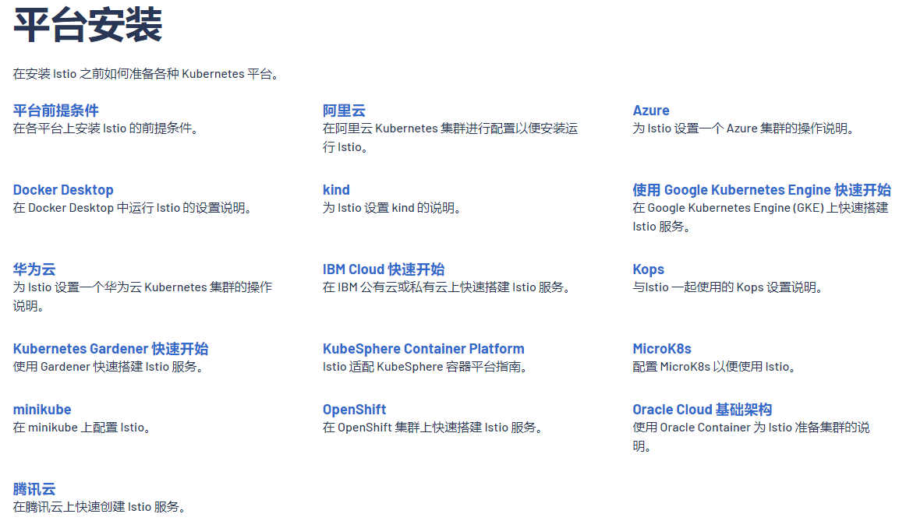
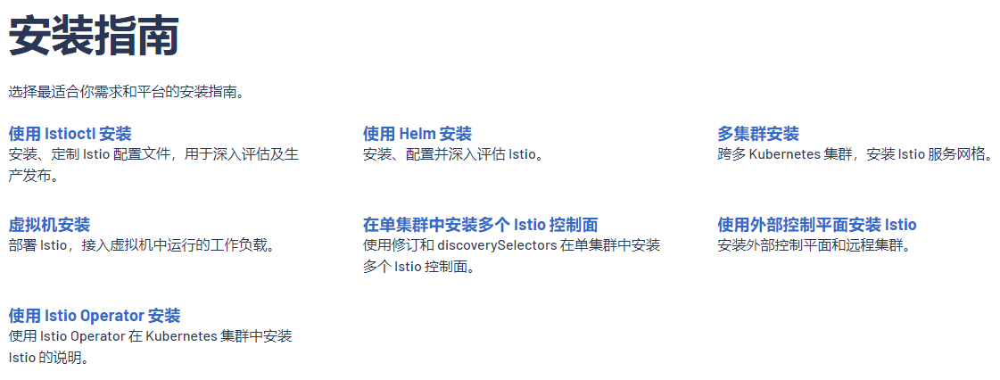
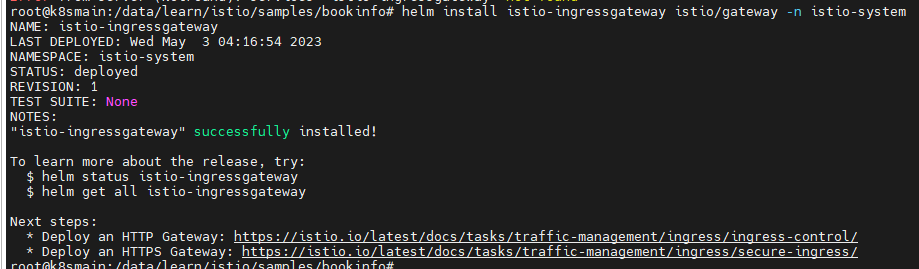
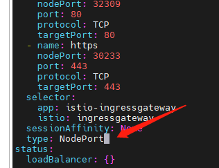

# 2，部署 Istio

在本章中，将会介绍如何部署 Istio，以及诠释 Istio 的一些组件。


Istio 的部署方式有两种类别，第一种是基于 Kubernetes 的安装，另一种是基于 Azure、KubeSphere 等公私有云或 Kubernetes 管理平台上的安装。


平台安装基于公有云或自建集群管理平台：




原生安装：




在本章中，只会介绍基于 Kubernetes 的 Helm 安装。

在 Kubernetes 中安装 Istio 有两种常用的方法，通过 istio cli 工具安装、通过 Helm 安装。


添加 istio 仓库

```bash
helm repo add istio https://istio-release.storage.googleapis.com/charts
helm repo update
```


接着为 Istio 组件创建命名空间 `istio-system`。

```
kubectl create namespace istio-system
```


将 Istio 组件安装到 istio-system 命名空间中。

安装 Istio CRD：

```
helm install istio-base istio/base -n istio-system
```

> `istio-base` 是一个 Istio 安装的基本设置，它包含了 Istio 控制平面和数据平面所需的基本资源定义和配置。在 Istio 的 Helm Chart 或者 Istio Operator 安装中，`istio-base` 为其他 Istio 组件（如 istiod、ingress 网关和 egress 网关）提供了基础设置。这些设置包括创建必要的自定义资源定义（CRDs）、命名空间和 RBAC 规则等。
>
> 通过使用 `istio-base`，您可以确保 Istio 部署的一致性和正确性，它为其他 Istio 组件提供了一个共享的基本配置。在自定义 Istio 安装时，通常需要首先部署 `istio-base`，然后根据需求部署其他 Istio 组件。


使用 `helm ls` 命令验证 CRD 的安装情况：

```bash
root@k8smain:~# helm install istio-base istio/base -n istio-system
NAME: istio-base
LAST DEPLOYED: Tue May  2 07:19:15 2023
NAMESPACE: istio-system
STATUS: deployed
REVISION: 1
TEST SUITE: None
NOTES:
Istio base successfully installed!

To learn more about the release, try:
  $ helm status istio-base
  $ helm get all istio-base
root@k8smain:~# helm ls -n istio-system
NAME      	NAMESPACE   	REVISION	UPDATED                                	STATUS  	CHART      	APP VERSION
istio-base	istio-system	1       	2023-05-02 07:19:15.792125237 +0000 UTC	deployed	base-1.17.2	1.17.2     
```


安装 Istio discovery chart，它用于部署 `istiod` 服务：

```
$ helm install istiod istio/istiod -n istio-system --wait

```


```bash
root@k8smain:~#  helm install istiod istio/istiod -n istio-system --wait
Error: INSTALLATION FAILED: Internal error occurred: failed calling webhook "rev.validation.istio.io": Post "https://istiod.istio-system.svc:443/validate?timeout=10s": dial tcp 10.233.28.13:443: connect: connection refused
```

从返回的信息中，替换其 `istiod.istio-system.svc:443` 为提示的 IP，然后使用 curl 命令访问。

```bash
root@k8smain:~# curl -k https://10.233.28.13:443/validate?timeout=10s
no body found
```


> Istiod 是 Istio 服务网格中的核心组件之一，是一个控制平面组件，用于管理和控制整个 Istio 系统。它为 IstioIstiod 是 Istio 服务网格的控制平面组件之一，它是 Istio 1.6 版本中引入的新组件，负责 组件提供了一个中心化的控制面，包括 Mixer、Pilot、Citadel 和 Galley 等。Istiod 管理和同步 Istio 的配置信息，以确保所有服务都能够进行安全通信，并提供流量管理和路由控制功能。Istiod 还支持 Istio 的扩展和自定义，可以通过 Istio Operator 或 Helm Chart 部署。


验证 Istio discovery chart 的安装情况：

helm ls -n istio-system

```bash
root@k8smain:~# helm ls -n istio-system
NAME      	NAMESPACE   	REVISION	UPDATED                                	STATUS  	CHART        	APP VERSION
istio-base	istio-system	1       	2023-05-02 07:19:15.792125237 +0000 UTC	deployed	base-1.17.2  	1.17.2     
istiod    	istio-system	1       	2023-05-02 07:21:07.791242626 +0000 UTC	failed  	istiod-1.17.2	1.17.2     
```


检查 `istiod` 服务是否安装成功，其 Pod 是否正在运行:

```
$ kubectl get deployments -n istio-system --output wide
NAME     READY   UP-TO-DATE   AVAILABLE   AGE   CONTAINERS   IMAGES                         SELECTOR
istiod   1/1     1            1           10m   discovery    docker.io/istio/pilot:1.16.1   istio=pilot
```


### istio-ingressgateway

```
kubectl create namespace istio-ingress
helm install istio-ingressgateway istio/gateway -n istio-system
```



接着执行命令将 istio-ingressway 的网络类型从 LoadBalancer 改成 NodePort：

```
kubectl edit svc istio-ingressgateway -n istio-system  
```




创建的 istio-gateway 会创建一个 Service，执行命令查看其 IP 和端口信息：

```
$> kubectl get svc -n istio-system
NAME                   TYPE        CLUSTER-IP      EXTERNAL-IP   PORT(S)                                      AGE
istio-ingressgateway   NodePort    10.233.54.139   <none>        15021:31356/TCP,80:32309/TCP,443:30233/TCP   2m15s
istiod                 ClusterIP   10.233.28.13    <none>        15010/TCP,15012/TCP,443/TCP,15014/TCP        20h
```


> ```
> kubectl get svc istio-ingressgateway -n istio-system -o jsonpath='{.spec.ports[?(@.name=="http2")].nodePort}'  
> ```
>
> 


### 清除

```
helm delete istio-base -n istio-system
helm delete istiod -n istio-system
kubectl delete namespace istio-system
```

