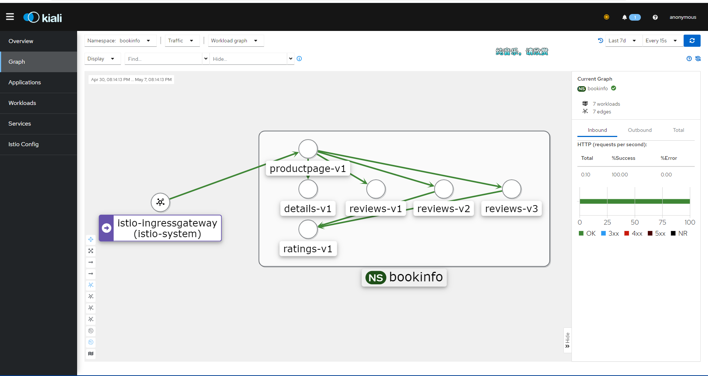
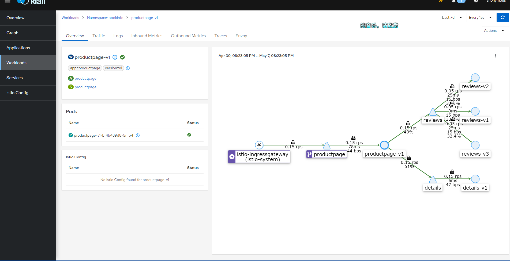
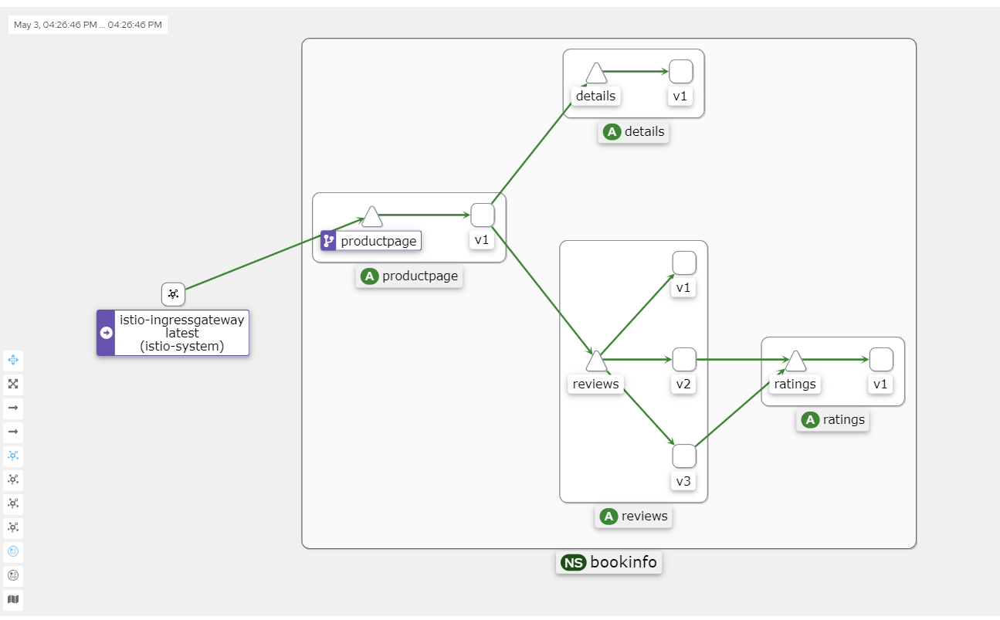
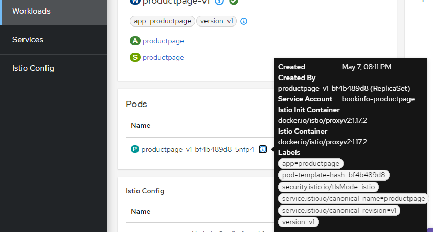

## 可观测性

Istio 集成了 Jaeger、Zipkin 和 Skywalking 等链路追踪应用，能够有效地捕获服务网格的结构，展示网络拓扑结构，并分析网格的健康状况。

这一切都得益于 Envoy 代理的实现。由于所有进出流量都需要经过 Envoy 代理，Envoy 可以捕获这些流量记录，并将其推送到相应的链路追踪系统中。这样一来，可以链路追踪系统轻松地监控和分析服务网格内的流量情况。

> 另外 Istio 还支持 Prometheus、 Grafana 收集指标数据。


下面我们将使用官方的模板部署 Kiali 、 还有 Jaeger，然后通过 Kiali 统一查看集群的指标信息。

Kiali 界面示例：


拉取 Istio 官方的仓库：

```bash
git clone https://github.com/istio/istio.git
```


在 `samples/addons/` 目录中有以下目录或文件：

```bash
samples/addons/
├── extras
│   ├── prometheus-operator.yaml
│   ├── prometheus_vm_tls.yaml
│   ├── prometheus_vm.yaml
│   ├── skywalking.yaml
│   └── zipkin.yaml
├── grafana.yaml
├── jaeger.yaml
├── kiali.yaml
├── prometheus.yaml
└── README.md
```


我们启用 `grafana.yaml`、`jaeger.yaml`、`kiali.yaml`、`prometheus.yaml` 四个文件。

```
 kubectl apply -f samples/addons
```

> 这些服务默认安装在 istio-system 命名空间下，因此不需要自行设置。
>
> Istio 默认使用 Jaeger 做链路追踪，我们也可以使用 Skywalking 来做追踪。extras 目录中的配置我们可以自行部署。


执行命令查看其 Service 对应的 IP 和端口：

```
kubectl get svc  -n istio-system
```


现在，我们有两种方式让 kiali 在外部访问，一种是修改 Service 配置，将其访问类型修改为 NodePort，另一种是使用 istio-ingressgateway 配置流量入口。

> 第二种方式比较麻烦，但是为了验证我们的学习成果，我们不妨使用 Gateway 的方式暴露服务。


#### 通过 Gateway 访问 Kiali

首先，创建一个 Gateway 。

`kiali_gateway.yaml`

```yaml
apiVersion: networking.istio.io/v1alpha3  
kind: Gateway  
metadata:  
  name: kiali-gateway  
spec:  
  selector:  
    istio: ingressgateway  
  servers:  
  - port:  
      number: 15029  
      name: http-kiali  
      protocol: HTTP  
    hosts:  
    - "*"  
```

```bash
kubectl -n istio-system apply -f kiali_gateway.yaml  
```

 

接下来，创建一个 VirtualService 资源，将 Gateway 路由到 Kiali 服务.

`kiali_vs.yaml  `

```yaml
apiVersion: networking.istio.io/v1alpha3  
kind: VirtualService  
metadata:  
  name: kiali  
spec:  
  hosts:  
  - "*"  
  gateways:  
  - kiali-gateway  
  http:  
  - match:  
    - uri:  
        prefix: /kiali  
    route:  
    - destination:  
        host: kiali.istio-system.svc.cluster.local  
        port:  
          number: 20001  
```

```bash
kubectl -n istio-system apply -f kiali_vs.yaml  
```


然后修改 istio-ingressgateway，新增加一个配置为 kiali 暴露服务。

```
kubectl edit svc istio-ingressgateway -n istio-system  
```

```
  - name: kiali
    nodePort: 32667
    port: 15029
    protocol: TCP
    targetPort: 15029
```

 

然后访问：http://192.168.3.150:32667/kiali


### 查看链路追踪数据

现在我们在 Shell 执行命令轮询一段时间前面部署的微服务，以便给集群创造访问流量。

```
for i in `seq 1 1000`; do curl -s -o /dev/null http://192.168.3.150:30666/productpage; done
```


> 因为默认链路追踪采样率是 1%，所以可以将请求次数设置大一些。


最终会得到一张类似的图片。








Kiali 的 Graph 数据主要来自两个来源：Prometheus 和 Istio 本身的遥测数据。

**Prometheus**：Prometheus 是一个开源监控和警报工具，它用于收集和存储 Istio 服务网格中的指标数据。Istio 使用 Envoy 代理收集遥测数据，这些数据随后被 Prometheus 抓取和存储。Kiali 使用这些 Prometheus 数据来生成服务之间的流量、错误率、延迟等指标。

**Istio 遥测数据**：Istio 服务网格生成的遥测数据包括请求、响应、延迟以及 Envoy 代理的其他性能指标。这些数据由 Istio 组件（例如 Mixer 和 Pilot）以及 Envoy 代理本身生成。Kiali 从这些遥测数据中获取服务拓扑信息，以创建服务之间的依赖关系图。


Kiali 将这两个数据源的信息整合在一起，生成 Graph，它展示了服务网格的拓扑结构、服务之间的流量以及其他性能指标。这有助于用户更好地理解服务之间的依赖关系，发现潜在的性能问题，并优化服务网格配置。


#### 可能失败的原因

如果你的 Kiali 一直显示 Empty Graph。请关注以下几种可能的情况：

* 集群版本低于 1.23 ，需要升级 Kubernetes 集群。
* 安装了 Kubesphere，说多了都是泪，Kubesphere 太重了，笔者花了一晚上时间重新安装集群。
* 访问的地址不正确，没有配置对 `/productpage` 的访问地址，请求流量没有打入集群。
* Pod 没有被注入 istio-proxy。


你可以在 Kiali 的 `Workloads` 查看每个负载的 Pod 信息，正常情况应当如下所示：




#### 修复 Kiali Grafana 问题

点击右上角的消息，可能会提示配置不正确，因为 kiali 需要从 Grafana 拉取数据。


编辑 configmap 。

```
 kubectl edit configmap kiali -n istio-system
```


在里面添加如下两行内容。

```yaml
  grafana:  \n    enabled: true  \n    url: \"http://grafana.istio-system.svc.cluster.local:3000\"
    \ \n    in_cluster_url: \"http://grafana.istio-system.svc.cluster.local:3000\"\n
```


如果使用的是可视化工具，添加就简单了。

```yaml
      grafana:  
        enabled: true  
        url: "http://grafana.istio-system.svc.cluster.local:3000"  
        in_cluster_url: "http://grafana.istio-system>.svc.cluster.local:3000"
```


然后使用 `kubectl describe configmap kiali -n istio-system` 查看配置是否正确。