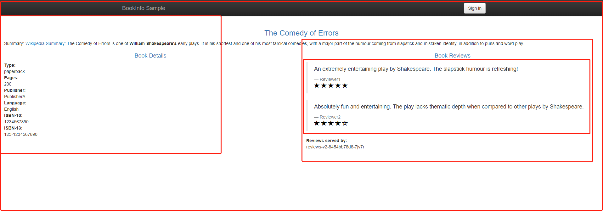
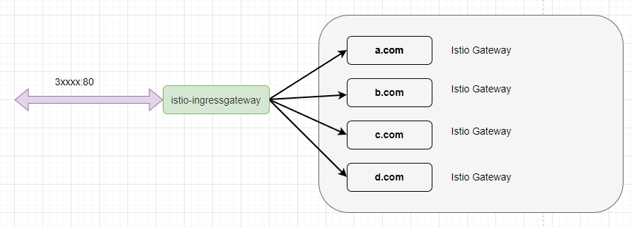
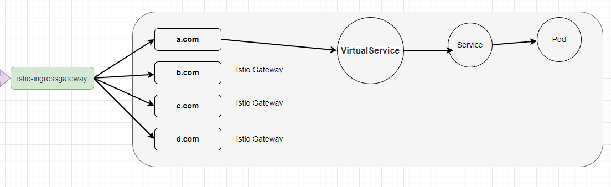

# 3，快速入门

在本章中，我们正式迈入学习 Istio 的第一步。因为 Istio 的知识体系是较为庞大的，因此我们可以先通过本章的入门教程快速了解如何使用 Istio 部署一套微服务，以及 Istio 核心功能的使用方法，了解 Istio 可以为微服务解决什么问题。


在本章中，我们将会学习到如何部署一套微服务、如何使用 Istio 暴露服务到集群外，并且如何使用可观测性组件监测流量和系统指标。


在后面的章节中，笔者会针对每个 Istio 组件做单独讲解，而在本章中，我们只需要大概了解使用方法即可。


### 书店微服务

本章教程示例使用的是 Istio 官方的一套微服务，这套微服务是一个在线书店，打开页面之后会看到一个分类、书的信息以及书的评论，页面的内容由不同的子服务提供。




书店微服务分为四个单独的微服务，在上图中已经使用红色方框画出来了。这四个微服务分别是：

- `productpage`： 汇集所有服务的数据，生成浏览页面。
- `details`：存储了书籍的信息，如描述、作者、出版社等。
- `reviews`：存储了书籍相关的评论，但是不包含评分打星。
- `ratings`：存储评论中的评分打星。


在这个微服务中，Productpage 服务对外提供 Web 访问页面，**而且其它的三个服务只能在集群内部访问**。四个服务分别采用了不同的语言开发，Productpage 聚合其它三个服务的信息生成一个页面。

> 在微服务设计中，我们不要每个子服务都暴露端口到集群外部，应该通过一些应用集中数据后给外部显示。我们可以使用 API 网关，代理子服务一部分接口，然后在 API 网关中实现基于客户端或第三方调用的身份验证。


productpage、details、ratings 都只有一个 v1 版本，而 reviews 有三个版本。

ratings 负责给出用户打分的数据，例如一星、两星。而 reviews 三个版本分别对 ratings 的数据做以下处理：

* reviews v1：屏蔽星级，不显示打分；
* reviews v2：显示星级，使用灰色星星表示，★★★★☆；
* reviews v3：显示星级，使用红色星星表示，<span style="color:red;">★★★★☆</span>；


<center>【图源 <a href="https://istio.io/latest/zh/docs/examples/bookinfo/">istio 官网 </a>】</center>


服务依赖图如下所示：


接下来我们将会使用 Kuubernetes Deployment 部署这些服务，这跟常规的 Kubernetes 部署并无差别。


#### 预先准备

给这些示例服务创建一个命名空间。

```bash
kubectl create namespace bookinfo
```


给命名空间添加 Istio 的标签，指示 Istio 在部署应用（只对 Pod 起效）的时候，自动注入 Envoy Sidecar Proxy 容器：

```bash
kubectl label namespace bookinfo istio-injection=enabled
```

> 开启让 Istio 注入 Sidecar 有很多种方式，其中一种是给命名空间设置下标签，在此命名空间下部署的 Pod，会被自动注入 Sidecar 。


你可以从本系列教程的 git 仓库中找到这些示例，文件位置：[https://github.com/whuanle/istio_book/tree/main/3](https://github.com/whuanle/istio_book/tree/main/3)。

仓库拉取后打开 `3` 目录，执行命令进行部署：

```bash
kubectl -n bookinfo apply -f details_deploy.yaml
kubectl -n bookinfo apply -f details_svc.yaml
kubectl -n bookinfo apply -f details_sa.yaml
kubectl -n bookinfo apply -f ratings_deploy.yaml
kubectl -n bookinfo apply -f ratings_svc.yaml
kubectl -n bookinfo apply -f ratings_sa.yaml
kubectl -n bookinfo apply -f reviews_v1_deploy.yaml
kubectl -n bookinfo apply -f reviews_v2_deploy.yaml
kubectl -n bookinfo apply -f reviews_v3_deploy.yaml
kubectl -n bookinfo apply -f reviews_svc.yaml
kubectl -n bookinfo apply -f reviews_sa.yaml
kubectl -n bookinfo apply -f productpage_deploy.yaml
kubectl -n bookinfo apply -f productpage_svc.yaml
kubectl -n bookinfo apply -f productpage_sa.yaml
```


或者你可以参考下面的四个小节，通过手动的方式部署应用，了解每一个应用是如何定义的。


#### details 应用

存储了书籍信息的应用。


部署命令：

```bash
kubectl -n bookinfo apply -f details_deploy.yaml
kubectl -n bookinfo apply -f details_svc.yaml
kubectl -n bookinfo apply -f details_sa.yaml
```


使用 Deployment 部署 details 应用。

`details_deploy.yaml`

```yaml
apiVersion: apps/v1
kind: Deployment
metadata:
  name: details-v1
  labels:
    app: details
    version: v1
spec:
  replicas: 1
  selector:
    matchLabels:
      app: details
      version: v1
  template:
    metadata:
      labels:
        app: details
        version: v1
    spec:
      serviceAccountName: bookinfo-details
      containers:
      - name: details
        image: docker.io/istio/examples-bookinfo-details-v1:1.17.0
        imagePullPolicy: IfNotPresent
        ports:
        - containerPort: 9080
        securityContext:
          runAsUser: 1000
```


部署 details。

```bash
kubectl -n bookinfo apply -f details_deploy.yaml
```


为 details 服务配置 Kubernetes Service 。

`details_svc.yaml`

```yaml
apiVersion: v1
kind: Service
metadata:
  name: details
  labels:
    app: details
    service: details
spec:
  ports:
  - port: 9080
    name: http
  selector:
    app: details
```

```bash
kubectl -n bookinfo apply -f details_svc.yaml
```


接下来为 details 服务创建一个 ServiceAccount。

> Istio 为服务之间的通信提供基于双向 TLS 的认证，这是是通过给每个 ServiceAccount 创建一个证书实现的，可以使用 ServiceAccount 验证对方的身份，不同的应用可以共享同一个 ServiceAccount，但是为每个 Deployment 使用单独的 ServiceAccount 可以更好地组织和管理安全配置。

`details_sa.yaml `

```yaml
apiVersion: v1
kind: ServiceAccount
metadata:
  name: bookinfo-details
  labels:
    account: details
```

```bash
kubectl -n bookinfo apply -f details_sa.yaml
```


#### ratings 应用

提供每条评论的打星数据。

部署命令：

```bash
kubectl -n bookinfo apply -f ratings_deploy.yaml
kubectl -n bookinfo apply -f ratings_svc.yaml
kubectl -n bookinfo apply -f ratings_sa.yaml
```


`ratings_deploy.yaml`

```yaml
apiVersion: apps/v1
kind: Deployment
metadata:
  name: ratings-v1
  labels:
    app: ratings
    version: v1
spec:
  replicas: 1
  selector:
    matchLabels:
      app: ratings
      version: v1
  template:
    metadata:
      labels:
        app: ratings
        version: v1
    spec:
      serviceAccountName: bookinfo-ratings
      containers:
      - name: ratings
        image: docker.io/istio/examples-bookinfo-ratings-v1:1.17.0
        imagePullPolicy: IfNotPresent
        ports:
        - containerPort: 9080
        securityContext:
          runAsUser: 1000
```


`ratings_svc.yaml`

```yaml
apiVersion: v1
kind: Service
metadata:
  name: ratings
  labels:
    app: ratings
    service: ratings
spec:
  ports:
  - port: 9080
    name: http
  selector:
    app: ratings
```


`ratings_sa.yaml`

```yaml
apiVersion: v1
kind: ServiceAccount
metadata:
  name: bookinfo-ratings
  labels:
    account: ratings
```


#### reviews v1/v2/v3 应用

提供书籍的评论信息。


部署命令：

```bash
kubectl -n bookinfo apply -f reviews_v1_deploy.yaml
kubectl -n bookinfo apply -f reviews_v2_deploy.yaml
kubectl -n bookinfo apply -f reviews_v3_deploy.yaml
kubectl -n bookinfo apply -f reviews_svc.yaml
kubectl -n bookinfo apply -f reviews_sa.yaml
```


为三个版本的 reviews 创建三个 Deployment。


`reviews_v1_deploy.yaml`

```yaml
apiVersion: apps/v1
kind: Deployment
metadata:
  name: reviews-v1
  labels:
    app: reviews
    version: v1
spec:
  replicas: 1
  selector:
    matchLabels:
      app: reviews
      version: v1
  template:
    metadata:
      labels:
        app: reviews
        version: v1
    spec:
      serviceAccountName: bookinfo-reviews
      containers:
      - name: reviews
        image: docker.io/istio/examples-bookinfo-reviews-v1:1.17.0
        imagePullPolicy: IfNotPresent
        env:
        - name: LOG_DIR
          value: "/tmp/logs"
        ports:
        - containerPort: 9080
        volumeMounts:
        - name: tmp
          mountPath: /tmp
        - name: wlp-output
          mountPath: /opt/ibm/wlp/output
        securityContext:
          runAsUser: 1000
      volumes:
      - name: wlp-output
        emptyDir: {}
      - name: tmp
        emptyDir: {}
```


`reviews_v2_deploy.yaml`

```yaml
apiVersion: apps/v1
kind: Deployment
metadata:
  name: reviews-v2
  labels:
    app: reviews
    version: v2
spec:
  replicas: 1
  selector:
    matchLabels:
      app: reviews
      version: v2
  template:
    metadata:
      labels:
        app: reviews
        version: v2
    spec:
      serviceAccountName: bookinfo-reviews
      containers:
      - name: reviews
        image: docker.io/istio/examples-bookinfo-reviews-v2:1.17.0
        imagePullPolicy: IfNotPresent
        env:
        - name: LOG_DIR
          value: "/tmp/logs"
        ports:
        - containerPort: 9080
        volumeMounts:
        - name: tmp
          mountPath: /tmp
        - name: wlp-output
          mountPath: /opt/ibm/wlp/output
        securityContext:
          runAsUser: 1000
      volumes:
      - name: wlp-output
        emptyDir: {}
      - name: tmp
        emptyDir: {}
```


`reviews_v3_deploy.yaml`

```yaml
apiVersion: apps/v1
kind: Deployment
metadata:
  name: reviews-v3
  labels:
    app: reviews
    version: v3
spec:
  replicas: 1
  selector:
    matchLabels:
      app: reviews
      version: v3
  template:
    metadata:
      labels:
        app: reviews
        version: v3
    spec:
      serviceAccountName: bookinfo-reviews
      containers:
      - name: reviews
        image: docker.io/istio/examples-bookinfo-reviews-v3:1.17.0
        imagePullPolicy: IfNotPresent
        env:
        - name: LOG_DIR
          value: "/tmp/logs"
        ports:
        - containerPort: 9080
        volumeMounts:
        - name: tmp
          mountPath: /tmp
        - name: wlp-output
          mountPath: /opt/ibm/wlp/output
        securityContext:
          runAsUser: 1000
      volumes:
      - name: wlp-output
        emptyDir: {}
      - name: tmp
        emptyDir: {}
```


给三个 Deployment 创建一个 Service，三个相同应用的不同版本共有同一个 Service。

`reviews_svc.yaml`

```yaml
apiVersion: v1
kind: Service
metadata:
  name: reviews
  labels:
    app: reviews
    service: reviews
spec:
  ports:
  - port: 9080
    name: http
  selector:
    app: reviews
```


`reviews_sa.yaml`

```yaml
apiVersion: v1
kind: ServiceAccount
metadata:
  name: bookinfo-reviews
  labels:
    account: reviews
```


#### productpage 应用

页面聚合服务，供用户浏览书籍信息。


部署命令：

```bash
kubectl -n bookinfo apply -f productpage_deploy.yaml
kubectl -n bookinfo apply -f productpage_svc.yaml
kubectl -n bookinfo apply -f productpage_sa.yaml
```


`productpage_deploy.yaml`

```yaml
apiVersion: apps/v1
kind: Deployment
metadata:
  name: productpage-v1
  labels:
    app: productpage
    version: v1
spec:
  replicas: 1
  selector:
    matchLabels:
      app: productpage
      version: v1
  template:
    metadata:
      labels:
        app: productpage
        version: v1
    spec:
      serviceAccountName: bookinfo-productpage
      containers:
      - name: productpage
        image: docker.io/istio/examples-bookinfo-productpage-v1:1.17.0
        imagePullPolicy: IfNotPresent
        ports:
        - containerPort: 9080
        volumeMounts:
        - name: tmp
          mountPath: /tmp
        securityContext:
          runAsUser: 1000
      volumes:
      - name: tmp
        emptyDir: {}
```


`productpage_svc.yaml`

```yaml
apiVersion: v1
kind: Service
metadata:
  name: productpage
  labels:
    app: productpage
    service: productpage
spec:
  ports:
  - port: 9080
    name: http
  selector:
    app: productpage
```


`productpage_sa.yaml`

```yaml
apiVersion: v1
kind: ServiceAccount
metadata:
  name: bookinfo-productpage
  labels:
    account: productpage
```


### 检查

执行命令完成后，查看 bookinfo 命名空间下的 Pod。

```bash
kubectl get pods -n bookinfo
```


可以看到，每个 Pod 的 READY 属性都是 `2/2` ，这表示该 Pod 中有两个容器，并且当前有两个容器已经就绪。

如果我们查看其中一个 Pod 的组成结构，会发现有 Pod 被塞进了一个 istio-proxy 容器。


> 如果 Kubernetes 中没有安装 Dashbooard ，那么可以使用 `kubectl -n bookinfo describe pod {Pod ID}` 查看组成结构。


接着使用 `kubectl -n bookinfo get svc` 查看 Service，四个微服务都已经被注册了 Service。


然后我们访问 productpage 对应的 CLUSTER-IP：

```bash
curl 10.233.37.130:9080
```

> 默认 Istio 不会开启零信任双向认证模式，因此在集群内可以自己访问应用。如果开启了 mTLS 双向认证模式，则只能在 Pod 中访问应用。


可以看到返回了一堆 html，说明我们的部署是正常的。


#### 临时访问

接着为了查看页面效果，我们在暂未使用 Istio-ingressgateway 之前，临时创建一个 Service 暴露 productpage 的页面。


`productpage_tmpsvc.yaml`

```yaml
apiVersion: v1
kind: Service
metadata:
  name: productpagetmp
  labels:
    app: productpage
    service: productpage
spec:
  ports:
  - port: 9080
    name: http
  selector:
    app: productpage
  type: NodePort
```

```bash
kubectl -n bookinfo apply -f  productpage_tmpsvc.yaml
```


查看所有 Service：

```bash
root@k8smain:/data/learn/book# kubectl -n bookinfo get svc
NAME             TYPE        CLUSTER-IP      EXTERNAL-IP   PORT(S)          AGE
details          ClusterIP   10.233.63.247   <none>        9080/TCP         40m
productpage      ClusterIP   10.233.37.130   <none>        9080/TCP         23m
productpagetmp   NodePort    10.233.47.14    <none>        9080:30258/TCP   77s
ratings          ClusterIP   10.233.7.6      <none>        9080/TCP         36m
reviews          ClusterIP   10.233.58.219   <none>        9080/TCP         23m

```


然后在页面中访问 30258 端口（大家的端口不一样，按自己的来）。


接着打开 `http://192.168.3.150:30258/productpage?u=normal`。


因为当前使用 Service 绑定 Pod，**因此会使用轮询实现负载均衡**，你可以多次刷新 `http://192.168.3.150:30258/productpage?u=normal`，会查到右侧的评分星星有所变化。

> Istio 默认情况下使用轮询负载均衡的方法。


页面右侧评论显示规则是 无星星 => 黑色星星 => 红色星星。


### 部署入口网关

#### 什么是 Gateway

终于来到体验 Istio 的时刻了，在本小节中，我们将会为 productpage 创建 Istio Gateway，对外提供网页访问。


在第二章中，我们已经部署了 istio-ingressgateway，这个组件起到了类似 nginx、apisix 的效果，对外提供端口访问，然后将流量转发到内部服务中。

但是 istio-ingressgateway 并不能直接转发流量到 Pod，它还需要进行一些配置。我们要为 productpage 创建一个站点，绑定对应的域名，这样外部访问 istio-ingressgateway 的端口时，istio-ingressgateway 才知道该将流量转发给谁。在 Istio 中，**定义这种绑定关系的资源叫 Gateway**。

> 后面的章节会解释清楚，这里大概了解即可。





Gateway 类似 Nginx 需要创建一个反向代理时需要绑定的域名配置。


#### 部署 Gateway

创建一个 Gateway，绑定域名入口。

`ingress_gateway.yaml`

```yaml
apiVersion: networking.istio.io/v1alpha3
kind: Gateway
metadata:
  name: bookinfo-gateway
spec:
  selector:
    istio: ingressgateway
  servers:
  - port:
      number: 80
      name: http
      protocol: HTTP
    hosts:
    - "*"
```

> `hosts` 表示对外开放的访问路径，你可以绑定域名、IP 等。这里使用 `*` ，表示所有访问都可以进入此网关。

```bash
kubectl -n bookinfo apply -f ingress_gateway.yaml
```


这一步就像 nginx 的监听配置：

```nginx
server {
    listen      80;
    server_name example.org www.example.org;
    #...
}
```


当我们创建 Istio Gateway 之后，istio-ingressgateway 会为我们监控流量，检测不同的域名或端口属于哪个 Istio Gateway 。


### 部署 VirtualService

#### 什么是 VirtualService

虽然创建了 Istio Gateway，但是我们还不能直接通过网关访问到前面部署的微服务，我们还需要创建 Istio VirtualService 将 Istio Gateway 跟对应的 Kubernetes Service 绑定起来，然后流量才能正式流向 Pod。



> **请一定要注意这里，流量实际并不会经过 Service 中，但是 VirtualService 需要通过 Service  来发现 Pod。**


这里类似 nginx 配置反向代理，配置监听之后，还需要指向将请求映射到哪个地址。

```nginx
server {
    listen      80;
    server_name example.org www.example.org;
    #...
}

location /some/path/ {
    proxy_pass http://A:9080;
}
```


为什么不直接将 Gateway 跟 Service 绑定，而是中间加个 VirtualService 呢？有句话叫做，计算机领域中的问题，都可以通过增加一个层来解决。

VirtualService 的主要目标是为服务提供稳定的入口地址，并通过配置一系列的路由规则来控制流量在网格内的行为。


就以最简单的路由区配来说，Kubernetes Service 是不支持路由规则的，而 Istio 可以通过指定路由后缀中；Service 不支持流量分析，负载均衡只有轮询。而 Istio 利用 Service 来发现 Pod，然后直接将流量转发到 Pod 中，可以实现各种功能。


VirtualService 可以用于实现以下功能：

请求路由：将请求路由到特定的服务或版本，例如将请求分发到不同版本的服务，以实现灰度发布或金丝雀发布。

请求重试：为失败的请求配置重试策略，以提高服务的可用性。

请求超时：设置请求的超时时间，以便在特定时间内没有得到响应时中断请求。

请求镜像：将请求的副本发送到另一个服务，用于测试新版本的服务，而不影响实际的生产流量。

流量分割：将流量按照特定的比例分发到不同的服务或版本，以实现流量控制。


#### 部署 VirtualService 

`productpage_vs.yaml`

```yaml
apiVersion: networking.istio.io/v1alpha3
kind: VirtualService
metadata:
  name: bookinfo
spec:
  hosts:
  - "*"
  gateways:
  - bookinfo-gateway
  http:
  - match:
    - uri:
        exact: /productpage
    - uri:
        prefix: /static
    - uri:
        exact: /login
    - uri:
        exact: /logout
    - uri:
        prefix: /api/v1/products
    route:
    - destination:
        host: productpage
        port:
          number: 9080
```

```bash
kubectl -n bookinfo apply -f productpage_vs.yaml
```

> 关于 VistualService 中各种配置的作用，在 4.1 章节中会有介绍。
>
> 

这里的 YAML 分为两大部分，第一部分是 `http.match`，表示暴露了哪些 API 地址，外部访问时只能访问到这些地址。


可以通过 `http.match` 限制集群外部访问此地址时所能使用的 URL。


然后通过 `http.route` 绑定 Kubernetes Service ，通过 Service 中的服务发现，将流量转发到对应的 Pod 中。


> host 这里，由于 VirtualService 跟 Service/Pod 在同一个命名空间中，所以只需要配置 Service 的名称即可，如果要跨命名空间访问，则需要加上完整的命名空间名称。


#### 什么是 DestinationRule

在本章中，会提前预告 DestinationRule，下一章才会使用 DestinationRule，这里我们知道还有 DestinationRule 这个东西即可。

Istio VistualService 中可以限制外部能够访问的路由地址，而 DestinationRule 则可以配置访问的 Pod 策略。可以为 Istio VistualService 绑定一个 Istio DestinationRule，通过 DestinationRule 我们还可以定义版本子集等，通过更加丰富的策略转发流量。


> 由于只暴露了五个地址，所以外部直接访问 `/` ，是打不开页面的。


#### 检查

为了确保网关没问题，我们需要执行 Istio 命令查看日志：

```bash
istioctl analyze
```


然后我们查看为 productpage 创建的网关。

```bash
root@k8smain:/data/learn/book# kubectl get gw -A
NAMESPACE   NAME               AGE
bookinfo    bookinfo-gateway   26m
```

> Kubernetes 本身也有一个 Gateway，因此不能使用 `kubectl get gateway` 来获取 Istio 的 Gateway，而是使用简写 `gw`。


然后查看 VistualService。

```
root@k8smain:/data/learn/book# kubectl get vs -A
NAMESPACE   NAME       GATEWAYS               HOSTS   AGE
bookinfo    bookinfo   ["bookinfo-gateway"]   ["*"]   79m
```


在第二章中，我们通过 Helm 部署了 istio-ingressgateway，其访问端口如下：


在本节部署 bookinfo-gateway 的时候，我们使用了端口 80，因此不需要另外配置 ，直接通过 istio-ingressgateway 的 32309 端口访问即可。

> 访问时一定需要带 `/productpage` ，因为我们并没有放通 `/`。


### 尝试修改 Gateway 端口

如果需要更换端口，可以修改 istio-ingressgateway 的 Service，增加新的端口映射。

```bash
kubectl edit svc istio-ingressgateway -n istio-system  
```


然后修改前面的 `ingress_gateway.yaml`，将端口从 80 改成 666 。


即可通过 32666 端口访问到此微服务。

示例：http://192.168.3.150:30666/productpage


