# 3，快速入门

部署 Istio 之后，我们正式开始迈入学习 Istio 的第一步。

因为 Istio 的知识体系是较为庞大的，因此我们可以先通过本章的入门教程快速了解如何使用 Istio 部署一套微服务，以及 Istio 核心功能的使用方法。

在后面的章节中，笔者会针对每个 Istio 组件做单独讲解，而在本章中，我们只需要大概了解使用方法即可。


### bookinfo 微服务

本章教程示例使用的是 Istio 官方的一套微服务，这套微服务是一个在线书店，打开页面之后会看到一个分类、书的信息以及书的评论。

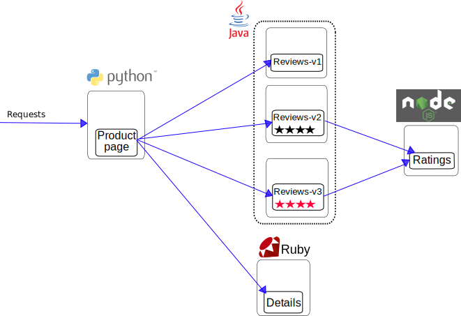

<center>【图源 <a href="https://istio.io/latest/zh/docs/examples/bookinfo/">istio 官网 </a>】</center>


Bookinfo 应用分为四个单独的微服务：

- `productpage`： 汇集所有服务的数据，生成浏览页面。
- `details`：存储了书籍的信息，如描述、作者、出版社等。
- `reviews`：存储了书籍相关的评论，但是不包含评分打星。
- `ratings`：存储评论中的评分打星。


服务依赖图如下所示：

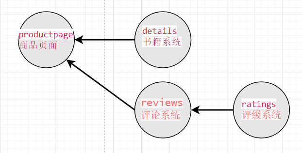


页面大概是这样的：


productpage、details、ratings 都只有一个 v1 版本，而 reviews 有三个版本。

ratings 负责给出用户打分的数据，例如一星、两星。而 reviews 三个版本分别对 ratings 的数据做以下处理：

* reviews v1：屏蔽星级，不显示打分；
* reviews v2：显示星级，使用灰色星星表示，★★★★☆；
* reviews v3：显示星级，使用红色星星表示，<span style="color:red;">★★★★☆</span>；


接下来我们将会使用 Kuubernetes Deployment 部署这些服务。


#### 预先准备

给这些示例服务创建一个命名空间，方便管理这些服务。

```bash
kubectl create namespace bookinfo
```


给命名空间添加 Istio 的标签，指示 Istio 在部署应用（只对 Pod 起效）的时候，自动注入 Envoy Sidecar Proxy 容器：

```bash
kubectl label namespace bookinfo istio-injection=enabled
```

> 如果服务要接入 Istio，需要让 Istio 在 Pod 中注入一个 Envoy 容器。
>
> Istio 注入 Sidecar 有很多种方式，其中一种是给命名空间设置下标签，在此命名空间下部署的 Pod，会被自动注入 Sidecar 。


本章主要内容是部署一套微服务，微服务由四个应用组成，其中 reviews 应用有三个版本，三个版本共同使用一个 Service，每个应用都是使用一个 Deployment 部署，并且公开一个 Service，所以最终会有 6 个 Deployment 和 4 个 Service。


你可以从本系列教程的 git 仓库中找到这些示例，文件位置：[https://github.com/whuanle/istio_book/tree/main/3](https://github.com/whuanle/istio_book/tree/main/3)。


#### details 应用

存储了书籍信息的应用。


部署命令：

```
kubectl -n bookinfo apply -f details_deploy.yaml
kubectl -n bookinfo apply -f details_svc.yaml
kubectl -n bookinfo apply -f details_sa.yaml
```


使用 Deployment 部署 details 应用。

`details_deploy.yaml`

```yaml
apiVersion: apps/v1
kind: Deployment
metadata:
  name: details-v1
  labels:
    app: details
    version: v1
spec:
  replicas: 1
  selector:
    matchLabels:
      app: details
      version: v1
  template:
    metadata:
      labels:
        app: details
        version: v1
    spec:
      serviceAccountName: bookinfo-details
      containers:
      - name: details
        image: docker.io/istio/examples-bookinfo-details-v1:1.17.0
        imagePullPolicy: IfNotPresent
        ports:
        - containerPort: 9080
        securityContext:
          runAsUser: 1000
```


部署 details。

```bash
kubectl -n bookinfo apply -f details_deploy.yaml
```


为 details 服务配置 Kubernetes Service 。

`details_svc.yaml`

```yaml
apiVersion: v1
kind: Service
metadata:
  name: details
  labels:
    app: details
    service: details
spec:
  ports:
  - port: 9080
    name: http
  selector:
    app: details
```

```bash
kubectl -n bookinfo apply -f details_svc.yaml
```


为 details 服务创建一个 ServiceAccount。

Istio 为服务之间的通信提供基于双向 TLS 的认证，这是是通过给每个 ServiceAccount 创建一个证书实现的，可以使用 ServiceAccount 验证对方的身份，不同的应用可以共享同一个 ServiceAccount。但是为每个 Deployment 使用单独的 ServiceAccount 可以更好地组织和管理安全配置。

`details_sa.yaml `

```yaml
apiVersion: v1
kind: ServiceAccount
metadata:
  name: bookinfo-details
  labels:
    account: details
```

```bash
kubectl -n bookinfo apply -f details_sa.yaml
```


#### ratings 应用

提供每条评论的打星数据。

部署命令：

```bash
kubectl -n bookinfo apply -f ratings_deploy.yaml
kubectl -n bookinfo apply -f ratings_svc.yaml
kubectl -n bookinfo apply -f ratings_sa.yaml
```


`ratings_deploy.yaml`

```yaml
apiVersion: apps/v1
kind: Deployment
metadata:
  name: ratings-v1
  labels:
    app: ratings
    version: v1
spec:
  replicas: 1
  selector:
    matchLabels:
      app: ratings
      version: v1
  template:
    metadata:
      labels:
        app: ratings
        version: v1
    spec:
      serviceAccountName: bookinfo-ratings
      containers:
      - name: ratings
        image: docker.io/istio/examples-bookinfo-ratings-v1:1.17.0
        imagePullPolicy: IfNotPresent
        ports:
        - containerPort: 9080
        securityContext:
          runAsUser: 1000
```


`ratings_svc.yaml`

```yaml
apiVersion: v1
kind: Service
metadata:
  name: ratings
  labels:
    app: ratings
    service: ratings
spec:
  ports:
  - port: 9080
    name: http
  selector:
    app: ratings
```


`ratings_sa.yaml`

```yaml
apiVersion: v1
kind: ServiceAccount
metadata:
  name: bookinfo-ratings
  labels:
    account: ratings
```


#### reviews v1/v2/v3 应用

提供书籍的评论信息。


部署命令：

```bash
kubectl -n bookinfo apply -f reviews_v1_deploy.yaml
kubectl -n bookinfo apply -f reviews_v2_deploy.yaml
kubectl -n bookinfo apply -f reviews_v3_deploy.yaml
kubectl -n bookinfo apply -f reviews_svc.yaml
kubectl -n bookinfo apply -f reviews_sa.yaml
```


为三个版本的 reviews 创建三个 Deployment。


`reviews_v1_deploy.yaml`

```yaml
apiVersion: apps/v1
kind: Deployment
metadata:
  name: reviews-v1
  labels:
    app: reviews
    version: v1
spec:
  replicas: 1
  selector:
    matchLabels:
      app: reviews
      version: v1
  template:
    metadata:
      labels:
        app: reviews
        version: v1
    spec:
      serviceAccountName: bookinfo-reviews
      containers:
      - name: reviews
        image: docker.io/istio/examples-bookinfo-reviews-v1:1.17.0
        imagePullPolicy: IfNotPresent
        env:
        - name: LOG_DIR
          value: "/tmp/logs"
        ports:
        - containerPort: 9080
        volumeMounts:
        - name: tmp
          mountPath: /tmp
        - name: wlp-output
          mountPath: /opt/ibm/wlp/output
        securityContext:
          runAsUser: 1000
      volumes:
      - name: wlp-output
        emptyDir: {}
      - name: tmp
        emptyDir: {}
```


`reviews_v2_deploy.yaml`

```yaml
apiVersion: apps/v1
kind: Deployment
metadata:
  name: reviews-v2
  labels:
    app: reviews
    version: v2
spec:
  replicas: 1
  selector:
    matchLabels:
      app: reviews
      version: v2
  template:
    metadata:
      labels:
        app: reviews
        version: v2
    spec:
      serviceAccountName: bookinfo-reviews
      containers:
      - name: reviews
        image: docker.io/istio/examples-bookinfo-reviews-v2:1.17.0
        imagePullPolicy: IfNotPresent
        env:
        - name: LOG_DIR
          value: "/tmp/logs"
        ports:
        - containerPort: 9080
        volumeMounts:
        - name: tmp
          mountPath: /tmp
        - name: wlp-output
          mountPath: /opt/ibm/wlp/output
        securityContext:
          runAsUser: 1000
      volumes:
      - name: wlp-output
        emptyDir: {}
      - name: tmp
        emptyDir: {}
```


`reviews_v3_deploy.yaml`

```yaml
apiVersion: apps/v1
kind: Deployment
metadata:
  name: reviews-v3
  labels:
    app: reviews
    version: v3
spec:
  replicas: 1
  selector:
    matchLabels:
      app: reviews
      version: v3
  template:
    metadata:
      labels:
        app: reviews
        version: v3
    spec:
      serviceAccountName: bookinfo-reviews
      containers:
      - name: reviews
        image: docker.io/istio/examples-bookinfo-reviews-v3:1.17.0
        imagePullPolicy: IfNotPresent
        env:
        - name: LOG_DIR
          value: "/tmp/logs"
        ports:
        - containerPort: 9080
        volumeMounts:
        - name: tmp
          mountPath: /tmp
        - name: wlp-output
          mountPath: /opt/ibm/wlp/output
        securityContext:
          runAsUser: 1000
      volumes:
      - name: wlp-output
        emptyDir: {}
      - name: tmp
        emptyDir: {}
```


给三个 Deployment 创建一个 Service，三个相同应用的不同版本共有同一个 Service。


`reviews_svc.yaml`

```yaml
apiVersion: v1
kind: Service
metadata:
  name: reviews
  labels:
    app: reviews
    service: reviews
spec:
  ports:
  - port: 9080
    name: http
  selector:
    app: reviews
```


`reviews_sa.yaml`

```yaml
apiVersion: v1
kind: ServiceAccount
metadata:
  name: bookinfo-reviews
  labels:
    account: reviews
```


#### productpage 应用

页面聚合服务，供用户浏览书籍信息。


部署命令：

```bash
kubectl -n bookinfo apply -f productpage_deploy.yaml
kubectl -n bookinfo apply -f productpage_svc.yaml
kubectl -n bookinfo apply -f productpage_sa.yaml
```


`productpage_deploy.yaml`

```yaml
apiVersion: apps/v1
kind: Deployment
metadata:
  name: productpage-v1
  labels:
    app: productpage
    version: v1
spec:
  replicas: 1
  selector:
    matchLabels:
      app: productpage
      version: v1
  template:
    metadata:
      labels:
        app: productpage
        version: v1
    spec:
      serviceAccountName: bookinfo-productpage
      containers:
      - name: productpage
        image: docker.io/istio/examples-bookinfo-productpage-v1:1.17.0
        imagePullPolicy: IfNotPresent
        ports:
        - containerPort: 9080
        volumeMounts:
        - name: tmp
          mountPath: /tmp
        securityContext:
          runAsUser: 1000
      volumes:
      - name: tmp
        emptyDir: {}
```


`productpage_svc.yaml`

```
apiVersion: v1
kind: Service
metadata:
  name: productpage
  labels:
    app: productpage
    service: productpage
spec:
  ports:
  - port: 9080
    name: http
  selector:
    app: productpage
```


`productpage_sa.yaml`

```yaml
apiVersion: v1
kind: ServiceAccount
metadata:
  name: bookinfo-productpage
  labels:
    account: productpage
```


### 检查

读者可以将 https://github.com/whuanle/istio_book 仓库拉取后打开 `3` 目录，执行命令进行部署：

```bash
kubectl -n bookinfo apply -f details_deploy.yaml
kubectl -n bookinfo apply -f details_svc.yaml
kubectl -n bookinfo apply -f details_sa.yaml
kubectl -n bookinfo apply -f ratings_deploy.yaml
kubectl -n bookinfo apply -f ratings_svc.yaml
kubectl -n bookinfo apply -f ratings_sa.yaml
kubectl -n bookinfo apply -f reviews_v1_deploy.yaml
kubectl -n bookinfo apply -f reviews_v2_deploy.yaml
kubectl -n bookinfo apply -f reviews_v3_deploy.yaml
kubectl -n bookinfo apply -f reviews_svc.yaml
kubectl -n bookinfo apply -f reviews_sa.yaml
kubectl -n bookinfo apply -f productpage_deploy.yaml
kubectl -n bookinfo apply -f productpage_svc.yaml
kubectl -n bookinfo apply -f productpage_sa.yaml
```


执行命令完成后，查看 bookinfo 命名空间下的 Pod。

```bash
kubectl get pods -n bookinfo
```

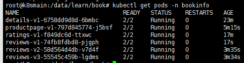


可以看到，每个 Pod 的 READY 属性都是 `2/2` ，这表示该 Pod 中有两个容器，并且当前有两个容器已经就绪。

如果我们查看其中一个 Pod 的组成结构，会发现有 Pod 被塞进了一个 istio-proxy 容器。

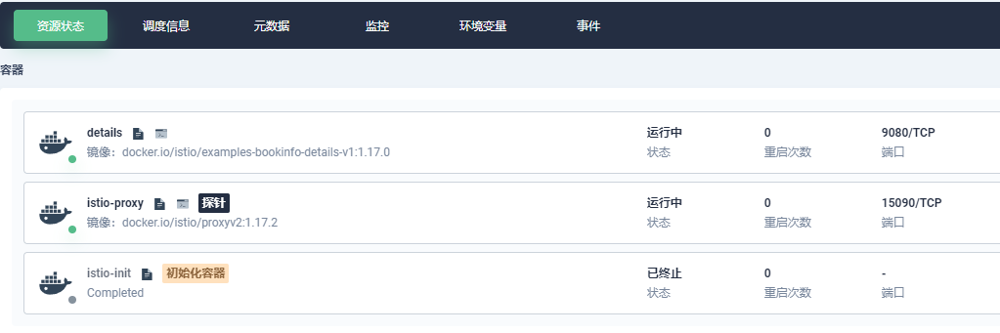

> 如果 Kubernetes 中没有安装 Dashbooard ，那么可以使用 `kubectl -n bookinfo describe pod {Pod ID}` 查看组成结构。


接着使用 `kubectl -n bookinfo get svc` 查看 Service，四个微服务都已经被注册了 Service。

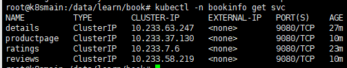


然后我们访问 productpage 对应的 CLUSTER-IP：

```bash
curl 10.233.37.130:9080
```


可以看到返回了一堆 html，说明我们的部署是正常的。

接着为了查看页面效果，我们在暂未使用 Istio 之前，临时创建一个 Service 暴露 productpage 的页面。


`productpage_tmpsvc.yaml`

```yaml
apiVersion: v1
kind: Service
metadata:
  name: productpagetmp
  labels:
    app: productpage
    service: productpage
spec:
  ports:
  - port: 9080
    name: http
  selector:
    app: productpage
  type: NodePort
```

```bash
kubectl -n bookinfo apply -f  productpage_tmpsvc.yaml
```


查看所有 Service：

```
root@k8smain:/data/learn/book# kubectl -n bookinfo get svc
NAME             TYPE        CLUSTER-IP      EXTERNAL-IP   PORT(S)          AGE
details          ClusterIP   10.233.63.247   <none>        9080/TCP         40m
productpage      ClusterIP   10.233.37.130   <none>        9080/TCP         23m
productpagetmp   NodePort    10.233.47.14    <none>        9080:30258/TCP   77s
ratings          ClusterIP   10.233.7.6      <none>        9080/TCP         36m
reviews          ClusterIP   10.233.58.219   <none>        9080/TCP         23m

```


然后在页面中访问 30258 端口（大家的端口不一样，按自己的来）。

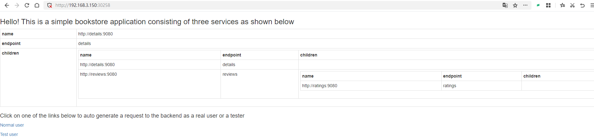


接着打开 `http://192.168.3.150:30258/productpage?u=normal`。


因为当前使用 Service 绑定 Pod，因此会使用轮询实现负载均衡，你可以多次刷新 `http://192.168.3.150:30258/productpage?u=normal`，会查到右侧的评分星星有所变化。

显示规则是 无星星、黑色星星、红色星星。

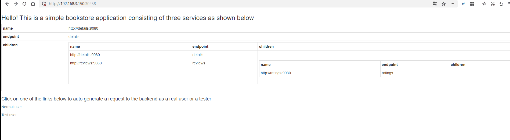


### 部署入口网关

终于来到体验 Istio 的时刻了，在本小节中，我们将会为 productpage 创建 Istio Gateway，对外提供网页访问。


在第二章中，我们已经部署了 istio-ingressgateway，这个组件起到了类似 nginx、apisix 的效果，对外提供端口访问，然后将流量转发到内部服务中。

但是 istio-ingressgateway 并不能直接转发流量到 Kubernetes Service，它还需要进行一些配置。


既然类似于 nginx，我们要为 productpage 创建一个站点，绑定对应的域名，外部才能访问。


`ingress_gateway.yaml`

```yaml
apiVersion: networking.istio.io/v1alpha3
kind: Gateway
metadata:
  name: bookinfo-gateway
spec:
  selector:
    istio: ingressgateway # use istio default controller
  servers:
  - port:
      number: 80
      name: http
      protocol: HTTP
    hosts:
    - "*"
```

> `hosts` 表示对外开放的访问路径，你可以绑定域名、IP 等。这里使用 `*` ，表示所有访问方式都可以进入此网关。

```bash
kubectl -n bookinfo apply -f ingress_gateway.yaml
```


当我们创建 Istio Gateway 之后，istio-ingressgateway 会为我们监控流量，检测不同的域名或端口转发到哪个 Istio Gateway 中。

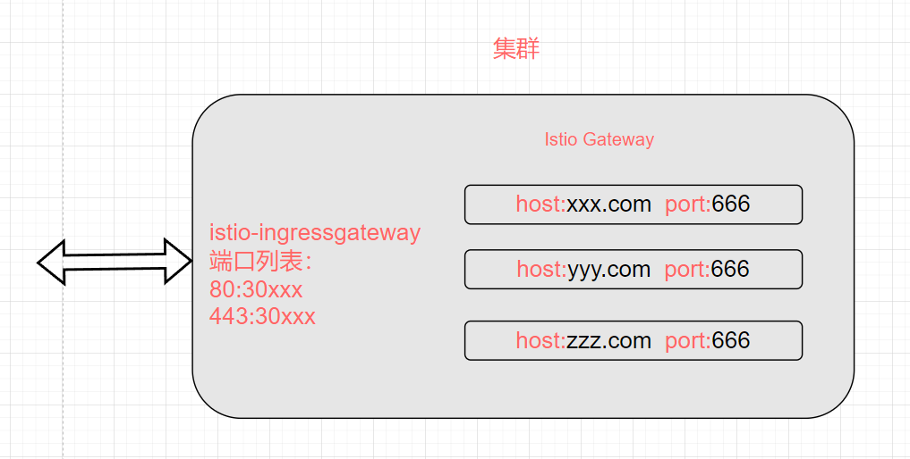


### 部署 VirtualService

虽然创建了 Istio Gateway，但是我们还不能直接通过网关访问到前面部署的微服务，我们还需要创建 Istio VirtualService 将 Istio Gateway 跟对应的 Kubernetes Service 绑定起来。


`productpage_vs.yaml`

```yaml
apiVersion: networking.istio.io/v1alpha3
kind: VirtualService
metadata:
  name: bookinfo
spec:
  hosts:
  - "*"
  gateways:
  - bookinfo-gateway
  http:
  - match:
    - uri:
        exact: /productpage
    - uri:
        prefix: /static
    - uri:
        exact: /login
    - uri:
        exact: /logout
    - uri:
        prefix: /api/v1/products
    route:
    - destination:
        host: productpage
        port:
          number: 9080
```

```bash
kubectl -n bookinfo apply -f productpage_vs.yaml
```


这里的 YAML 分为两大部分，第一部分是 `http.match`。

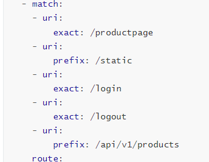

可以通过 `http.match` 限制集群外部访问此地址时所能使用的 URL。


然后通过 `http.route` 将流量转发到对应的 Kubernetes Service 中。

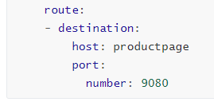


当然，我们还可以为 Istio VistualService 绑定一个 Istio DestinationRule，这样在 VisttualService 将流量转发到 Kubernetes Service 之后，还将进一步筛选符合条件的 Pod，例如版本号。

> 下一章才会介绍 DestinationRule。

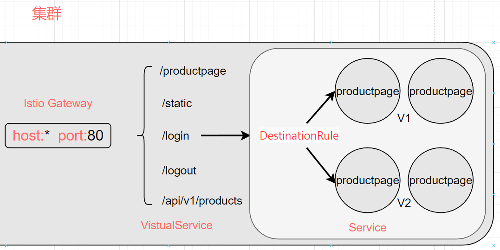

> 由于只暴露了五个地址，所以直接访问 `/` ，是打不开页面的。


为了确保网关没问题，我们需要执行 Istio 命令查看日志：

```bash
istioctl analyze
```


然后我们查看为 productpage 创建的网关。

```bash
root@k8smain:/data/learn/book# kubectl get gw -A
NAMESPACE   NAME               AGE
bookinfo    bookinfo-gateway   26m
```

> Kubernetes 本身也有一个 Gateway，因此不能使用 `kubectl get gateway` 来获取 Istio 的 Gateway，而是使用简写 `gw`。


然后查看 VistualService。

```
root@k8smain:/data/learn/book# kubectl get vs -A
NAMESPACE   NAME       GATEWAYS               HOSTS   AGE
bookinfo    bookinfo   ["bookinfo-gateway"]   ["*"]   79m
```


在第二章中，我们通过 Helm 部署了 istio-ingressgateway，其访问端口如下：

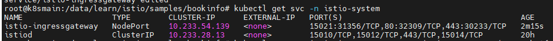


在本节部署 bookinfo-gateway 的时候，我们使用了端口 80，因此不需要另外配置 ，直接通过 istio-ingressgateway 的 32309 端口访问即可。

> 访问时一定需要带 `/productpage` ，因为我们并没有放通 `/`。

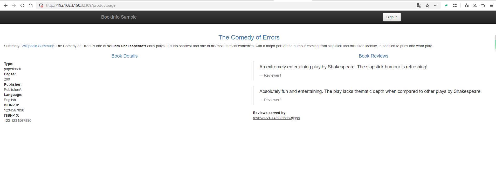

### 尝试修改 Gateway 端口

如果需要更换端口，可以修改 istio-ingressgateway 的 Service，增加新的端口映射。

```bash
kubectl edit svc istio-ingressgateway -n istio-system  
```

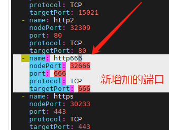


然后修改前面的 `ingress_gateway.yaml`，将端口从 80 改成 666 。


即可通过 32666 端口访问到此微服务。

示例：http://192.168.3.150:30666/productpage


### 可观察性

Istio 集成了 Jaeger 、Zipkin、Skywalking 链路追踪应用，能够获取服务网格的结构、展示网络的拓扑结构、分析网格的健康状态。


下面我们将使用官方的模板部署 Kiali 、 Prometheus、 Grafana、 还有 Jaeger，然后通过 Kiali 统一查看集群的指标信息。


拉取 Istio 官方的仓库：

```bash
git clone https://github.com/istio/istio.git
```


在 `samples/addons/` 目录中有以下目录或文件：

```bash
samples/addons/
├── extras
│   ├── prometheus-operator.yaml
│   ├── prometheus_vm_tls.yaml
│   ├── prometheus_vm.yaml
│   ├── skywalking.yaml
│   └── zipkin.yaml
├── grafana.yaml
├── jaeger.yaml
├── kiali.yaml
├── prometheus.yaml
└── README.md
```


我们启用 `grafana.yaml`、`jaeger.yaml`、`kiali.yaml`、`prometheus.yaml` 四个文件。

```
 kubectl apply -f samples/addons
```

> 这些服务默认安装在 istio-system 命名空间下，因此不需要自行设置。


在官方的这个步骤中，由于我们使用的是服务器，因此不能直接在 Shell 中启动浏览器，该方式只能使用 localhost 的方式访问，因此我们需要配置，以便在外部访问。

但是笔者并不想使用 istioctl，我们可以通过开放 Service 的方式直接访问 Kiali 或者使用前面学习到的 Gateway。

执行命令查看其 Service 对应的 IP 和端口：

```
kubectl get svc  -n istio-system
```

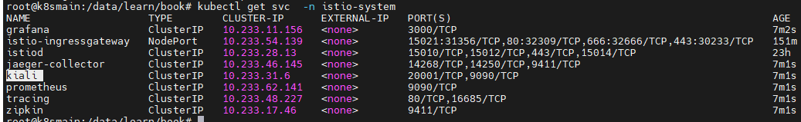


现在，我们有两种方式让 kiali 在外部访问，一种是修改 Service 配置，将其访问类型修改为 NodePort，另一种是使用 istio-ingressgateway 配置流量入口。


#### 通过Gateway 访问 Kiali

首先，创建一个 Gateway 。

`kiali_gateway.yaml`

```yaml
apiVersion: networking.istio.io/v1alpha3  
kind: Gateway  
metadata:  
  name: kiali-gateway  
spec:  
  selector:  
    istio: ingressgateway  
  servers:  
  - port:  
      number: 15029  
      name: http-kiali  
      protocol: HTTP  
    hosts:  
    - "*"  
```

```bash
kubectl -n istio-system apply -f kiali_gateway.yaml  
```

 

接下来，创建一个 VirtualService 资源，将 Gateway 路由到 Kiali 服务.

`kiali_vs.yaml  `

```yaml
apiVersion: networking.istio.io/v1alpha3  
kind: VirtualService  
metadata:  
  name: kiali  
spec:  
  hosts:  
  - "*"  
  gateways:  
  - kiali-gateway  
  http:  
  - match:  
    - uri:  
        prefix: /kiali  
    route:  
    - destination:  
        host: kiali.istio-system.svc.cluster.local  
        port:  
          number: 20001  
```

```bash
kubectl -n istio-system apply -f kiali_vs.yaml  
```


然后修改 istio-ingressgateway，新增加一个配置为 kiali 暴露服务。

```
kubectl edit svc istio-ingressgateway -n istio-system  
```

```
  - name: kiali
    nodePort: 32667
    port: 15029
    protocol: TCP
    targetPort: 15029
```

 

然后访问：http://192.168.3.150:32667/kiali

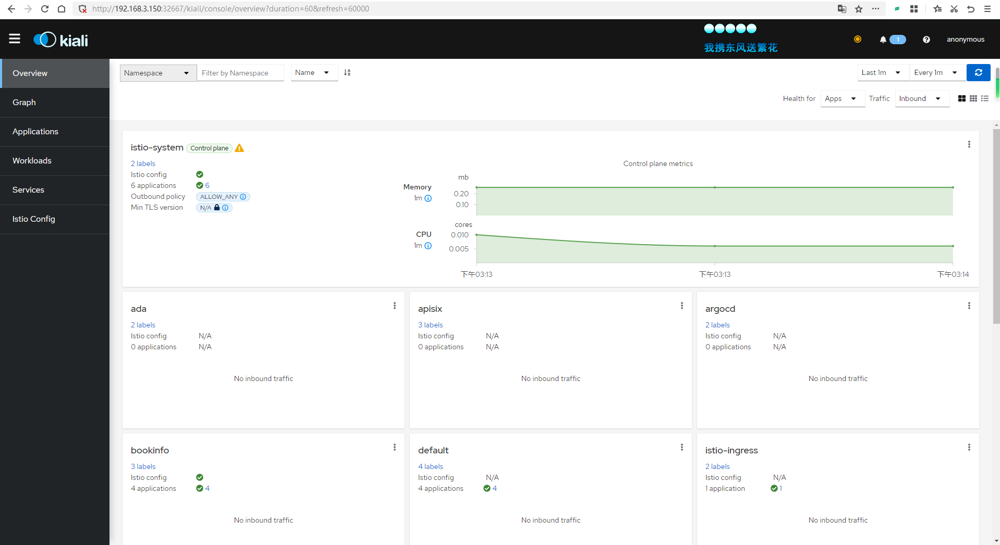


### 查看链路追踪数据

现在我们在 Shell 执行命令轮询一段时间前面部署的微服务，以便给集群创造访问流量。

```
for i in `seq 1 1000`; do curl -s -o /dev/null http://192.168.3.150:30666/productpage; done
```


> 因为默认链路追踪采样率是 1%，所以可以将请求次数设置大一些。


最终会得到一张类似的图片。

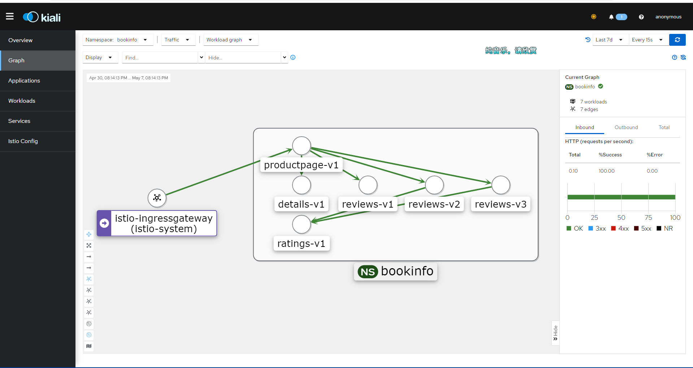

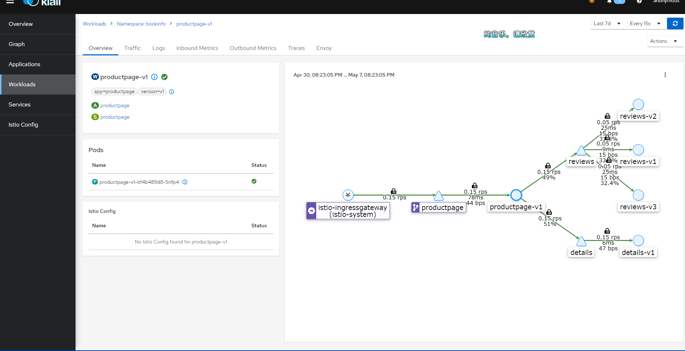

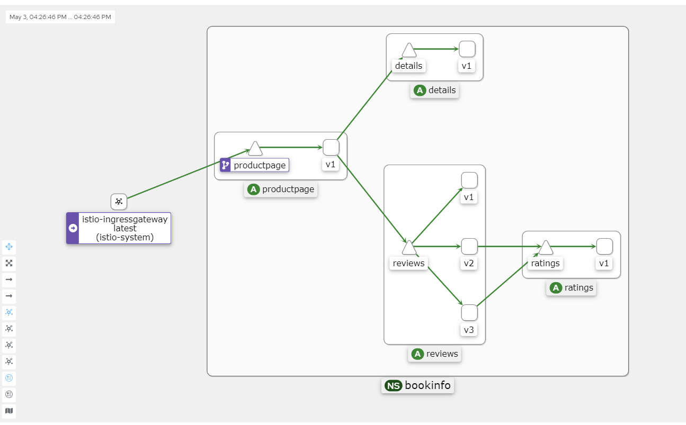

如果你的 Kiali 一直显示 Empty Graph。请关注以下几种可能的情况：

* 集群版本低于 1.23 ，需要升级 Kubernetes 集群。
* 安装了 Kubesphere，说多了都是泪，Kubesphere 太重了，笔者花了一晚上时间重新安装集群。
* 访问的地址不正确，没有配置对 `/productpage` 的访问地址，请求流量没有打入集群。
* Pod 没有被注入 istio-proxy。


你可以在 Kiali 的 `Workloads` 查看每个负载的 Pod 信息，正常情况应当如下所示：

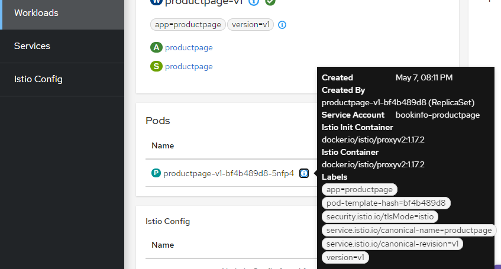


### 修复 Kiali Grafana 问题


点击右上角的消息，可能会提示配置不正确，因为 kiali 需要从 Grafana 拉取数据。

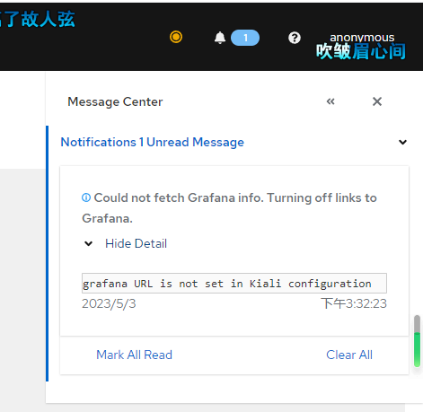


编辑 configmap

```
 kubectl edit configmap kiali -n istio-system
```


添加


```
  grafana:  \n    enabled: true  \n    url: \"http://grafana.istio-system.svc.cluster.local:3000\"
    \ \n    in_cluster_url: \"http://grafana.istio-system.svc.cluster.local:3000\"\n
```

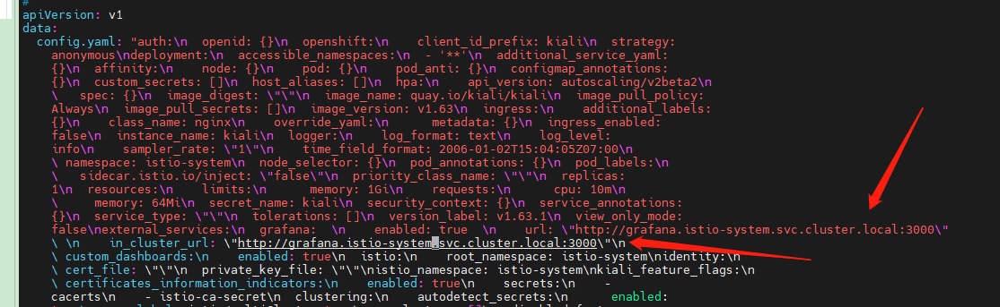


如果使用的是可视化工具，添加就简单了。

```
      grafana:  
        enabled: true  
        url: "http://grafana.istio-system.svc.cluster.local:3000"  
        in_cluster_url: "http://grafana.istio-system>.svc.cluster.local:3000"
```


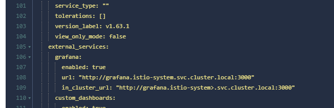


然后使用 `kubectl describe configmap kiali -n istio-system` 查看配置是否正确。


列出 kiali 架构


Kiali 的 Graph 数据主要来自两个来源：Prometheus 和 Istio 本身的遥测数据。

1. **Prometheus**：Prometheus 是一个开源监控和警报工具，它用于收集和存储 Istio 服务网格中的指标数据。Istio 使用 Envoy 代理收集遥测数据，这些数据随后被 Prometheus 抓取和存储。Kiali 使用这些 Prometheus 数据来生成服务之间的流量、错误率、延迟等指标。

2. **Istio 遥测数据**：Istio 服务网格生成的遥测数据包括请求、响应、延迟以及 Envoy 代理的其他性能指标。这些数据由 Istio 组件（例如 Mixer 和 Pilot）以及 Envoy 代理本身生成。Kiali 从这些遥测数据中获取服务拓扑信息，以创建服务之间的依赖关系图。

   Kiali 将这两个数据源的信息整合在一起，生成 Graph，它展示了服务网格的拓扑结构、服务之间的流量以及其他性能指标。这有助于用户更好地理解服务之间的依赖关系，发现潜在的性能问题，并优化服务网格配置。
