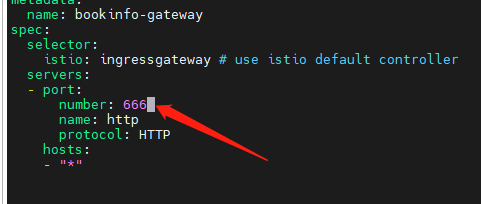

# 3，快速入门

从 https://istio.io/latest/zh/docs/examples/bookinfo/ 补充齐全信息

给命名空间添加标签，指示 Istio 在部署应用的时候，自动注入 Envoy 边车代理：

```
kubectl create namespace bookinfo
```

```
kubectl label namespace bookinfo istio-injection=enabled
```


> Istio 注入 sider 有很多种方式，其中一种是给命名空间设置下标签，在此命名空间下部署的 Pod，会被自动注入 Sider。


本章主要内容是部署一套微服务，微服务由四个应用组成，其中 reviews 应用有三个版本，三个版本共同使用一个 Service，每个应用都是使用一个 Deployment 部署，并且公开一个 Service，所以最终会有 6 个 Deployment 和 4 个 Service。


```
kubectl -n bookinfo apply -f details_sa.yaml
kubectl -n bookinfo apply -f details_deploy.yaml
kubectl -n bookinfo apply -f details_svc.yaml

kubectl -n bookinfo apply -f ratings_sa.yaml
kubectl -n bookinfo apply -f ratings_deploy.yaml
kubectl -n bookinfo apply -f ratings_svc.yaml

kubectl -n bookinfo apply -f reviews_sa.yaml
kubectl -n bookinfo apply -f reviews_v1_deploy.yaml
kubectl -n bookinfo apply -f reviews_v2_deploy.yaml
kubectl -n bookinfo apply -f reviews_v3_deploy.yaml
kubectl -n bookinfo apply -f reviews_svc.yaml

kubectl -n bookinfo apply -f productpage_sa.yaml
kubectl -n bookinfo apply -f productpage_deploy.yaml
kubectl -n bookinfo apply -f productpage_svc.yaml
```


#### details 应用

details_sa.yaml

```
apiVersion: v1
kind: ServiceAccount
metadata:
  name: bookinfo-details
  labels:
    account: details
```

> ServiceAccount 在 Kubernetes 中的主要作用是为 Pod 提供身份认证和授权，确保应用程序和服务具有恰当的权限。
>
> 当我们使用 kubectl 操控 Kubernetes 集群时，一般使用 admin 账号访问 Api Server；而一般的 Pod 会被赋予对应默认命名空间同名的 ServiceAccount 。

在 Istio 中，为每个部署创建一个单独的 ServiceAccount 有以下几个原因：

1. 安全性和权限管理：ServiceAccount 是 Kubernetes 中用于表示 Pod 身份的一种机制。它允许您定义 Pod 的权限和访问控制。在 Istio 中，使用 ServiceAccount 可以对服务之间的通信应用细粒度的安全策略。例如，您可以限制某个服务只能与具有特定 ServiceAccount 的其他服务进行通信。

2. 服务间认证：Istio 使用 ServiceAccount 为服务之间的通信提供基于双向 TLS 的认证。这意味着当两个服务互相通信时，它们可以使用 ServiceAccount 验证对方的身份。这增强了安全性，因为您可以确保仅允许已知和信任的服务之间的通信。

3. 配置分离：为每个部署使用单独的 ServiceAccount 可以帮助您更好地组织和管理安全配置。这使您能够更轻松地查找和修改与特定服务相关的安全设置。

4. 审计和监控：使用 ServiceAccount 可以帮助您跟踪和监控服务之间的通信。Istio 的遥测功能可以使用 ServiceAccount 信息来生成有关服务间交互的详细指标和日志。这有助于您分析系统性能，识别潜在的问题，并加强安全性。

   在 Istio 的 bookinfo 示例中，为每个部署创建一个 ServiceAccount 是为了演示这些安全性和身份管理的最佳实践。使用 ServiceAccount，您可以更好地保护您的服务网格，确保只有经过授权的服务能够相互通信。


执行，命令：

```
kubectl -n bookinfo apply -f details_sa.yaml
```


details_deploy.yaml

```yaml
apiVersion: apps/v1
kind: Deployment
metadata:
  name: details-v1
  labels:
    app: details
    version: v1
spec:
  replicas: 1
  selector:
    matchLabels:
      app: details
      version: v1
  template:
    metadata:
      labels:
        app: details
        version: v1
    spec:
      serviceAccountName: bookinfo-details
      containers:
      - name: details
        image: docker.io/istio/examples-bookinfo-details-v1:1.17.0
        imagePullPolicy: IfNotPresent
        ports:
        - containerPort: 9080
        securityContext:
          runAsUser: 1000
```


```
kubectl -n bookinfo apply -f details_deploy.yaml
```


details_svc.yaml

```
apiVersion: v1
kind: Service
metadata:
  name: details
  labels:
    app: details
    service: details
spec:
  ports:
  - port: 9080
    name: http
  selector:
    app: details
```


#### ratings 应用


ratings_sa.yaml

```yaml
apiVersion: v1
kind: ServiceAccount
metadata:
  name: bookinfo-ratings
  labels:
    account: ratings
```


ratings_deploy.yaml

```yaml
apiVersion: apps/v1
kind: Deployment
metadata:
  name: ratings-v1
  labels:
    app: ratings
    version: v1
spec:
  replicas: 1
  selector:
    matchLabels:
      app: ratings
      version: v1
  template:
    metadata:
      labels:
        app: ratings
        version: v1
    spec:
      serviceAccountName: bookinfo-ratings
      containers:
      - name: ratings
        image: docker.io/istio/examples-bookinfo-ratings-v1:1.17.0
        imagePullPolicy: IfNotPresent
        ports:
        - containerPort: 9080
        securityContext:
          runAsUser: 1000
```


ratings_svc.yaml

```yaml
apiVersion: v1
kind: Service
metadata:
  name: ratings
  labels:
    app: ratings
    service: ratings
spec:
  ports:
  - port: 9080
    name: http
  selector:
    app: ratings
```


kubectl -n bookinfo apply -f detail_sa.yaml
kubectl -n bookinfo apply -f detail_deploy.yaml
kubectl -n bookinfo apply -f detail_svc.yaml


kubectl -n bookinfo apply -f ratings_sa.yaml
kubectl -n bookinfo apply -f ratings_deploy.yaml
kubectl -n bookinfo apply -f ratings_svc.yaml


#### reviews v1/v2/v3 应用


reviews_sa.yaml

```
apiVersion: v1
kind: ServiceAccount
metadata:
  name: bookinfo-reviews
  labels:
    account: reviews
```


reviews_v1_deploy.yaml

```yaml
apiVersion: apps/v1
kind: Deployment
metadata:
  name: reviews-v1
  labels:
    app: reviews
    version: v1
spec:
  replicas: 1
  selector:
    matchLabels:
      app: reviews
      version: v1
  template:
    metadata:
      labels:
        app: reviews
        version: v1
    spec:
      serviceAccountName: bookinfo-reviews
      containers:
      - name: reviews
        image: docker.io/istio/examples-bookinfo-reviews-v1:1.17.0
        imagePullPolicy: IfNotPresent
        env:
        - name: LOG_DIR
          value: "/tmp/logs"
        ports:
        - containerPort: 9080
        volumeMounts:
        - name: tmp
          mountPath: /tmp
        - name: wlp-output
          mountPath: /opt/ibm/wlp/output
        securityContext:
          runAsUser: 1000
      volumes:
      - name: wlp-output
        emptyDir: {}
      - name: tmp
        emptyDir: {}
```


reviews_v2_deploy.yaml

```yaml
apiVersion: apps/v1
kind: Deployment
metadata:
  name: reviews-v2
  labels:
    app: reviews
    version: v2
spec:
  replicas: 1
  selector:
    matchLabels:
      app: reviews
      version: v2
  template:
    metadata:
      labels:
        app: reviews
        version: v2
    spec:
      serviceAccountName: bookinfo-reviews
      containers:
      - name: reviews
        image: docker.io/istio/examples-bookinfo-reviews-v2:1.17.0
        imagePullPolicy: IfNotPresent
        env:
        - name: LOG_DIR
          value: "/tmp/logs"
        ports:
        - containerPort: 9080
        volumeMounts:
        - name: tmp
          mountPath: /tmp
        - name: wlp-output
          mountPath: /opt/ibm/wlp/output
        securityContext:
          runAsUser: 1000
      volumes:
      - name: wlp-output
        emptyDir: {}
      - name: tmp
        emptyDir: {}
```

reviews_v3_deploy.yaml


```
apiVersion: apps/v1
kind: Deployment
metadata:
  name: reviews-v3
  labels:
    app: reviews
    version: v3
spec:
  replicas: 1
  selector:
    matchLabels:
      app: reviews
      version: v3
  template:
    metadata:
      labels:
        app: reviews
        version: v3
    spec:
      serviceAccountName: bookinfo-reviews
      containers:
      - name: reviews
        image: docker.io/istio/examples-bookinfo-reviews-v3:1.17.0
        imagePullPolicy: IfNotPresent
        env:
        - name: LOG_DIR
          value: "/tmp/logs"
        ports:
        - containerPort: 9080
        volumeMounts:
        - name: tmp
          mountPath: /tmp
        - name: wlp-output
          mountPath: /opt/ibm/wlp/output
        securityContext:
          runAsUser: 1000
      volumes:
      - name: wlp-output
        emptyDir: {}
      - name: tmp
        emptyDir: {}
```


reviews_svc.yaml

```
apiVersion: v1
kind: Service
metadata:
  name: reviews
  labels:
    app: reviews
    service: reviews
spec:
  ports:
  - port: 9080
    name: http
  selector:
    app: reviews
```


#### productpage 应用


productpage_sa.yaml

```
apiVersion: v1
kind: ServiceAccount
metadata:
  name: bookinfo-productpage
  labels:
    account: productpage
```


productpage_deploy.yaml

```
apiVersion: apps/v1
kind: Deployment
metadata:
  name: productpage-v1
  labels:
    app: productpage
    version: v1
spec:
  replicas: 1
  selector:
    matchLabels:
      app: productpage
      version: v1
  template:
    metadata:
      labels:
        app: productpage
        version: v1
    spec:
      serviceAccountName: bookinfo-productpage
      containers:
      - name: productpage
        image: docker.io/istio/examples-bookinfo-productpage-v1:1.17.0
        imagePullPolicy: IfNotPresent
        ports:
        - containerPort: 9080
        volumeMounts:
        - name: tmp
          mountPath: /tmp
        securityContext:
          runAsUser: 1000
      volumes:
      - name: tmp
        emptyDir: {}
```


productpage_svc.yaml

```
apiVersion: v1
kind: Service
metadata:
  name: productpage
  labels:
    app: productpage
    service: productpage
spec:
  ports:
  - port: 9080
    name: http
  selector:
    app: productpage
```


### 检查

当以上 yaml 执行完成后，

执行命令查看 bookinfo 命名空间下的 Pod。

```
kubectl get pods -n bookinfo
```


可以看到，每个 Pod 的 READY 属性都是 `2/2` ，表示该 Pod 中有两个容器，并且当前有两个容器已经就绪。

如果我们查看其中一个 Pod 的组成结构：


> 如果 Kubernetes 中没有安装 Dashbooard ，那么可以使用 `kubectl -n bookinfo describe pod {Pod ID}` 查看组成结构。


接着使用 `kubectl -n bookinfo get svc` 查看 Service：


然后我们访问 productpage 对应的 CLUSTER-IP：

```
curl 10.233.37.130:9080
```


可以看到返回了一堆 html。

为了查看页面效果，我们可以临时创建一个 Service：

```yaml
apiVersion: v1
kind: Service
metadata:
  name: productpagetmp
  labels:
    app: productpage
    service: productpage
spec:
  ports:
  - port: 9080
    name: http
  selector:
    app: productpage
  type: NodePort
```


```
kubectl -n bookinfo apply -f  productpage_tmpsvc.yaml
```


```
root@k8smain:/data/learn/book# kubectl -n bookinfo get svc
NAME             TYPE        CLUSTER-IP      EXTERNAL-IP   PORT(S)          AGE
details          ClusterIP   10.233.63.247   <none>        9080/TCP         40m
productpage      ClusterIP   10.233.37.130   <none>        9080/TCP         23m
productpagetmp   NodePort    10.233.47.14    <none>        9080:30258/TCP   77s
ratings          ClusterIP   10.233.7.6      <none>        9080/TCP         36m
reviews          ClusterIP   10.233.58.219   <none>        9080/TCP         23m

```


因为当前使用 Service 绑定 Pod，因此会使用轮询实现负载均衡，你可以多次刷新 `http://192.168.3.150:30258/productpage?u=normal`，会查到右侧的评分星星有所变化。


### 部署入口网关

Istio 入口网关成为 Ingress Gateway，类似于 Kubernetes 中的 Ingress，

ingress_gateway.yaml

```bash
apiVersion: networking.istio.io/v1alpha3
kind: Gateway
metadata:
  name: bookinfo-gateway
spec:
  selector:
    istio: ingressgateway # use istio default controller
  servers:
  - port:
      number: 80
      name: http
      protocol: HTTP
    hosts:
    - "*"
```


> `hosts` 表示对外开放的访问路径，你可以绑定域名、IP 等。这里使用 `*` ，表示所有访问方式都可以进入此网关。


虽然创建了网关，但是我们还不能直接通过网关访问到前面部署的微服务，我们需要通过中介，将 Istio 入口网关跟对应的 Kubernetes Service 绑定起来。

此时需要用到 Isito 中的 VirtualService，

productpage_vs.yaml

```
apiVersion: networking.istio.io/v1alpha3
kind: VirtualService
metadata:
  name: bookinfo
spec:
  hosts:
  - "*"
  gateways:
  - bookinfo-gateway
  http:
  - match:
    - uri:
        exact: /productpage
    - uri:
        prefix: /static
    - uri:
        exact: /login
    - uri:
        exact: /logout
    - uri:
        prefix: /api/v1/products
    route:
    - destination:
        host: productpage
        port:
          number: 9080
```


```
kubectl -n bookinfo apply -f ingress_gateway.yaml
kubectl -n bookinfo apply -f productpage_vs.yaml
```


为了确保网关没问题，我们需要执行 Istio 命令查看日志：

```
istioctl analyze
```


> Istio 创建 Gateway 之后，集群资源中找不到对应的 Gateway，显示 No resources found，请参考：
>
> Kubernetes 网关的简称为 gtw，Istio 网关的简称为 gw。您可以执行`kubectl get gw`或`kubectl get gateways.networking.istio.io`以确保返回的是Istio网关。


```
root@k8smain:/data/learn/book# kubectl get gw -A
NAMESPACE   NAME               AGE
bookinfo    bookinfo-gateway   26m
```


```
root@k8smain:/data/learn/book# kubectl get vs -A
NAMESPACE   NAME       GATEWAYS               HOSTS   AGE
bookinfo    bookinfo   ["bookinfo-gateway"]   ["*"]   79m
```


在第二章中，我们通过 Helm 部署了 istio-ingressgateway，其访问端口如下：


在本节部署 bookinfo-gateway 的时候，我们使用了端口 80，因此不需要另外配置 ，直接通过 istio-ingressgateway 的 32309 端口访问即可。

> 一定需要带 `/productpage`


如果需要更换端口，可以修改 istio-ingressgateway 的 Service：

```
kubectl edit svc istio-ingressgateway -n istio-system  
```


然后修改前面的 ingress_gateway.yaml，将端口从 80 改成 666 。



即可通过 32666 端口访问到此微服务。

但是访问时，一定要带上后缀。


### 可观察性

Istio 和[几个](https://istio.io/latest/zh/docs/ops/integrations)遥测应用做了集成。 遥测能帮您了解服务网格的结构、展示网络的拓扑结构、分析网格的健康状态。

使用下面说明部署 [Kiali](https://istio.io/latest/zh/docs/ops/integrations/kiali/) 仪表板、 以及 [Prometheus](https://istio.io/latest/zh/docs/ops/integrations/prometheus/)、 [Grafana](https://istio.io/latest/zh/docs/ops/integrations/grafana)、 还有 [Jaeger](https://istio.io/latest/zh/docs/ops/integrations/jaeger/)。


拉取官方的仓库：

```
git clone https://github.com/istio/istio.git
```


在 `samples/addons/` 目录中有以下目录或文件：

```
samples/addons/
├── extras
│   ├── prometheus-operator.yaml
│   ├── prometheus_vm_tls.yaml
│   ├── prometheus_vm.yaml
│   ├── skywalking.yaml
│   └── zipkin.yaml
├── grafana.yaml
├── jaeger.yaml
├── kiali.yaml
├── prometheus.yaml
└── README.md
```


```
 kubectl apply -f samples/addons
```

> 这些服务默认安装在 istio-system 命名空间下，因此不需要自行设置。


在官方的这个步骤中，由于我们使用的是服务器，因此不能直接在 Shell 中启动浏览器，该方式只能使用 localhost 的方式访问，因此我们需要配置，以便在外部访问。


执行命令查看其 Service 对应的 IP 和端口：

```
kubectl get svc  -n istio-system
```


现在，我们有两种方式让 kiali 在外部访问，一种是修改 Service 配置，将其访问类型修改为 NodePort，另一种是使用 istio-ingressgateway 配置流量入口。


要使 Kiali 在外部可访问，您需要通过 Istio Ingress Gateway 将流量路由到 Kiali 服务。以下是将 Kiali 暴露给外部流量的步骤：

首先，创建一个 Gateway 资源。以下是一个示例：

kiali_gateway.yaml

```
apiVersion: networking.istio.io/v1alpha3  
kind: Gateway  
metadata:  
  name: kiali-gateway  
spec:  
  selector:  
    istio: ingressgateway  
  servers:  
  - port:  
      number: 15029  
      name: http-kiali  
      protocol: HTTP  
    hosts:  
    - "*"  
```

将此 YAML 内容保存到一个文件（例如：`kiali-gateway.yaml`），然后运行以下命令创建 Gateway：

```
kubectl -n istio-system apply -f kiali_gateway.yaml  
```

 

接下来，创建一个 VirtualService 资源，将 Gateway 路由到 Kiali 服务。以下是一个示例：

```
apiVersion: networking.istio.io/v1alpha3  
kind: VirtualService  
metadata:  
  name: kiali  
spec:  
  hosts:  
  - "*"  
  gateways:  
  - kiali-gateway  
  http:  
  - match:  
    - uri:  
        prefix: /kiali  
    route:  
    - destination:  
        host: kiali.istio-system.svc.cluster.local  
        port:  
          number: 20001  
```

将此 YAML 内容保存到一个文件（例如：`kiali_vs.yaml`），然后运行以下命令创建 VirtualService：

```
kubectl -n istio-system apply -f kiali_vs.yaml  
```


完成这些步骤后，您应该可以通过 Istio Ingress Gateway 的外部 IP 地址和端口 15029 访问 Kiali。要获取外部 IP，请运行以下命令：，在 ports 中增加新的端口配置。

```
kubectl edit svc istio-ingressgateway -n istio-system  
```

```
  - name: kiali
    nodePort: 32667
    port: 15029
    protocol: TCP
    targetPort: 15029
```

 

然后访问：http://192.168.3.150:32667/kiali


点击右上角的消息，可能会提示配置不正确，因为 kiali 需要从 Grafana 拉取数据。


编辑 configmap

```
 kubectl edit configmap kiali -n istio-system
```


添加


```
  grafana:  \n    enabled: true  \n    url: \"http://grafana.istio-system.svc.cluster.local:3000\"
    \ \n    in_cluster_url: \"http://grafana.istio-system.svc.cluster.local:3000\"\n
```


如果使用的是可视化工具，添加就简单了。

```
      grafana:  
        enabled: true  
        url: "http://grafana.istio-system.svc.cluster.local:3000"  
        in_cluster_url: "http://grafana.istio-system>.svc.cluster.local:3000"
```


然后使用 `kubectl describe configmap kiali -n istio-system` 查看配置是否正确。


现在我们在 Shell 执行命令轮询一段时间前面部署的微服务。

```
for i in `seq 1 100`; do curl -s -o /dev/null http://192.168.3.150:32666/productpage; done
```


列出 kiali 架构


Kiali 的 Graph 数据主要来自两个来源：Prometheus 和 Istio 本身的遥测数据。

1. **Prometheus**：Prometheus 是一个开源监控和警报工具，它用于收集和存储 Istio 服务网格中的指标数据。Istio 使用 Envoy 代理收集遥测数据，这些数据随后被 Prometheus 抓取和存储。Kiali 使用这些 Prometheus 数据来生成服务之间的流量、错误率、延迟等指标。

2. **Istio 遥测数据**：Istio 服务网格生成的遥测数据包括请求、响应、延迟以及 Envoy 代理的其他性能指标。这些数据由 Istio 组件（例如 Mixer 和 Pilot）以及 Envoy 代理本身生成。Kiali 从这些遥测数据中获取服务拓扑信息，以创建服务之间的依赖关系图。

   Kiali 将这两个数据源的信息整合在一起，生成 Graph，它展示了服务网格的拓扑结构、服务之间的流量以及其他性能指标。这有助于用户更好地理解服务之间的依赖关系，发现潜在的性能问题，并优化服务网格配置。
