# 4， 流量管理

在上一章中部署的 bookinfo 示例，主要演示了替代 Kubernetes Ingress ，以及基于 Istio 实现可观察性的 Kiali 组件。

但是并不足以讨论 Istio 强大的功能。


### 基于版本的路由配置

在前面访问的 http://192.168.3.150:30666/productpage?u=normal 地址中，我们每次刷新得到的结果都不一样。

因为 Kubenetes Service 绑定了三个版本的 reviews 的 Deployment ，正常情况下，Kubernetes 会将客户端的请求以轮询的方式转发到 Deployment 中的 Pod。


在第三章中，我们通过给 productpage 定义了一个 Istio VistualService，其定义如下：

```
apiVersion: networking.istio.io/v1alpha3
kind: VirtualService
metadata:
  name: bookinfo
spec:
  hosts:
  - "*"
  gateways:
  - bookinfo-gateway
  http:
  - match:
    - uri:
        exact: /productpage
    - uri:
        prefix: /static
    - uri:
        exact: /login
    - uri:
        exact: /logout
    - uri:
        prefix: /api/v1/products
    route:
    - destination:
        host: productpage
        port:
          number: 9080
```


在 Istio 中，VirtualService（虚拟服务）起着关键的作用，主要用于定义流量路由规则。它允许您配置如何将请求分配到各种目标服务，从而实现对服务之间流量的细粒度控制。VirtualService 的主要作用包括：

1. 路由规则定义：通过定义 HTTP、TCP 和 gRPC 请求的匹配条件，可以控制请求流向不同的目标服务。例如，可以根据请求路径、头部信息等将请求路由到特定版本的服务。

2. 流量分配：VirtualService 可以将流量按照指定的权重分配给多个目标服务，实现负载均衡和灰度发布等功能。

3. 请求重试和超时设置：VirtualService 允许您为请求配置重试策略和超时时间，提高服务的可用性和容错能力。

4. 故障注入：通过 VirtualService，您可以在服务间注入故障，例如延迟或返回错误响应，以便测试系统的弹性和故障恢复能力。

5. 镜像流量：VirtualService 可以将流量复制到一个镜像服务，以便在不影响主流程的情况下观察和分析请求。

   综上所述，Istio 中的 VirtualService 是一个非常强大的功能，它使您能够灵活地管理和控制服务间的流量，提高服务的可用性和故障恢复能力。


给每个微服务定义版本，其中 reviews 服务有三个 Deployment，对应三个版本。

service_version.yaml

```yaml
apiVersion: networking.istio.io/v1alpha3
kind: DestinationRule
metadata:
  name: productpage
spec:
  host: productpage
  subsets:
  - name: v1
    labels:
      version: v1
---
apiVersion: networking.istio.io/v1alpha3
kind: DestinationRule
metadata:
  name: reviews
spec:
  host: reviews
  subsets:
  - name: v1
    labels:
      version: v1
  - name: v2
    labels:
      version: v2
  - name: v3
    labels:
      version: v3
---
apiVersion: networking.istio.io/v1alpha3
kind: DestinationRule
metadata:
  name: ratings
spec:
  host: ratings
  subsets:
  - name: v1
    labels:
      version: v1
  - name: v2
    labels:
      version: v2
  - name: v2-mysql
    labels:
      version: v2-mysql
  - name: v2-mysql-vm
    labels:
      version: v2-mysql-vm
---
apiVersion: networking.istio.io/v1alpha3
kind: DestinationRule
metadata:
  name: details
spec:
  host: details
  subsets:
  - name: v1
    labels:
      version: v1
  - name: v2
    labels:
      version: v2
---
```


```
kubectl -n bookinfo apply -f service_version.yaml
```


执行命令查询更多信息

```bash
$> kubectl get destinationrules -o wide -n bookinfo
NAME          HOST          AGE
details       details       59s
productpage   productpage   60s
ratings       ratings       59s
reviews       reviews       59s

```


首先我们为三个微服务 productpage、ratings、details 定义 Istio VirtualService，

其中 productpage 有所不一样，因为我们需要为 productpage 对外开放服务，因此需要将其 `pec.hosts` 设置为 `"*"` ，表示允许的访问来源。然后绑定了入口网关 bookinfo-gateway。


3vs.yaml

```yaml
apiVersion: networking.istio.io/v1alpha3
kind: VirtualService
metadata:
  name: productpage
spec:
  hosts:
  - productpage
  http:
  - route:
    - destination:
        host: productpage
        subset: v1
---
apiVersion: networking.istio.io/v1alpha3
kind: VirtualService
metadata:
  name: ratings
spec:
  hosts:
  - ratings
  http:
  - route:
    - destination:
        host: ratings
        subset: v1
---
apiVersion: networking.istio.io/v1alpha3
kind: VirtualService
metadata:
  name: details
spec:
  hosts:
  - details
  http:
  - route:
    - destination:
        host: details
        subset: v1
---
```


```
kubectl -n bookinfo apply -f 3vs.yaml
```


而对于 reviews 服务，我们只对其 v1 版本配置 VirtualService。

reviews_v1_vs.yaml

```yaml
apiVersion: networking.istio.io/v1alpha3
kind: VirtualService
metadata:
  name: reviews
spec:
  hosts:
  - reviews
  http:
  - route:
    - destination:
        host: reviews
        subset: v1
```

```
kubectl -n bookinfo apply -f reviews_v1_vs.yaml
```


对于 VistualService 中的 https 部分，这里浅解释一下，

```
  http:
  - route:
    - destination:
        host: details
        subset: v1
```


```bash
$> kubectl get vs -n bookinfo
NAME          GATEWAYS               HOSTS                                AGE
bookinfo      ["bookinfo-gateway"]   ["*"]                                76m
details                              ["details.bookinfo.svc.local"]       103m
productpage                          ["productpage.bookinfo.svc.local"]   103m
ratings                              ["ratings.bookinfo.svc.local"]       103m
reviews                              ["reviews"]                          103m
```

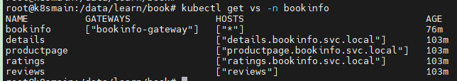


之后，无论怎么刷新 http://192.168.3.150:32666/productpage ，右侧的 Book Reviews 都不会显示星星。

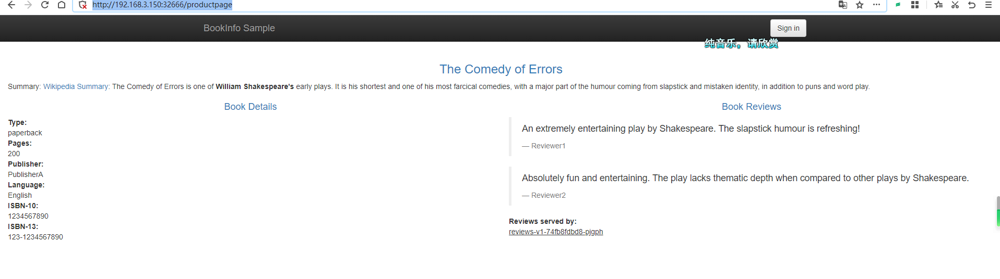

因为 VistualService 作用于 Service，在同为 Istio 的容器中访问 Service，效果也是一样的。


### 基于 Http header 的路由配置


将 

```
  http:
  - route:
    - destination:
        host: reviews
        subset: v1
```


改成：


```
  http:
  - match:
    - headers:
        end-user:
          exact: jason
    route:
    - destination:
        host: reviews
        subset: v2
  - route:
    - destination:
        host: reviews
        subset: v1
```


完整的 YAML如下

```
apiVersion: networking.istio.io/v1alpha3
kind: VirtualService
metadata:
  name: reviews
spec:
  hosts:
  - reviews
  http:
  - match:
    - headers:
        end-user:
          exact: jason
    route:
    - destination:
        host: reviews
        subset: v2
  - route:
    - destination:
        host: reviews
        subset: v1
```


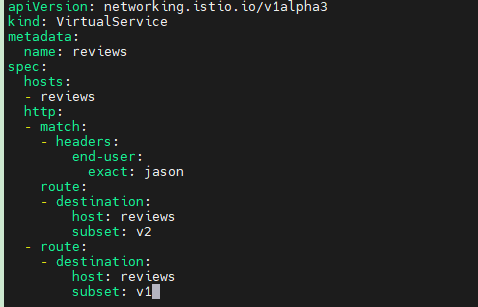


执行

```
kubectl -n bookinfo apply -f reviews_v2_vs.yaml
```


然后在页面中的右上角点击 `Sign in` 进行登录，账号密码都是 jason。

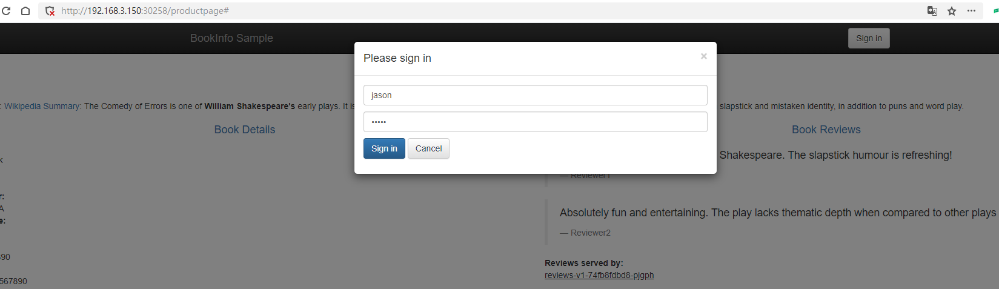


此时 Book Reviews 一直显示星星。

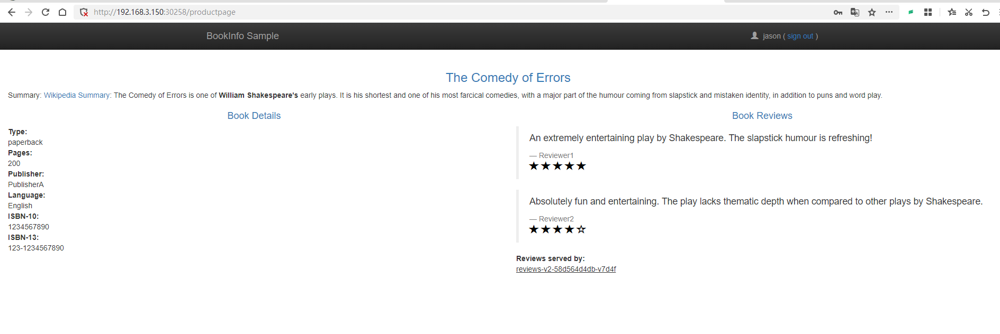

如果我们查看 productpage 的日志：

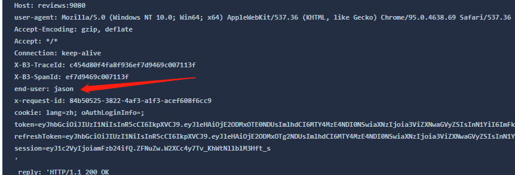


但是需要注意，起作用的是 productpage 将这个 header 头转发给了 reviews Service，Istio 检测到 Http header 中带有 end-user ，然后才决定使用 reviews v2。


- 经过上面的配置，下面是请求的流程：
  - `productpage` → `reviews:v2` → `ratings` (针对 `jason` 用户)
  - `productpage` → `reviews:v1` (其他用户)


### 故障注入

将前面部署的 ratings 的 VirtualService，改造一下。

ratings_delay.yaml

```yaml
apiVersion: networking.istio.io/v1alpha3
kind: VirtualService
metadata:
  name: ratings
spec:
  hosts:
  - ratings
  http:
  - match:
    - headers:
        end-user:
          exact: jason
    fault:
      delay:
        percentage:
          value: 100.0
        fixedDelay: 7s
    route:
    - destination:
        host: ratings
        subset: v1
  - route:
    - destination:
        host: ratings
        subset: v1
```


```
kubectl -n bookinfo apply -f ratings_delay.yaml
```


再次访问网页，发现已经加载不出来了，因为超时。

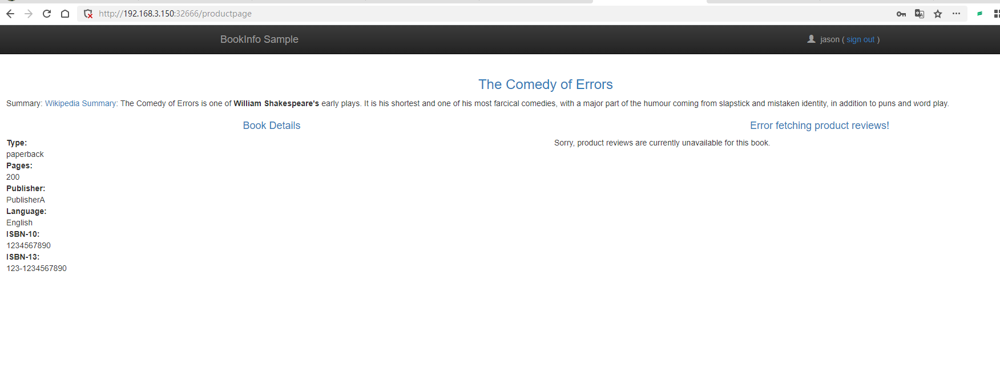

在 Istio 的 VirtualService 中，`fault` 配置用于注入故障，以模拟和测试应用程序在出现问题时的行为。主要有两种类型的故障注入：延迟（delay）和异常（abort）。


配置示例分别如下：

延迟（delay）故障注入：

延迟故障注入用于在应答之前向请求添加指定的延迟时间。这可以帮助您测试应用程序在网络延迟或服务响应缓慢的情况下的表现。以下是一个示例，演示了如何在 VirtualService 中添加一个延迟故障注入：

```
  http:  
  - fault:  
      delay:  
        percentage:  
          value: 100.0  
        fixedDelay: 5s  
```

异常（abort）故障注入：

异常故障注入用于模拟请求失败的情况，例如 HTTP 错误状态码或 gRPC 状态码。这可以帮助您测试应用程序在遇到故障时的恢复能力。以下是一个示例，演示了如何在 VirtualService 中添加一个异常故障注入：

```
  http:  
  - fault:  
      abort:  
        percentage:  
          value: 100.0  
        httpStatus: 503 
```

也可以将两者放在一起同时使用。

```
  http:  
  - fault:  
      delay:  
        percentage:  
          value: 50.0  
        fixedDelay: 5s  
      abort:  
        percentage:  
          value: 50.0  
        httpStatus: 503 
```


在 Istio 的 VirtualService 配置中，`fault` 配置用于注入故障，以模拟和测试应用程序在出现问题时的行为。`fault` 配置主要有两种类型的故障注入：延迟（delay）和异常（abort）。下面是这两种故障注入的属性定义：

1. 延迟（delay）故障注入：

   - `percentage`: 表示注入延迟的概率，取值范围为 0.0 到 100.0。例如，50.0 表示有 50% 的概率注入延迟。
   - `fixedDelay`: 表示注入的固定延迟时间，通常以秒（s）或毫秒（ms）为单位。例如，`5s` 表示 5 秒延迟。

   延迟故障注入的示例：

   ```
   fault:  
     delay:  
       percentage:  
         value: 50.0  
       fixedDelay: 5s  
   ```

   在这个示例中，`delay` 配置了一个 50% 概率发生的 5 秒固定延迟。

2. 异常（abort）故障注入：

   - `percentage`: 表示注入异常的概率，取值范围为 0.0 到 100.0。例如，50.0 表示有 50% 的概率注入异常。
   - `httpStatus`: 表示要注入的 HTTP 错误状态码。例如，`503` 表示 HTTP 503 错误。
   - `grpcStatus`: 表示要注入的 gRPC 错误状态码。例如，`UNAVAILABLE` 表示 gRPC 服务不可用错误。
   - `http2Error`: 表示要注入的 HTTP/2 错误。例如，`CANCEL` 表示 HTTP/2 流被取消。

   异常故障注入的示例：

   ```
   fault:  
     abort:  
       percentage:  
         value: 50.0  
       httpStatus: 503  
   ```

   在这个示例中，`abort` 配置了一个 50% 概率发生的 HTTP 503 错误。

   您可以根据需要在 VirtualService 配置中使用这些属性来定义故障注入。可以单独使用延迟或异常故障注入，也可以将它们放在一起使用，以模拟复杂的故障场景。通过注入故障，您可以更好地了解应用程序在面临问题时的行为和恢复能力。


实验完成后，别忘了将 ratings 服务恢复正常。

```
kubectl -n bookinfo apply -f 3vs.yaml
```


### 流量转移

在本章的其它小节中，针对 reviews 服务，使用了两个 yaml 文件配置，现在我们忘记之前的实验，重新思考一个问题。

1. 使用下面的命令把 50% 的流量从 `reviews:v1` 转移到 `reviews:v3`：

```yaml
apiVersion: networking.istio.io/v1alpha3
kind: VirtualService
metadata:
  name: reviews
spec:
  hosts:
    - reviews
  http:
  - route:
    - destination:
        host: reviews
        subset: v1
      weight: 50
    - destination:
        host: reviews
        subset: v3
      weight: 50
```

新浏览器中的 `/productpage` 页面，大约有 50% 的几率会看到页面中带 *红色* 星级的评价内容。这是因为 `reviews` 的 `v3` 版本可以访问带星级评价，但 `v1` 版本不能。


### 请求超时

reviews 依赖于 ratings 服务。

不同编程语言都会提供 http client 类库，程序发起 http 请求时，程序本身一般都会有超时时间，超过这个时间，代码会抛出异常。而网关如 nginx、apisix 等，也有 http 连接超时的功能。

在 Istio 中，服务间的调用也可以由 Istio 进行管理，可以设置超时断开。

我们可以为 reviews 服务设置 http 入口超时时间，当其它服务 请求reviews 服务时，如果 http 请求超过 0.5s，那么 Istio 立即断开 http 请求。

reviews_timeout.yaml

```
apiVersion: networking.istio.io/v1alpha3
kind: VirtualService
metadata:
  name: reviews
spec:
  hosts:
  - reviews
  http:
  - route:
    - destination:
        host: reviews
        subset: v2
    timeout: 0.5s
```


```
kubectl -n bookinfo apply -f reviews_timeout.yaml
```


然后为了模拟这种超时情况，我们可以给 ratings 注入故障。

```yaml
kubectl -n bookinfo apply -f - <<EOF
apiVersion: networking.istio.io/v1alpha3
kind: VirtualService
metadata:
  name: ratings
spec:
  hosts:
  - ratings
  http:
  - fault:
      delay:
        percent: 100
        fixedDelay: 2s
    route:
    - destination:
        host: ratings
        subset: v1
EOF
```


我们再次刷新页面。


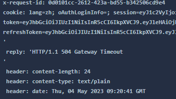

注：因为 productpage 是 Python 编写的，其代码中设置了请求失败后自动重试一次，因此页面刷新后 1 s 后才会完成，而不是 0.5s。


还有一点关于 Istio 中超时控制方面的补充说明，除了像本文一样在路由规则中进行超时设置之外，还可以进行请求一级的设置，只需在应用的对外请求中加入 `x-envoy-upstream-rq-timeout-ms` 请求头即可。在这个请求头中的超时设置单位是毫秒而不是秒。


现在让我们将本小节的故障清理掉，恢复正常的微服务。

```
kubectl -n bookinfo apply -f - <<EOF
apiVersion: networking.istio.io/v1alpha3
kind: VirtualService
metadata:
  name: reviews
spec:
  hosts:
    - reviews
  http:
  - route:
    - destination:
        host: reviews
        subset: v1
      weight: 50
    - destination:
        host: reviews
        subset: v3
      weight: 50
EOF
```

```
kubectl -n bookinfo apply -f - <<EOF
apiVersion: networking.istio.io/v1alpha3
kind: VirtualService
metadata:
  name: ratings
spec:
  hosts:
  - ratings
  http:
  - route:
    - destination:
        host: ratings
        subset: v1
EOF
```


### 熔断

本任务展示如何为连接、请求以及异常检测配置熔断。

熔断，是创建弹性微服务应用程序的重要模式。熔断能够使您的应用程序具备应对来自故障、潜在峰值和其他未知网络因素影响的能力。

这个任务中，你将配置熔断规则，然后通过有意的使熔断器“跳闸”来测试配置。


接下来将会使用一个 httpbin 服务，这个服务代码在 https://github.com/istio/istio/tree/release-1.17/samples/httpbin


httpbin.yaml

```yaml
apiVersion: v1
kind: ServiceAccount
metadata:
  name: httpbin
---
apiVersion: v1
kind: Service
metadata:
  name: httpbin
  labels:
    app: httpbin
    service: httpbin
spec:
  ports:
  - name: http
    port: 8000
    targetPort: 80
  selector:
    app: httpbin
  type: NodePort
---
apiVersion: apps/v1
kind: Deployment
metadata:
  name: httpbin
spec:
  replicas: 1
  selector:
    matchLabels:
      app: httpbin
      version: v1
  template:
    metadata:
      labels:
        app: httpbin
        version: v1
    spec:
      serviceAccountName: httpbin
      containers:
      - image: docker.io/kennethreitz/httpbin
        imagePullPolicy: IfNotPresent
        name: httpbin
        ports:
        - containerPort: 80
```


```
kubectl -n bookinfo apply -f  httpbin.yaml
```

然后查看 Service 列表

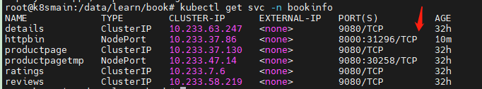

通过浏览器打开对应的服务。

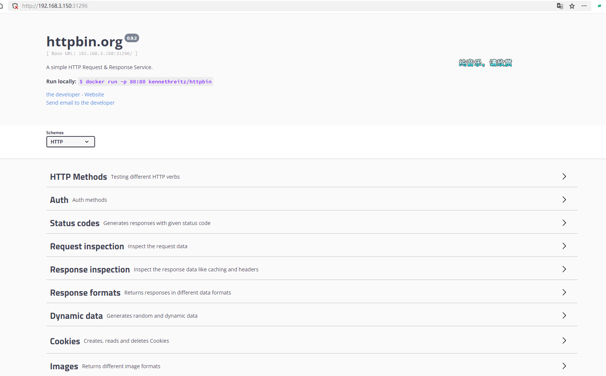


httpbin_circurt.yaml

```
apiVersion: networking.istio.io/v1alpha3
kind: DestinationRule
metadata:
  name: httpbin
spec:
  host: httpbin
  trafficPolicy:
    connectionPool:
      tcp:
        maxConnections: 1
      http:
        http1MaxPendingRequests: 1
        maxRequestsPerConnection: 1
    outlierDetection:
      consecutive5xxErrors: 1
      interval: 1s
      baseEjectionTime: 3m
      maxEjectionPercent: 100
```


```
kubectl -n bookinfo apply -f  httpbin_circuit.yaml
```

`DestinationRule`（目标规则）用于定义访问特定服务的流量策略。`DestinationRule` 配置中的 `trafficPolicy` 属性允许您为服务指定全局的流量策略。这些策略包括负载均衡设置、连接池设置、异常检测等。


在 Istio 服务网格中，当流量进入网格时，它会被 Sidecar 代理（Envoy 代理）拦截并根据相关配置进行路由。要触发熔断，流量必须经过 Envoy 代理，因为熔断逻辑是在 Envoy 代理中实现的。因此，在 Istio 服务网格中，您应该确保流量经过 Envoy 代理，以便根据 `DestinationRule` 的熔断设置触发熔断。

然而，如果您直接访问 Kubernetes 的 `Service`，这意味着流量可能没有经过 Envoy 代理。在这种情况下，Istio 的熔断机制将不起作用。不过，Kubernetes 也有其自己的负载均衡和服务发现机制，它可能会在一定程度上处理故障实例。但是，这种处理方式与 Istio 的熔断机制不同，没有相应的熔断策略可供配置。

因此，为了确保熔断机制生效，请确保在 Istio 服务网格中的流量经过 Envoy 代理。通常，这意味着使用网格内部的服务名称（例如 `myapp.default.svc.cluster.local`）作为目标主机，而不是直接使用 Kubernetes `Service` 的 IP 地址。


因此前面给 httpbin 开放的 Service 端口，只是为了方便大家了解这个服务，并不能用于实验熔断。


```yaml
apiVersion: v1
kind: Service
metadata:
  name: fortio
  labels:
    app: fortio
    service: fortio
spec:
  ports:
  - port: 8080
    name: http
  selector:
    app: fortio
---
apiVersion: apps/v1
kind: Deployment
metadata:
  name: fortio-deploy
spec:
  replicas: 1
  selector:
    matchLabels:
      app: fortio
  template:
    metadata:
      annotations:
        # This annotation causes Envoy to serve cluster.outbound statistics via 15000/stats
        # in addition to the stats normally served by Istio. The Circuit Breaking example task
        # gives an example of inspecting Envoy stats via proxy config.
        proxy.istio.io/config: |-
          proxyStatsMatcher:
            inclusionPrefixes:
            - "cluster.outbound"
            - "cluster_manager"
            - "listener_manager"
            - "server"
            - "cluster.xds-grpc"
      labels:
        app: fortio
    spec:
      containers:
      - name: fortio
        image: fortio/fortio:latest_release
        imagePullPolicy: Always
        ports:
        - containerPort: 8080
          name: http-fortio
        - containerPort: 8079
          name: grpc-ping
```


```
 kubectl -n bookinfo apply -f  fortio_deploy.yaml
```


执行命令获取 fortio 的 pod 名称

```
export FORTIO_POD=$(kubectl get pods -n bookinfo -l app=fortio -o 'jsonpath={.items[0].metadata.name}')
```

然后让 pod 容器执行命令

```
kubectl -n bookinfo exec "$FORTIO_POD" -c fortio -- /usr/bin/fortio curl -quiet http://httpbin:8000/get
```

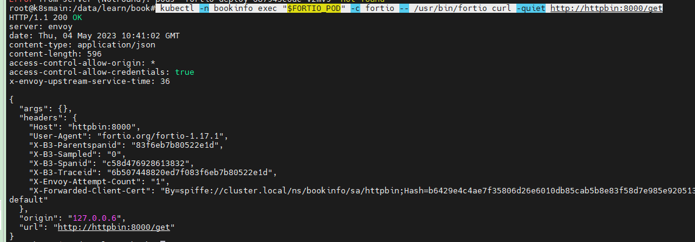


```
kubectl -n bookinfo exec "$FORTIO_POD" -c fortio -- /usr/bin/fortio load -c 3 -qps 0 -n 20 -loglevel Warning http://httpbin:8000/get
```

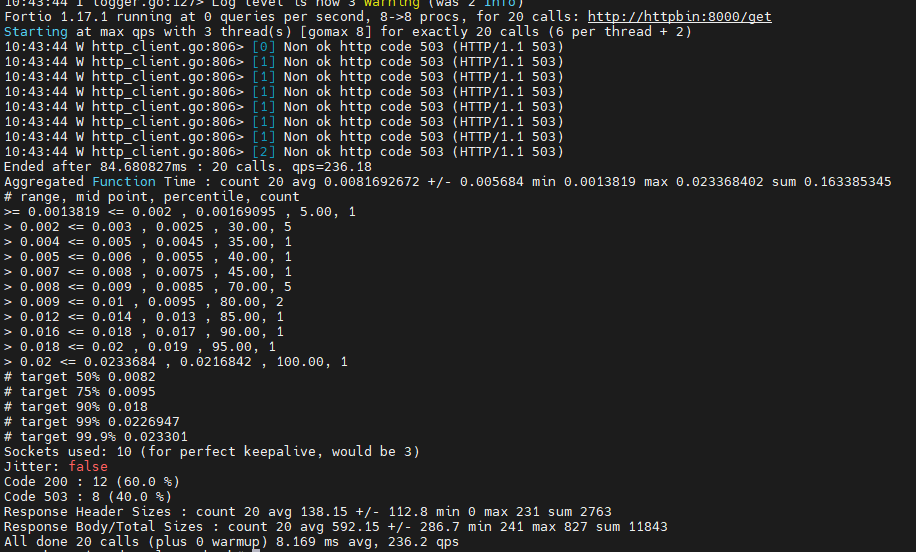

在控制台中可以看到请求返回 200 和 503 的比例。

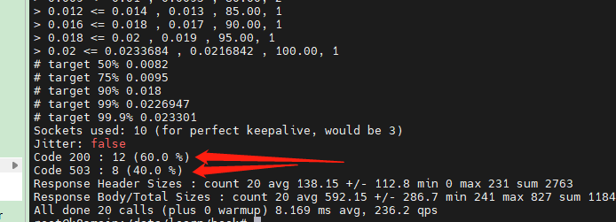


现在让我们清理示例程序。

```
kubectl -n bookinfo delete destinationrule httpbin
kubectl -n bookinfo delete sa httpbin
kubectl -n bookinfo delete svc httpbin
kubectl -n bookinfo delete deployment httpbin
```


productpage_circuit.yaml

```
apiVersion: networking.istio.io/v1alpha3
kind: DestinationRule
metadata:
  name: productpage
spec:
  host: productpage
  subsets:
  - name: v1
    labels:
      version: v1
  trafficPolicy:
    connectionPool:
      tcp:
        maxConnections: 1
      http:
        http1MaxPendingRequests: 1
        maxRequestsPerConnection: 1
    outlierDetection:
      consecutive5xxErrors: 1
      interval: 1s
      baseEjectionTime: 3m
      maxEjectionPercent: 100
```


```
kubectl -n bookinfo apply -f productpage_circuit.yaml
```


然后我们使用 fortio 测试 productpage 应用，从 istio gateway 入口进行访问。

```
kubectl -n bookinfo exec "$FORTIO_POD" -c fortio -- /usr/bin/fortio load -c 3 -qps 0 -n 20 -loglevel Warning http://192.168.3.150:32666/productpage
```

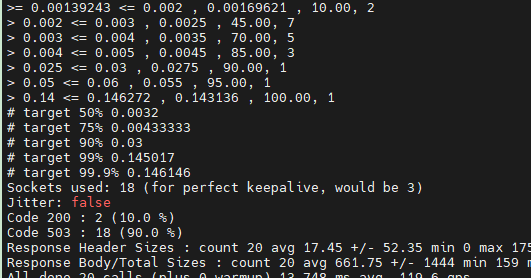


然后删除 productpage 的熔断配置，重新恢复成一个正常的应用。

```
kubectl -n bookinfo apply -f - <<EOF
apiVersion: networking.istio.io/v1alpha3
kind: DestinationRule
metadata:
  name: productpage
spec:
  host: productpage
  subsets:
  - name: v1
    labels:
      version: v1
EOF
```


重新执行

```
kubectl -n bookinfo exec "$FORTIO_POD" -c fortio -- /usr/bin/fortio load -c 3 -qps 0 -n 20 -loglevel Warning http://192.168.3.150:32666/productpage
```

通过打印的日志可以看出，不会再有 503 错误。

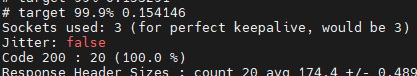

此时访问 http://192.168.3.150:32666/productpage ，页面也应恢复正常。


然后我们清理 fortio

```
kubectl -n bookinfo delete svc fortio
kubectl -n bookinfo delete deployment fortio-deploy
```


