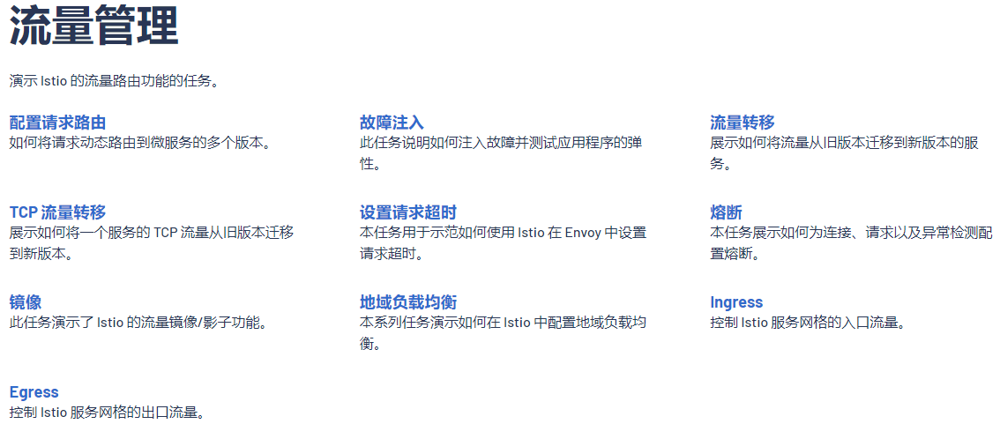
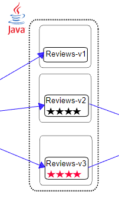
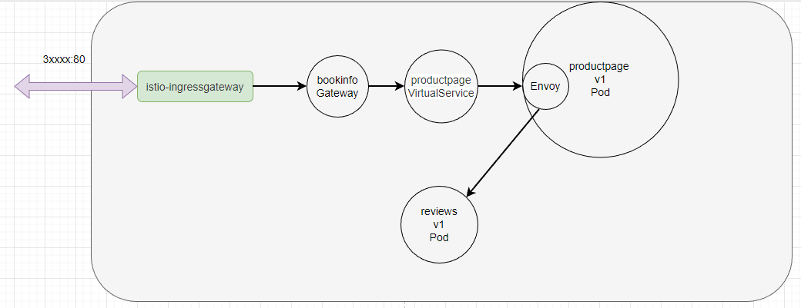
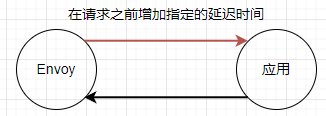
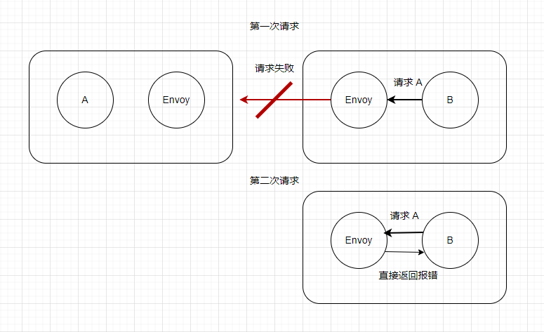

# 4， 流量管理

主要演示了使用 Istio Gateway、VirtualService 对外暴露服务的访问地址 ，以及基于 Istio 实现可观察性的 Kiali 组件。让我们回在上一章中部署的 bookinfo 示例已经学习了什么：

* 使用 Istio Gateway 创建 “站点”；

* 使用 Istio VistualService 暴露 Kubernetes Service，并指定暴露的路由后缀。

* 使用 Kiali 收集服务间的指标。


通过快速练习，我们学到了如何在 Istio 中暴露服务，以及只暴露部分 API。可是只暴露服务并没有太大的用处，因为市面上各种网关都可以做到，并且功能更加丰富。


在微服务系统中，我们会碰到很多关于服务治理的问题，下面是笔者从 ChatGPT 中获取到的一些关于服务治理常见的问题。

1. 服务发现：在动态的微服务环境中，如何实时地发现和注册新的服务实例？
2. 负载均衡：如何在服务实例之间有效地分配请求流量，以实现高性能和高可用性？
3. 容错处理：如何处理服务之间的故障，例如服务实例故障、网络故障等？
4. 流量管理：如何控制服务间的请求流量，例如请求路由、流量分割、金丝雀发布等？
5. 服务监控：如何实时地监控服务的性能和健康状况？
6. 链路追踪：如何跟踪和分析分布式系统中的请求调用链？
7. 安全性：如何确保服务之间的通信安全，例如身份验证、授权和加密？
8. 策略执行：如何实施和管理服务治理的策略，例如限流、熔断、访问控制等？
9. 配置管理：如何在服务之间统一和动态地管理配置信息？
10. 服务编排：如何协调服务之间的交互，以实现复杂的业务流程？


前面的章节提到过， Istio 是服务治理的工具。所以，在本章中，将会介绍 Istio 的流量管理能力，来解决微服务中关于服务治理的部分问题。

Istio 的流量管理模型源于和服务一起部署的 Envoy，网格内 Pod 中的应用发送和接收的所有流量（data plane流量）都经由 Envoy，而应用本身不需要对服务做任何的更改，这对业务来说是非侵入式的，却可以实现强大的流量管理。





### 基于版本的路由配置

在第三章访问的 http://192.168.3.150:30666/productpage?u=normal 地址中，我们每次刷新得到的结果都不一样。

因为 Kubenetes Service 通过标签中的 `app: reviews` 来绑定对应的 Pod，正常情况下，Kubernetes 会将客户端的请求以轮询的方式转发到 Deployment 中的 Pod。



Service 是这样定义的标签选择：

```
  selector:
    app: reviews
```


三个不同的 Reviews Deployment 都带有相同的 `app: reviews` 标签，所以 Service 会把它们的 Pod 放到一起。

```
  labels:
    app: reviews
    version: v1
    
  labels:
    app: reviews
    version: v2
    
  labels:
    app: reviews
    version: v2
```


所以，流量进入 Reviews Service 之后，会被 Kubernetes 均衡地分配到各个 Pod 中。但是 Kubernetes 本身并不支持按照版本来划分流量，此时 Istio 派上用场了。


Istio 通过 DestinationRule 定义了应用的版本，使用 Istio DestinationRule 设置 reviews v1/v2/v3 版本的定义如下所示：

```yaml
apiVersion: networking.istio.io/v1alpha3
kind: DestinationRule
metadata:
  name: reviews
spec:
  host: reviews
  subsets:
  - name: v1
    labels:
      version: v1
  - name: v2
    labels:
      version: v2
  - name: v3
    labels:
      version: v3
```

> 看看就行，不用执行命令。


这看起来非常简单， DestinationRule 没有什么特别的配置。通过 `name: v1` 定义版本，通过 `labels` 指定哪些符合条件的 Pod 划分到这个版本中。


接下来我们创建一个 yaml 文件，给书店微服务的四个应用都创建一个 DestinationRule 。

`service_version.yaml`

```yaml
apiVersion: networking.istio.io/v1alpha3
kind: DestinationRule
metadata:
  name: productpage
spec:
  host: productpage
  subsets:
  - name: v1
    labels:
      version: v1
---
apiVersion: networking.istio.io/v1alpha3
kind: DestinationRule
metadata:
  name: reviews
spec:
  host: reviews
  subsets:
  - name: v1
    labels:
      version: v1
  - name: v2
    labels:
      version: v2
  - name: v3
    labels:
      version: v3
---
apiVersion: networking.istio.io/v1alpha3
kind: DestinationRule
metadata:
  name: ratings
spec:
  host: ratings
  subsets:
  - name: v1
    labels:
      version: v1
  - name: v2
    labels:
      version: v2
  - name: v2-mysql
    labels:
      version: v2-mysql
  - name: v2-mysql-vm
    labels:
      version: v2-mysql-vm
---
apiVersion: networking.istio.io/v1alpha3
kind: DestinationRule
metadata:
  name: details
spec:
  host: details
  subsets:
  - name: v1
    labels:
      version: v1
  - name: v2
    labels:
      version: v2
---
```

```bash
kubectl -n bookinfo apply -f service_version.yaml
```


执行命令查询更多信息

```bash
$> kubectl get destinationrules -o wide -n bookinfo
NAME          HOST          AGE
details       details       59s
productpage   productpage   60s
ratings       ratings       59s
reviews       reviews       59s

```


接着我们为三个微服务 productpage、ratings、details 定义 Istio VirtualService，因为它们都只有 v1 版本，所以在 VirtualService 中直接将流量转发的 v1 版本即可。


`3vs.yaml`

```yaml
apiVersion: networking.istio.io/v1alpha3
kind: VirtualService
metadata:
  name: productpage
spec:
  hosts:
  - productpage
  http:
  - route:
    - destination:
        host: productpage
        subset: v1
---
apiVersion: networking.istio.io/v1alpha3
kind: VirtualService
metadata:
  name: ratings
spec:
  hosts:
  - ratings
  http:
  - route:
    - destination:
        host: ratings
        subset: v1
---
apiVersion: networking.istio.io/v1alpha3
kind: VirtualService
metadata:
  name: details
spec:
  hosts:
  - details
  http:
  - route:
    - destination:
        host: details
        subset: v1
---
```

```bash
kubectl -n bookinfo apply -f 3vs.yaml
```


`  host: reviews` 使用 Service 的名称。如果这样填写，该规则只能应用于当前命名空间的 Service，如果需要将流量引导到其它命名空间的 Service，则需要使用完整的 DNS 路径，如：`reviews.bookinfo.svc.cluster.local`。


而对于 reviews 服务，我们在 VirtualService  只将流量转发到 v1 版本，忽略  v2、v3。

`reviews_v1_vs.yaml`

```yaml
apiVersion: networking.istio.io/v1alpha3
kind: VirtualService
metadata:
  name: reviews
spec:
  hosts:
  - reviews
  http:
  - route:
    - destination:
        host: reviews
        subset: v1
```

```bash
kubectl -n bookinfo apply -f reviews_v1_vs.yaml
```


然后我们查看所有的 VirtualService  。

```bash
$> kubectl get vs -n bookinfo
NAME          GATEWAYS               HOSTS                                AGE
bookinfo      ["bookinfo-gateway"]   ["*"]                                76m
details                              ["details.bookinfo.svc.local"]       103m
productpage                          ["productpage.bookinfo.svc.local"]   103m
ratings                              ["ratings.bookinfo.svc.local"]       103m
reviews                              ["reviews"]                          103m
```


之后，无论怎么刷新 http://192.168.3.150:32666/productpage ，右侧的 Book Reviews 都不会显示星星，因为流量都转发到 v1 版本中，而 v1 版本是不会有星星的。


Istio 起作用的原理大概是这样的，首先是 istio-ingressgateway 将流量转发到 bookinfo 网关中，然后 productpage VirtualService 根据对应的路由规则，判断是否放通流量，最后转发到对应的 productpage 应用中。接着 productpage 需要访问其它服务例如 reviews，发出的请求会经过 Envoy，Envoy 根据配置的 VirtualService 规则，直接将流量转发到对应的 Pod 中。




### 基于 Http header 的路由配置

基于 Http header 的转发，是通过 HTTP 请求中的 header 值，将流量转发到对应的 Pod 中。

在本节中，我们将会通过配置 DestinationRule ，将 header 带有 `end-user: jason` 的流量转发到 v2 中，其它情况依然转发到 v1 版本。


将 reviews 的 DestinationRule 描述文件的内容改成：

```yaml
  http:
  - match:
    - headers:
        end-user:
          exact: jason
    route:
    - destination:
        host: reviews
        subset: v2
  - route:
    - destination:
        host: reviews
        subset: v1
```


完整的 YAML如下：

```yaml
apiVersion: networking.istio.io/v1alpha3
kind: VirtualService
metadata:
  name: reviews
spec:
  hosts:
  - reviews
  http:
  - match:
    - headers:
        end-user:
          exact: jason
    route:
    - destination:
        host: reviews
        subset: v2
  - route:
    - destination:
        host: reviews
        subset: v1
```

> kubectl -n bookinfo apply -f reviews_v2_vs.yaml


然后在页面中的右上角点击 `Sign in` 进行登录，账号密码都是 jason。


此时 Book Reviews 一直显示星星。


如果我们查看 productpage 的日志：


productpage 将这个 header 头转发给 `http://reviews:9080/` ，然后流量经过 Envoy 时，Envoy 检测到 Http header 中带有 end-user ，通过规则决定将流量转发到 reviews v2。**在这个过程中并不需要 Service 参与**。


- 经过上面的配置，下面是请求的流程：
  - `productpage` → `reviews:v2` → `ratings` (针对 `jason` 用户)
  - `productpage` → `reviews:v1` (其他用户)


### 故障注入

故障注入是 Istio 模拟故障的一种手段，通过故障注入我们可以模拟一个服务出现故障的情况，然后从实际请求中看到出现故障时，整个微服务是否会乱套。通过故意在服务间通信中引入错误，例如延迟、中断或错误的返回值，可以测试系统在不理想的运行状况下的表现。这有助于发现潜在的问题，提高系统的健壮性和可靠性。


将前面部署的 ratings 的 VirtualService，改造一下。

`ratings_delay.yaml`

```yaml
apiVersion: networking.istio.io/v1alpha3
kind: VirtualService
metadata:
  name: ratings
spec:
  hosts:
  - ratings
  http:
  - match:
    - headers:
        end-user:
          exact: jason
    fault:
      delay:
        percentage:
          value: 100.0
        fixedDelay: 7s
    route:
    - destination:
        host: ratings
        subset: v1
  - route:
    - destination:
        host: ratings
        subset: v1
```

```
kubectl -n bookinfo apply -f ratings_delay.yaml
```


再次访问网页，发现评论区已经加载不出来了，因为超时。


#### 两种故障注入

在 Istio 的 VirtualService 中，`fault` 配置用于注入故障，以模拟和测试应用程序在出现问题时的行为。主要有两种类型的故障注入：延迟（delay）和异常（abort）。


**延迟故障注入**

延迟故障注入用于在应答之前向请求添加指定的延迟时间。这可以测试应用程序在网络延迟或服务响应缓慢的情况下的表现。以下是一个示例，演示了如何在 VirtualService 中添加一个延迟故障注入：

```yaml
  http:  
  - fault:  
      delay:  
        percentage:  
          value: 100.0  
        fixedDelay: 5s  
```



延迟（delay）故障注入有两个主要属性。

- `percentage`: 表示注入延迟的概率，取值范围为 0.0 到 100.0。例如，50.0 表示有 50% 的概率注入延迟。
- `fixedDelay`: 表示注入的固定延迟时间，通常以秒（s）或毫秒（ms）为单位。例如，`5s` 表示 5 秒延迟。

延迟故障注入的示例：

```
fault:  
  delay:  
    percentage:  
      value: 50.0  
    fixedDelay: 5s  
```

在这个示例中，`delay` 配置了一个 50% 概率发生的 5 秒固定延迟。


**异常故障注入**

异常故障注入用于模拟请求失败的情况，例如 HTTP 错误状态码或 gRPC 状态码。这可以帮助测试应用程序在遇到故障时的恢复能力。以下是一个示例，演示了如何在 VirtualService 中添加一个异常故障注入：

```
  http:  
  - fault:  
      abort:  
        percentage:  
          value: 100.0  
        httpStatus: 503 
```


也可以将延迟故障注入 和 异常故障注入两者放在一起同时使用。

```yaml
  http:  
  - fault:  
      delay:  
        percentage:  
          value: 50.0  
        fixedDelay: 5s  
      abort:  
        percentage:  
          value: 50.0  
        httpStatus: 503 
```

> 虽然放在一起使用，但是并不会两种情况同时发生，而是通过 percentage 来配置出现的概率。


异常（abort）故障注入有四个主要属性。

- `percentage`: 表示注入异常的概率，取值范围为 0.0 到 100.0。例如，50.0 表示有 50% 的概率注入异常。
- `httpStatus`: 表示要注入的 HTTP 错误状态码。例如，`503` 表示 HTTP 503 错误。
- `grpcStatus`: 表示要注入的 gRPC 错误状态码。例如，`UNAVAILABLE` 表示 gRPC 服务不可用错误。
- `http2Error`: 表示要注入的 HTTP/2 错误。例如，`CANCEL` 表示 HTTP/2 流被取消。

异常故障注入的示例：

```
fault:  
  abort:  
    percentage:  
      value: 50.0  
    httpStatus: 503  
```


实验完成后，别忘了将 ratings 服务恢复正常。

```
kubectl -n bookinfo apply -f 3vs.yaml
```


### 比例分配流量

使用下面的配置，可以把 50% 的流量分配给 `reviews:v1` 和  `reviews:v3`：

```yaml
apiVersion: networking.istio.io/v1alpha3
kind: VirtualService
metadata:
  name: reviews
spec:
  hosts:
    - reviews
  http:
  - route:
    - destination:
        host: reviews
        subset: v1
      weight: 50
    - destination:
        host: reviews
        subset: v3
      weight: 50
```


刷新浏览器中的 `/productpage` 页面，大约有 50% 的几率会看到页面中带 *红色* 星级的评价内容。这是因为 `reviews` 的 `v3` 版本可以访问带星级评价，但 `v1` 版本不能。


### 请求超时

不同编程语言都会提供 http client 类库，程序发起 http 请求时，程序本身一般都会有超时时间，超过这个时间，代码会抛出异常。而网关如 nginx、apisix 等，也有 http 连接超时的功能。

在 Istio 中，服务间的调用也可以由 Istio 进行管理，可以设置超时断开。

我们可以为 reviews 服务设置 http 入口超时时间，当其它服务 请求reviews 服务时，如果 http 请求超过 0.5s，那么 Istio 立即断开 http 请求。

`reviews_timeout.yaml`

```yaml
apiVersion: networking.istio.io/v1alpha3
kind: VirtualService
metadata:
  name: reviews
spec:
  hosts:
  - reviews
  http:
  - route:
    - destination:
        host: reviews
        subset: v2
    timeout: 0.5s
```

```
kubectl -n bookinfo apply -f reviews_timeout.yaml
```


因为 reviews 依赖于 ratings 服务，为了模拟这种超时情况，我们可以给 ratings 注入延迟故障。这样 ratings 会给所有请求都延迟 2s 才会返回响应，但是 reviews 要求所有请求 reviews 的流量在 0.5s 内响应。


给 ratings 设置延迟故障：

```yaml
kubectl -n bookinfo apply -f - <<EOF
apiVersion: networking.istio.io/v1alpha3
kind: VirtualService
metadata:
  name: ratings
spec:
  hosts:
  - ratings
  http:
  - fault:
      delay:
        percent: 100
        fixedDelay: 2s
    route:
    - destination:
        host: ratings
        subset: v1
EOF
```


我们再次刷新页面。


> 注：因为 productpage 是 Python 编写的，其代码中设置了请求失败后自动重试一次，因此页面刷新后 1 s 后才会完成，而不是 0.5s。


还有一点关于 Istio 中超时控制方面的补充说明，除了像本文一样在路由规则中进行超时设置之外，还可以进行请求一级的设置，只需在应用的对外请求中加入 `x-envoy-upstream-rq-timeout-ms` 请求头即可。在这个请求头中的超时设置单位是毫秒而不是秒。


现在让我们将本小节的故障清理掉，恢复正常的微服务。

```yaml
kubectl -n bookinfo apply -f - <<EOF
apiVersion: networking.istio.io/v1alpha3
kind: VirtualService
metadata:
  name: reviews
spec:
  hosts:
    - reviews
  http:
  - route:
    - destination:
        host: reviews
        subset: v1
      weight: 50
    - destination:
        host: reviews
        subset: v3
      weight: 50
EOF
kubectl -n bookinfo apply -f - <<EOF
apiVersion: networking.istio.io/v1alpha3
kind: VirtualService
metadata:
  name: ratings
spec:
  hosts:
  - ratings
  http:
  - route:
    - destination:
        host: ratings
        subset: v1
EOF
```


### 熔断


#### 什么是熔断

熔断（Circuit Breaking）是微服务架构中的一种重要的弹性设计模式，在微服务环境中，不同的服务存在依赖关系，当其中一个依赖的服务出现问题时，可能导致请求积压，从而影响到其他服务和整个系统的稳定性。比如说，B 服务来了 100 个请求，B 需要请求 100 次 A 服务，但是A 服务故障了，那么每次失败时都会重试一次，那么整体上就一共请求了 200 次。这样就会造成很大的浪费。而熔断器可以检测到这种情况，当检测到 A 服务故障之后，一段时间内所有对 A 的请求都会直接返回错误。

 




熔断器模式的工作原理如下：

1. 正常状态：熔断器处于关闭状态，允许请求通过。在这个状态下，熔断器会监控请求的成功和失败率。

2. 故障检测：当失败率达到预先定义的阈值时，熔断器会切换到打开状态。

3. 熔断状态：熔断器处于打开状态时，将拒绝所有新的请求，并返回错误响应。这可以防止故障级联和给故障服务带来更多的压力。

4. 恢复状态：在一段时间后，熔断器会进入半打开状态，允许一部分请求通过。如果这些请求成功，则熔断器将返回到关闭状态；如果仍然存在失败请求，则熔断器继续保持打开状态。

   使用熔断器模式可以提高微服务系统的弹性和稳定性。在实现熔断器时，可以使用开源库如Netflix的Hystrix或者服务网格技术如Istio等。这些工具提供了熔断器模式的实现，以及其他弹性设计模式，如负载均衡、重试和超时等。


#### 创建 httpbin 服务

接下来本节将会使用一个 httpbin 服务，这个服务代码可以在 istio 官方仓库中找到： https://github.com/istio/istio/tree/release-1.17/samples/httpbin


创建一个 httpbin 服务。

`httpbin.yaml `

```yaml
apiVersion: v1
kind: ServiceAccount
metadata:
  name: httpbin
---
apiVersion: v1
kind: Service
metadata:
  name: httpbin
  labels:
    app: httpbin
    service: httpbin
spec:
  ports:
  - name: http
    port: 8000
    targetPort: 80
  selector:
    app: httpbin
  type: NodePort
---
apiVersion: apps/v1
kind: Deployment
metadata:
  name: httpbin
spec:
  replicas: 1
  selector:
    matchLabels:
      app: httpbin
      version: v1
  template:
    metadata:
      labels:
        app: httpbin
        version: v1
    spec:
      serviceAccountName: httpbin
      containers:
      - image: docker.io/kennethreitz/httpbin
        imagePullPolicy: IfNotPresent
        name: httpbin
        ports:
        - containerPort: 80
```

```bash
kubectl -n bookinfo apply -f  httpbin.yaml
```

> 这里使用的 NodePort 只是为了分别预览访问，后续还需要通过 Gateway 来实验熔断。


然后查看 Service 列表。


通过浏览器打开对应的服务。


接着给 httpbin 创建一个 DestinationRule ，里面配置了熔断规则。

`httpbin_circurt.yaml`

```yaml
apiVersion: networking.istio.io/v1alpha3
kind: DestinationRule
metadata:
  name: httpbin
spec:
  host: httpbin
  trafficPolicy:
    connectionPool:
      tcp:
        maxConnections: 1
      http:
        http1MaxPendingRequests: 1
        maxRequestsPerConnection: 1
    outlierDetection:
      consecutive5xxErrors: 1
      interval: 1s
      baseEjectionTime: 3m
      maxEjectionPercent: 100
```

```
kubectl -n bookinfo apply -f  httpbin_circuit.yaml
```


`DestinationRule`（目标规则）用于定义访问特定服务的流量策略。`DestinationRule` 配置中的 `trafficPolicy` 属性允许为服务指定全局的流量策略。这些策略包括负载均衡设置、连接池设置、异常检测等。


#### 创建访问者服务


在 Istio 服务网格中，当流量进入网格时，它会被 Sidecar 代理（Envoy 代理）拦截并根据相关配置进行路由。要触发熔断，流量必须经过 Envoy 代理，因为熔断逻辑是在 Envoy 代理中实现的。因此，在 Istio 服务网格中，您应该确保流量经过 Envoy 代理，以便根据 `DestinationRule` 的熔断设置触发熔断。

然而，如果您直接访问 Kubernetes 的 `Service`，这意味着流量可能没有经过 Envoy 代理。在这种情况下，Istio 的熔断机制将不起作用。不过，Kubernetes 也有其自己的负载均衡和服务发现机制，它可能会在一定程度上处理故障实例。但是，这种处理方式与 Istio 的熔断机制不同，没有相应的熔断策略可供配置。

因此，为了确保熔断机制生效，请确保在 Istio 服务网格中的流量经过 Envoy 代理。通常，这意味着使用网格内部的服务名称（例如 `myapp.default.svc.cluster.local`）作为目标主机，而不是直接使用 Kubernetes `Service` 的 IP 地址。


```yaml
apiVersion: v1
kind: Service
metadata:
  name: fortio
  labels:
    app: fortio
    service: fortio
spec:
  ports:
  - port: 8080
    name: http
  selector:
    app: fortio
---
apiVersion: apps/v1
kind: Deployment
metadata:
  name: fortio-deploy
spec:
  replicas: 1
  selector:
    matchLabels:
      app: fortio
  template:
    metadata:
      annotations:
        # This annotation causes Envoy to serve cluster.outbound statistics via 15000/stats
        # in addition to the stats normally served by Istio. The Circuit Breaking example task
        # gives an example of inspecting Envoy stats via proxy config.
        proxy.istio.io/config: |-
          proxyStatsMatcher:
            inclusionPrefixes:
            - "cluster.outbound"
            - "cluster_manager"
            - "listener_manager"
            - "server"
            - "cluster.xds-grpc"
      labels:
        app: fortio
    spec:
      containers:
      - name: fortio
        image: fortio/fortio:latest_release
        imagePullPolicy: Always
        ports:
        - containerPort: 8080
          name: http-fortio
        - containerPort: 8079
          name: grpc-ping
```

```
 kubectl -n bookinfo apply -f  fortio_deploy.yaml
```


执行命令获取 fortio 的 pod 名称

```
export FORTIO_POD=$(kubectl get pods -n bookinfo -l app=fortio -o 'jsonpath={.items[0].metadata.name}')
```

然后让 pod 容器执行命令

```
kubectl -n bookinfo exec "$FORTIO_POD" -c fortio -- /usr/bin/fortio curl -quiet http://httpbin:8000/get
```


```
kubectl -n bookinfo exec "$FORTIO_POD" -c fortio -- /usr/bin/fortio load -c 3 -qps 0 -n 20 -loglevel Warning http://httpbin:8000/get
```


在控制台中可以看到请求返回 200 和 503 的比例。


现在让我们清理示例程序。

```
kubectl -n bookinfo delete destinationrule httpbin
kubectl -n bookinfo delete sa httpbin
kubectl -n bookinfo delete svc httpbin
kubectl -n bookinfo delete deployment httpbin
```


productpage_circuit.yaml

```
apiVersion: networking.istio.io/v1alpha3
kind: DestinationRule
metadata:
  name: productpage
spec:
  host: productpage
  subsets:
  - name: v1
    labels:
      version: v1
  trafficPolicy:
    connectionPool:
      tcp:
        maxConnections: 1
      http:
        http1MaxPendingRequests: 1
        maxRequestsPerConnection: 1
    outlierDetection:
      consecutive5xxErrors: 1
      interval: 1s
      baseEjectionTime: 3m
      maxEjectionPercent: 100
```


```
kubectl -n bookinfo apply -f productpage_circuit.yaml
```


然后我们使用 fortio 测试 productpage 应用，从 istio gateway 入口进行访问。

```
kubectl -n bookinfo exec "$FORTIO_POD" -c fortio -- /usr/bin/fortio load -c 3 -qps 0 -n 20 -loglevel Warning http://192.168.3.150:32666/productpage
```


然后删除 productpage 的熔断配置，重新恢复成一个正常的应用。

```
kubectl -n bookinfo apply -f - <<EOF
apiVersion: networking.istio.io/v1alpha3
kind: DestinationRule
metadata:
  name: productpage
spec:
  host: productpage
  subsets:
  - name: v1DestinationRule
    labels:
      version: v1
EOF
```


重新执行

```
kubectl -n bookinfo exec "$FORTIO_POD" -c fortio -- /usr/bin/fortio load -c 3 -qps 0 -n 20 -loglevel Warning http://192.168.3.150:32666/productpage
```

通过打印的日志可以看出，不会再有 503 错误。


此时访问 http://192.168.3.150:32666/productpage ，页面也应恢复正常。


然后我们清理 fortio

```
DestinationRuleDestinationRulekubectl -n bookinfo delete svc fortio
kubectl -n bookinfo delete deployment fortio-deploy
```
