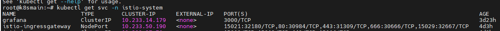

# 5，网关

Istio Gateway 是类似于 Kubernetes Ingress 一种对象。

Istio Ingress Gateway是Istio服务网格中的一个关键组件，它充当从外部访问网格内部服务的入口点。基于Envoy代理，Istio Ingress Gateway为流量提供了管理、安全和可观察性功能。

以下是Istio Ingress Gateway的主要作用和特点：

1. 接收从服务网格外部发起的流量，并根据Istio的配置将其路由到相应的内部服务。

2. 提供负载平衡和流量控制功能，如请求路由、重试和超时。

3. 支持TLS终止，以便在流量进入服务网格之前加密。

4. 支持双向TLS身份验证，以提高服务网格的安全性。

5. 提供遥测数据和访问日志，以便更好地观察和监控流量。

   与Kubernetes Ingress资源相比，Istio Ingress Gateway具有一些差异。虽然它们都作为从外部访问集群内部服务的入口点，但Istio Ingress Gateway提供了更高级的功能，如流量管理、安全和可观察性。此外，Istio Ingress Gateway可以与其他Istio组件（如VirtualService和DestinationRule）一起使用，实现更复杂的流量控制和策略执行。

   

首先是 istio-ingressgateway，




可以看到，istio-ingressgateway 本身占用了不少端口。

只有流量进入到这些端口时， istio-ingressgateway 才能起作用。


下面我们将使用 httpbin 服务作为示例，如何一步步配置在外部访问 httpbin 服务。


## 入口网关

#### 部署服务

首先部署 httpbin 服务。

`httpbin.yaml`

```yaml
apiVersion: v1
kind: ServiceAccount
metadata:
  name: httpbin
---
apiVersion: v1
kind: Service
metadata:
  name: httpbin
  labels:
    app: httpbin
    service: httpbin
spec:
  ports:
  - name: http
    port: 8000
    targetPort: 80
  selector:
    app: httpbin
---
apiVersion: apps/v1
kind: Deployment
metadata:
  name: httpbin
spec:
  replicas: 1
  selector:
    matchLabels:
      app: httpbin
      version: v1
  template:
    metadata:
      labels:
        app: httpbin
        version: v1
    spec:
      serviceAccountName: httpbin
      containers:
      - image: docker.io/kennethreitz/httpbin
        imagePullPolicy: IfNotPresent
        name: httpbin
        ports:
        - containerPort: 80
```

```
kubectl -n bookinfo apply -f httpbin.yaml
```


#### 配置 Gateway

配置入口网关

这一步仅从 istio-ingressgateway 中引导一份流量，即创建了路由。

也可以理解为创建了一个站点，这个站点监控了某些域名或ip，但是还没有配置上游。

`httpbin_gw.yaml`

```yaml
apiVersion: networking.istio.io/v1alpha3
kind: Gateway
metadata:
  name: httpbin-gateway
spec:
  selector:
    istio: ingressgateway # use Istio default gateway implementation
  servers:
  - port:
      number: 80
      name: http
      protocol: HTTP
    hosts:
    - "httpbin.s1.whuanle.cn"
    - "*"
```

> `httpbin.s1.whuanle.cn` 替换为自己的域名。
>
> 在自己的电脑中打开 `C:\Windows\System32\drivers\etc\hosts ` 增加一条记录 
>
> 


```bash
kubectl -n bookinfo apply -f httpbin_gw.yaml
```


接下来我们将要为 Gateway 配置服务地址，并配置外部允许访问的地址后缀。

配置 VistualService

```yaml
apiVersion: networking.istio.io/v1alpha3
kind: VirtualService
metadata:
  name: httpbin
spec:
  hosts:
  - "*"
  gateways:
  - httpbin-gateway
  http:
  - match: 
    - uri:
        prefix: /status
    - uri:
        prefix: /delay 
    route:
    - destination:
        port:
          number: 8000
        host: httpbin
```

> 当 Gateway 和 VirtualService 端口只有一个时，不需要配置端口绑定。

```
kubectl -n bookinfo apply -f httpbin_vs.yaml
```


找到 istio-ingressgateway 对外暴露的端口。

```
kubectl get svc istio-ingressgateway  -n istio-system
```


httpbin 是一个 http 测试程序，我们可以通过使用 `/status/{状态码}` 获取对应的 http 请求状态。

例如：


如果我们不希望这个服务被外界访问到，我们可以先把 `/status` 删除。

```
kubectl apply -f - <<EOF
apiVersion: networking.istio.io/v1alpha3
kind: VirtualService
metadata:
  name: httpbin
spec:
  hosts:
  - "*"
  gateways:
  - httpbin-gateway
  http:
  - match:
    - uri:
        prefix: /delay
    route:
    - destination:
        port:
          number: 8000
        host: httpbin
EOF
```


此时你将无法访问 `status` 路径。

但是我们还可以访问 `/delay` 路径。

delay 路径用于延迟 http 请求响应使用，`/delay/{秒数}`.

例如 http://192.168.3.150:32309/delay/5 将在 5 秒后响应。


httpbin 还有很多路由接口，我们可以通过 VirtualService 配置放通哪些路径。


如果需要全部放通，可以使用：

```
kubectl apply -f - <<EOF
apiVersion: networking.istio.io/v1alpha3
kind: VirtualService
metadata:
  name: httpbin
spec:
  hosts:
  - "*"
  gateways:
  - httpbin-gateway
  http:
  - match:
    - uri:
        prefix: /
    route:
    - destination:
        port:
          number: 8000
        host: httpbin
        subset: v1
EOF
```


### 子版本

第四章中进行版本路由实验时，使用到。

```
kubectl -n bookinfo apply -f - <<EOF
apiVersion: networking.istio.io/v1alpha3
kind: DestinationRule
metadata:
  name: httpbin
spec:
  host: httpbin
  subsets:
  - name: v1
    labels:
      version: v1
EOF
```


首先是使用 DestinationRule 指向一个 Service，

```yaml
  host: httpbin
```

当然，我们也可以写成

```
  host: httpbin.bookinfo.svc.cluster.local
```


通过 host 可以识别到对应的 Kubernetes Service，然后从 Service 对应的 Endpoints 中获得所有 Pod 列表。


通过 Endpoints 获得所有 Pod 之后，查看每个 Pod 的描述信息。当有一个请求到达时，根据 DestinationRule 中的标签选择器，选择合适的 Pod 进行访问。

```
  - name: v1
    labels:
      version: v1
```


## 出口网关


当集群内部要访问外部的一个服务时，需要配置访问地址，如 aaa.com。


Istio ServiceEntry 是一种资源，允许您将外部服务（即不在Istio服务网格中的服务）纳入Istio服务网格。通过将外部服务添加到网格，您可以使用Istio的流量管理和策略功能来控制与这些外部服务的交互。


以下是一个ServiceEntry示例，将外部HTTP服务` www.google.com`添加到Istio服务网格：

```
apiVersion: networking.istio.io/v1alpha3  
kind: ServiceEntry  
metadata:  
  name: google
spec:  
  hosts:  
  - www.google.com  
  addresses:  
  - 192.168.1.1  
  ports:  
  - number: 80  
    name: http  
    protocol: HTTP  
  location: MESH_EXTERNAL  
  resolution: DNS  
  endpoints:  
  - address: "www.google.com"  
    ports:  
      http: 80  
    locality: "us-west1/zone1"  
  exportTo:  
  - "*"  

```

 
在此示例中，我们创建了一个名为`httpbin-ext`的ServiceEntry资源。指定的主机为`httpbin.org`，端口号为80，协议为HTTP。此外，我们将`resolution`设置为`DNS`，将`location`设置为`MESH_EXTERNAL`，表示该服务位于网格之外。

要将此ServiceEntry应用到集群，请将其保存到一个YAML文件（例如：`httpbin-ext.yaml`），然后运行以下命令：

```
kubectl apply -f httpbin-ext.yaml  
```


现在，Istio服务网格中的服务可以访问`httpbin.org`，同时仍受Istio策略的控制。例如，您可以为此ServiceEntry创建VirtualService以应用流量管理规则，或者为其创建DestinationRule以配置负载均衡和连接池设置。


安装 istio-egressgateway 

```
helm install istio-egressgateway istio/gateway -n istio-system
```

`spec`: 包含ServiceEntry的具体配置的对象。

- `hosts`: 一个包含要导入的外部服务的主机名（FQDN）的列表。例如：`["httpbin.org"]`。
- `addresses`: （可选）与外部服务关联的虚拟IP地址的列表。例如：`["192.168.1.1"]`。
- ports: 一个描述外部服务使用的端口的列表。每个端口都有以下属性：
  - `number`: 端口号，例如：80。
  - `name`: 端口的名称，例如：`http`。
  - `protocol`: 使用的协议，例如：`HTTP`、`TCP`、`HTTPS`等。
- `location`: 服务的位置。可以是`MESH_EXTERNAL`（表示服务在网格外部）或`MESH_INTERNAL`（表示服务在网格内部，但不属于任何已知服务）。
- `resolution`: 用于确定服务实例地址的解析方法。可以是`NONE`（默认值，表示不解析地址），`STATIC`（表示使用`addresses`字段中的IP地址），`DNS`（表示使用DNS解析主机名）或`MESH_EXTERNAL`。
- endpoints: （可选）外部服务的端点列表。每个端点都有以下属性：
  - `address`: 端点的IP地址或主机名。
  - `ports`: 一个包含端口名称和端口号的映射，例如：`{"http": 8080}`。
  - `labels`: （可选）应用于端点的标签。
  - `locality`: （可选）端点的地理位置，例如：`us-west1/zone1`。
- `exportTo`: （可选）一个包含命名空间名称的列表，指定可以访问此ServiceEntry的命名空间。可以使用星号（`*`）表示所有命名空间。默认值为`*`。
- `subjectAltNames`: （可选）用于验证服务器证书主题替代名（SANs）的列表。


https://istio.io/latest/zh/docs/tasks/traffic-management/egress/egress-control/