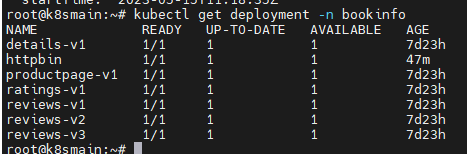
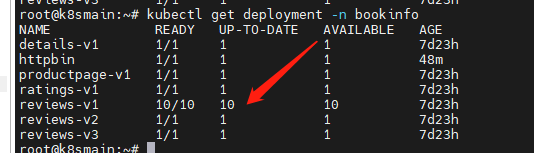
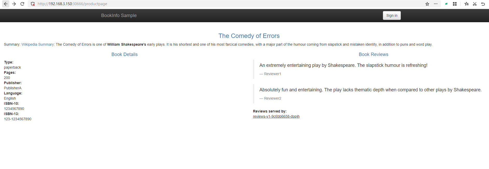
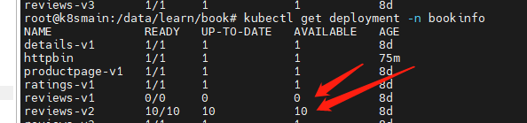

# 6，金丝雀发布

项目总是处于不断变化之中，每次发布新的版本时，都考验了团队的运维能力。


<center>【图源：互联网】</center>

新版本上线之前，经历过开发和测试人员的验证，也经过产品经理的验收。可是当要上线到生产环境时，谁也保证不了上线一定就能跑起来。所以往往需要在上线时保持新版本和旧版本同时在用，测试人员或内测用户可以访问新版本，其他人继续使用旧版本。再有就是上线时新旧系统能够丝滑切换，用户完全感知不到这种变化。

并且新版本上线时，不应该影响旧版本的运行，要求实现不停止更新。但是除了应用本身，还涉及到新旧版本共有同一个数据库，新旧版本应用对应的数据库表结构不一样。

> 新旧版本切换带来的问题很多，但是，在本系列教程中我们只考虑外部访问效果即可。


很多项目的版本更新做得并不好。很多初级阶段的 Web 服务团队，每次更新都需要中断当前的应用，后端服务有一段时间内不可用。如果新版本有问题，那么还需要重新发布旧版本。如果只是内部服务，问题不大，可是如果系统是给客户使用的，那么很容易让客户给出一个低分的评价。


<center>【图源：互联网】</center>


Kubernetes 中虽然有滚动升级，能够逐渐使用新版本的 Pod 替换旧版本的 Pod，两个版本共存，但是并不能做到流量自由切分，一个流量进入时，依然会在新旧版本的 Pod 中轮询选择。但是我们还是可以调整 v1 和 v2 的 Pod 数量，实现流量按照比例划分，比如 v1 的 Pod 数量有 40 个，v2 的 Pod 的数量有 60 个，那么按照比例，会有 60% 的流量进入到 v2 中。不过这样并没有什么鸟用。

> Kubernetes 滚动升级、伸缩参考资料：https://k8s.whuanle.cn/3.pod/6.scale.html


Istio 中虽然没有名为 金丝雀发布的功能，但是按照之前我们所学到的 Istio 的 VirtualService 、DestinationRule 就可以实现根据请求的 header 等，将流量转发到不同的子版本中，我们使用这些操作方法即可实现金丝雀发布。


### 金丝雀发布

尴尬，在学习 Istio 之前，我对蓝绿发布、灰度发布、金丝雀发布的概念并不清晰，很多文章都是将它们分成三类发布方式。实际上蓝绿发布和金丝雀发布都是灰度发布的一种。

灰度发布是两个版本共存，将一小部分流量切到新版本中，当新版本经过一段时间验证后，如果没有问题，再将流量逐步切换到新版本中。

所以，可以把蓝绿发布、A/B 测试、金丝雀发布都划分为灰度发布。

> 当然，它们有一些差别，每个人的划分方法也有差别，有的说法是金丝雀发布才是灰度发布。


**蓝绿发布**

蓝绿发布的方式是使用另一套资源部署新版本，然后将旧版本的流量都切换到新版本中去，缺点是需要消耗两套资源，而且蓝绿发布是全量切换，如果新版本出现问题则会影响到所有用户。


**A/B 测试**

A/B 测试是同时部署两个版本对等的版本来接收流量，但它不是指新旧版本。比如，产品经理有一个好主意，做新时代的农场区块链，想知道大家喜欢养猪还是养鸡。于是发布了养猪农场和养鸡农场两个对等的应用，然后邀请不同的用户进行内测，喜欢养猪的用户会被导向养猪农场应用。然后收集用户的意见和各种指标数据，分析用户喜欢养什么动物，最后决定上线什么版本。


**金丝雀发布**

先上线一个新版本，然后根据规则将一小部分用户导向到新应用，观察新版本在生产环境的表现，如果达到预期，则逐步将流量切换到新版本中。


### 按照流量比例划分

在第四章中，我们使用 DestinationRule 为 reviews 定义了三个版本，但是每个版本只有一个 Pod。

```yaml
apiVersion: networking.istio.io/v1alpha3
kind: DestinationRule
metadata:
  name: reviews
spec:
  host: reviews
  subsets:
  - name: v1
    labels:
      version: v1
  - name: v2
    labels:
      version: v2
  - name: v3
    labels:
      version: v3
```



现在使用命令将 v1 版本增加到 10 个 pod。

```yaml
kubectl scale deployment reviews-v1 -n bookinfo --replicas=10
```




在原配置不变的情况下，我们来部署 VirtualService，将流量的 90% 打入到包含 10个 Pod 的 v1 版本。因为 v2 版本只有10% 的流量，所以只需要 1 个 Pod 也可以支撑了叭。

```yaml
kubectl -n bookinfo apply -f - <<EOF
apiVersion: networking.istio.io/v1alpha3
kind: VirtualService
metadata:
  name: reviews
spec:
  hosts:
    - reviews
  http:  
  - route:  
    - destination:  
        host: reviews
        subset: v1  
      weight: 90  
    - destination:  
        host: reviews
        subset: v2  
      weight: 10  
EOF
```


命令之前完毕之后，不断刷新 productpage页面，会发现大部分情况下不会显示评星，少部分情况会出现黑色的星星。



#### 按照 Header 划分

当然，也可以使用 header 的方式，将流量导入到不同的版本中。比如只有测试人员的流量才会打入到新版本中。

```yaml
  http:
  - match:
    - headers:
        end-user:
          exact: jason
    route:
    - destination:
        host: reviews
        subset: v2
  - route:
    - destination:
        host: reviews
        subset: v1
```


当我们检查 v2 版本没有问题之后，我们就将 v2 版本扩容。

```
kubectl scale deployment reviews-v2 -n bookinfo --replicas=10
```


与此同时，修改 VirtualService，将全部流量路由到 v2 中。

```yaml
kubectl -n bookinfo apply -f - <<EOF
apiVersion: networking.istio.io/v1alpha3
kind: VirtualService
metadata:
  name: reviews
spec:
  hosts:
    - reviews
  http:  
  - route:  
    - destination:  
        host: reviews
        subset: v1  
      weight: 0  
    - destination:  
        host: reviews
        subset: v2  
      weight: 100  
EOF
```


当一段时间后，如果一切正常，将 v1 版本的 Pod 数量降低为 0。

```
kubectl scale deployment reviews-v1 -n bookinfo --replicas=0
```



但是不要删除  v1 版本，如果新版本出现问题，我们只需要调整 v1版本的 Pod 数量，然后修改 VirtualService ，将理论导入到 v1 即可。


金丝雀发布其实很简单，除了 Istio 之外，我们通过 Nginx、Apisix、Kong 等网关都可以轻松实现。
