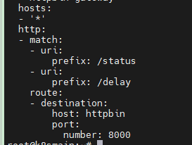

# 7，安全


在Istio中，默认情况下，服务之间的通信不会被加密或进行身份验证。这意味着，如果您没有明确配置安全策略，服务之间的通信将使用纯文本（即未加密）传输，且不会对调用方进行身份验证。


Istio 提供两种类型的认证：

- Peer authentication：用于服务到服务的认证，以验证建立连接的客户端。Istio 提供[双向 TLS](https://en.wikipedia.org/wiki/Mutual_authentication) 作为传输认证的全栈解决方案，无需更改服务代码就可以启用它。这个解决方案：
  - 为每个服务提供强大的身份，表示其角色，以实现跨群集和云的互操作性。
  - 保护服务到服务的通信。
  - 提供密钥管理系统，以自动进行密钥和证书的生成，分发和轮换。
- Request authentication：用于终端用户认证，以验证附加到请求的凭据。 Istio 使用 JSON Web Token（JWT）验证启用请求级认证，并使用自定义认证实现或任何 OpenID Connect 的认证实现（例如下面列举的）来简化的开发人员体验。
  - [ORY Hydra](https://www.ory.sh/)
  - [Keycloak](https://www.keycloak.org/)
  - [Auth0](https://auth0.com/)
  - [Firebase Auth](https://firebase.google.com/docs/auth/)
  - [Google Auth](https://developers.google.com/identity/protocols/OpenIDConnect)

在所有情况下，Istio 都通过自定义 Kubernetes API 将认证策略存储在 `Istio config store`。Istiod 使每个代理保持最新状态，并在适当时提供密钥。此外，Istio 的认证机制支持宽容模式（permissive mode），以帮助您在强制实施前了解策略更改将如何影响您的安全状况。


除此之外，还有一个 AuthorizationPolicy。

RequestAuthentication和AuthorizationPolicy：这两个策略用于验证和授权客户端访问服务网格中的服务。RequestAuthentication负责验证客户端提供的JSON Web Token（JWT），而AuthorizationPolicy负责基于角色的访问控制（RBAC），允许您定义细粒度的权限以限制对特定服务、方法和路径的访问。


#### Peer authentication

Istio的PeerAuthentication是一种安全策略，用于对服务网格内的工作负载之间的通信进行双向TLS（mTLS）验证。通过PeerAuthentication，您可以强制执行mTLS，以确保工作负载之间的通信在传输过程中是加密和安全的。PeerAuthentication可以配置为全局范围或命名空间范围的策略。

只能有一个网格范围的 Peer 认证策略，每个命名空间也只能有一个命名空间范围的 Peer 认证策略。


- `selector`: 标签选择器，用于选择应用PeerAuthentication策略的工作负载。例如：

```
selector:  
  matchLabels:  
    app: my-app  
```

如果省略选择器，PeerAuthentication策略将应用于命名空间中的所有工作负载。

- mtls: 定义双向TLS的模式。它可以是以下之一：
  
  - `STRICT`: 强制执行mTLS，要求客户端和服务器使用TLS进行通信。这需要客户端和服务器具有有效的证书。

  - `PERMISSIVE`: 允许客户端使用TLS或纯文本进行通信。这对于逐步迁移到mTLS的场景非常有用。

  - `DISABLE`: 禁用mTLS，不要求客户端和服务器使用TLS进行通信。

    下面是一个简单的PeerAuthentication示例：

```
apiVersion: security.istio.io/v1beta1  
kind: PeerAuthentication  
metadata:  
  name: my-peer-authentication  
  namespace: my-namespace  
spec:  
  selector:  
    matchLabels:  
      app: my-app  
  mtls:  
    mode: STRICT  
```

这个示例定义了一个PeerAuthentication策略，强制执行具有标签`app: my-app`的工作负载之间的双向TLS通信。

> 只能有一个网格范围的 Peer 认证策略，每个命名空间也只能有一个命名空间范围的 Peer 认证策略。当您为同一网格或命名空间配置多个网格范围或命名空间范围的 Peer 认证策略时，Istio 会忽略较新的策略。当多个特定于工作负载的 Peer 认证策略匹配时，Istio 将选择最旧的策略。


我们对之前的 bookinfo 微服务设置命名空间内均需要使用 mTLS。

```
kubectl apply -f - <<EOF
apiVersion: "security.istio.io/v1beta1"
kind: "PeerAuthentication"
metadata:
  name: "bookinfo-policy"
  namespace: "bookinfo"
spec:
  mtls:
    mode: STRICT
EOF
```


然后再次请求 productpage 服务。

在 kiali 中的 Display 选项中下拉选择 Security。


请注意，PeerAuthentication策略仅适用于Istio服务网格内的通信。如果客户端（发送请求的工作负载）和服务端（接收请求的工作负载）都在服务网格内，那么它们之间的通信将通过mTLS加密，但在应用层仍然可以使用HTTP。这意味着，虽然底层的传输层使用的是mTLS，但应用层仍然可以使用HTTP协议，如REST API等。


如果未设置模式，将继承父作用域的模式。未设置模式的网格范围的 peer 认证策略默认使用 `PERMISSIVE` 模式。


### RequestAuthencation


https://istio.io/latest/zh/docs/tasks/security/authentication/jwt-route/

Istio的RequestAuthentication是一种安全策略，用于验证和授权客户端访问Istio服务网格中的服务。它定义了如何验证和处理JSON Web Tokens（JWT）。RequestAuthentication资源有以下属性：

面是一个完整的RequestAuthentication示例：

```
apiVersion: security.istio.io/v1beta1  
kind: RequestAuthentication  
metadata:  
  name: my-request-authentication  
  namespace: my-namespace  
spec:  
  jwtRules:  
  - issuer: "https://accounts.google.com"  
    audiences:  
    - "my-audience-1"  
    - "my-audience-2"  
    jwksUri: "https://www.googleapis.com/oauth2/v3/certs"  
    jwtHeaders:  
    - "x-jwt-assertion"  
    - "x-jwt-assertion-original"  
    jwtParams:  
    - "access_token"  
    forward: true  
```

> 如果只针对命名空间中的部分应用，可以使用：
>
> ```
>   selector:  
>     matchLabels:  
>       app: my-app  
> ```
>
> 


如果省略选择器，RequestAuthentication策略将应用于命名空间中的所有工作负载。

Istio的RequestAuthentication是一种安全策略，用于验证和授权客户端访问Istio服务网格中的服务。JWT（JSON Web Token）是一种常用的访问令牌，用于在客户端和服务器之间安全地传输信息。Istio的RequestAuthentication使用JWT规则对这些令牌进行验证。

在RequestAuthentication中，jwtRules是一个配置项，用于定义如何验证和处理JSON Web Token。一个典型的jwtRules配置可能包括以下几个部分：

1. `issuer`: 发行者，表示JWT的发行方，例如：`https://accounts.google.com`。这个字段用于验证JWT的iss（发行者）声明。

2. `audiences`: 受众列表，表示接受JWT的一组实体。这个字段用于验证JWT的aud（受众）声明。例如：`["my-audience-1", "my-audience-2"]`。

3. `jwksUri`: JSON Web Key Set（JWKS）的URL，用于获取JWT签名公钥。Istio会从这个URL下载公钥，用于验证JWT的签名。例如：`https://www.googleapis.com/oauth2/v3/certs`。

4. `jwtHeaders`: 一个字符串数组，表示可以从HTTP请求头中获取JWT的头名称。默认情况下，Istio会从"Authorization"头中获取令牌。例如：`["x-jwt-assertion", "x-jwt-assertion-original"]`。

5. `jwtParams`: 一个字符串数组，表示可以从HTTP请求参数中获取JWT的参数名称。例如：`["access_token"]`。

6. `forward`: 一个布尔值，表示是否将JWT转发给上游服务。默认值为`false`，表示JWT令牌不会转发给上游服务。如果设置为`true`，则Istio会将令牌添加到请求头中，并转发给上游服务。

   通过正确配置jwtRules，Istio可以对请求中的JWT进行验证，确保客户端访问服务网格中的服务时具有适当的授权。


Istio的AuthorizationPolicy是一种安全策略，用于控制在Istio服务网格中谁可以访问哪些服务。它提供了基于角色的访问控制（RBAC），允许您定义细粒度的权限，以限制对特定服务、方法和路径的访问。AuthorizationPolicy使用Istio的Envoy代理拦截并检查传入的请求，以确保它们满足定义的访问策略。

AuthorizationPolicy的主要属性包括：

- `action`: 定义在规则匹配时要执行的操作。它可以是`ALLOW`（允许访问），`DENY`（拒绝访问）或`CUSTOM`（自定义操作，与自定义扩展插件一起使用）。
- `rules`: 定义一组访问策略规则。每个规则可以包括以下属性：
  - `from`: 包含一个或多个源规范，用于定义允许访问的来源。可以包括`principals`（发起请求的主体，例如用户或服务帐户）和`namespaces`（发起请求的命名空间）。
  - `to`: 包含一个或多个目标规范，用于定义允许访问的操作。可以包括`methods`（允许的HTTP方法，例如GET或POST）和`paths`（允许访问的路径，可以是精确路径或通配符路径）。
  - `when`: 包含一组条件，用于定义规则生效的附加约束。例如，您可以使用`key`和`values`定义请求头匹配。


RequestAuthentication 的作用对象是 Kubernetes Service，主要有两种形式，作用于 ingressgateway

```
apiVersion: security.istio.io/v1beta1
kind: RequestAuthentication
metadata:
  name: ingress-jwt
  namespace: bookinnfo
spec:
  selector:
    matchLabels:
      istio: ingressgateway
  jwtRules:
  - issuer: "testing@secure.istio.io"
    jwksUri: "https://raw.githubusercontent.com/istio/istio/release-1.17/security/tools/jwt/samples/jwks.json"
```


或者其它普通 Service。

```
apiVersion: security.istio.io/v1beta1
kind: RequestAuthentication
metadata:
 name: frontend
 namespace: default
spec:
  selector:
    matchLabels:
      app: frontend
  jwtRules:
  - issuer: "testing@secure.istio.io"
    jwksUri: "https://raw.githubusercontent.com/istio/istio/release-1.5/security/tools/jwt/samples/jwks.json"
```


考虑到一般不会在 istio-ingressgateway 这个入口网关上操作。我们主要是使用第二种形式。


Request 认证策略指定验证 JSON Web Token（JWT）所需的值。 这些值包括：

- token 在请求中的位置
- 请求的 issuer
- 公共 JSON Web Key Set（JWKS）


首先是这个 `jwksUri`，用于验证 token 是否有效。

在 C# 中，可以这样生成一个 jwksjson。

```csharp
using System;  
using System.IO;  
using System.Security.Cryptography;
using Microsoft.IdentityModel.Tokens;
using Newtonsoft.Json;


namespace JWKSGenerator
{
	class Program
	{
		static void Main(string[] args)
		{
			using var rsa = RSA.Create(2048);
			var jwk = new RsaSecurityKey(rsa);
			jwk.KeyId = Guid.NewGuid().ToString();
			var jsonWebKey = JsonWebKeyConverter.ConvertFromRSASecurityKey(jwk);
			var jwkJson = JsonConvert.SerializeObject(jsonWebKey);

			var jwksJson = "{\"keys\": [" + jwkJson + "]}";
			Console.WriteLine(jwksJson);
		}
	}
}

```


```
apiVersion: security.istio.io/v1beta1
kind: RequestAuthentication
metadata:
 name: httpbin-jwt
 namespace: bookinfo
spec:
  selector:
    matchLabels:
      app: httpbin
  jwtRules:
  - issuer: "testing@secure.istio.io"
    forwardOriginalToken: true
    jwksUri: "https://raw.githubusercontent.com/istio/istio/release-1.5/security/tools/jwt/samples/jwks.json"
```

> `forwardOriginalToken: true` 表示将 token 转发的应用。
>
> `githubusercontent.com` 可能需要开飞机才能访问。
>
> 你也可以使用 YAML 嵌入 json 的方式。
>
> ```yaml
> apiVersion: security.istio.io/v1beta1  
> kind: RequestAuthentication  
> metadata:  
>  name: httpbin-jwt  
>  namespace: bookinfo  
> spec:  
>   selector:  
>     matchLabels:  
>       app: httpbin  
>   jwtRules:
>   - issuer: "testing@secure.istio.io"
>     forwardOriginalToken: true
>     jwks: |  
>       {  
>           "keys": [  
>               {  
>                   "e": "AQAB",  
>                   "kid": "DHFbpoIUqrY8t2zpA2qXfCmr5VO5ZEr4RzHU_-envvQ",  
>                   "kty": "RSA",  
>                   "n": "xAE7eB6qugXyCAG3yhh7pkDkT65pHymX-P7KfIupjf59vsdo91bSP9C8H07pSAGQO1MV_xFj9VswgsCg4R6otmg5PV2He95lZdHtOcU5DXIg_pbhLdKXbi66GlVeK6ABZOUW3WYtnNHD-91gVuoeJT_DwtGGcp4ignkgXfkiEm4sw-4sfb4qdt5oLbyVpmW6x9cfa7vs2WTfURiCrBoUqgBo_-4WTiULmmHSGZHOjzwa8WtrtOQGsAFjIbno85jp6MnGGGZPYZbDAa_b3y5u-YpW7ypZrvD8BgtKVjgtQgZhLAGezMt0ua3DRrWnKqTZ0BJ_EyxOGuHJrLsn00fnMQ"  
>               }  
>           ]  
>       }
> ```
>
> 


https://istio.io/latest/zh/docs/concepts/security/#authorization-policies



```yaml
apiVersion: security.istio.io/v1
kind: AuthorizationPolicy
metadata:
  name: httpbin-policy
  namespace: bookinfo
spec:
  selector:
    matchLabels:
      app: httpbin
  action: ALLOW
  rules:
  - to:
    - operation:
        paths: ["/delay/*"]
```


```
kubectl get requestauthentication -n bookinfo  
kubectl get authorizationpolicy -n bookinfo  
```


然后通过 istio-ingressgateway 的节点端口来访问 `/status` 和 `/delay` ，会发现 `/status` 在没有 token 的情况下返回 403，而 `/delay` 可以正常访问。


> 执行命令之后，你可以使用以下命令查看是否正常：
>
> ```
> kubectl logs -n istio-system -l app=istiod  
> ```
>
> 


如果我们需要验证，当 token 中的 issuer 为 example-issuer 才能访问时，可以使用：

```yaml
apiVersion: security.istio.io/v1
kind: AuthorizationPolicy
metadata:
  name: httpbin-policy
  namespace: bookinfo
spec:
  selector:
    matchLabels:
      app: httpbin
  action: ALLOW
  rules:
  - to:
    - operation:
        paths: ["/delay/*"]
    when:  
    - key: request.auth.claims[iss]  
      values: ["example-issuer"]  
```


所以 istio 这里一般做验证 jwt 是否有效，或者做路由地址的策略访问，但是如果有数十个上百个路由，使用 istio 配置就会好麻烦。但是依然不是我们想要的，因为在 istio 中配置不同应用访问权限和检验 token 比较繁琐，而且业务系统大多数情况下需要给用户单独配置各种 API 的访问权限。