# 7，认证

本章的内容主要是讲解服务间通讯的安全和集群外部访问内部服务的 jwt token 验证。


Istio 提供两种类型的认证，一种是服务间认证 Peer Authentication，一种是客户端请求认证 Request Authentication。


**Peer Authentication**

Peer authentication 用于服务到服务的认证，在零信任网络中，Envoy 给服务之间的通讯加密，只有服务双方才能看到请求内容和响应结果。

> 在 Istio 中，默认情况下，服务之间的通信不会被加密或进行身份验证。比如说， A 服务通过 http 请求 B 服务，流量经过 Envoy A 时，Envoy A 直接将流量发送到 Envoy B 中，流量不会进行加密处理，也就是明文请求。


Istio 的 Peer Authentication 主要解决以下问题：

* 保护服务到服务的通信。
* 提供密钥管理系统，通讯加密需要使用证书，而证书会过期，所以需要一个管理系统自动颁发证书、替换证书等。
* 为每个服务提供强大的身份标识，以实现跨群集和云的互操作性。


**Request Authentication**

Request authentication 用于外部请求的用户认证， Istio 使用 JWT（JSON Web Token) 来验证客户端的请求，并使用自定义认证实现或任何 OpenID Connect 的Request authentication 认证实现来简化的开发人员体验。

支持以下认证类型：

- ORY Hydra
- Keycloak
- Auth0
- Firebase Auth
- Google Auth


### Peer Authentication

Istio 的 PeerAuthentication 是一种安全策略，用于对服务网格内的工作负载之间的通信进行双向 TLS（mTLS）验证。

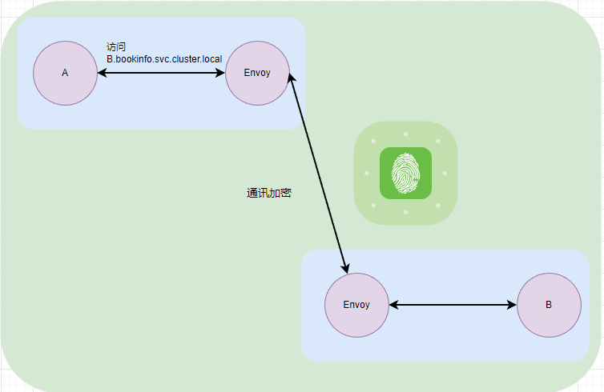


通过 PeerAuthentication 在 Envoy 间启用 mTLS，以确保工作负载之间的通信在传输过程中是加密和安全的。

> PeerAuthentication 可以配置为整个集群或只在命名空间中起作用，但是只能有一个网格范围的 Peer 认证策略，每个命名空间也只能有一个命名空间范围的 Peer 认证策略。


#### PeerAuthentication 的定义

下面是一个简单的 PeerAuthentication 示例：

```yaml
apiVersion: security.istio.io/v1beta1  
kind: PeerAuthentication  
metadata:  
  name: my-peer-authentication  
  namespace: my-namespace  
spec:  
  selector:  
    matchLabels:  
      app: my-app  
  mtls:  
    mode: STRICT  
```


- `selector`: 标签选择器，用于选择应用 PeerAuthentication 策略的工作负载。例如：

```yaml
selector:  
  matchLabels:  
    app: my-app  
```

如果省略选择器，PeerAuthentication 策略将应用于命名空间中的所有工作负载。

- mtls: 定义双向 TLS 的模式，有三种模式。
  
  - `STRICT`: 强制执行 mTLS，要求客户端和服务器使用 TLS 进行通信。这需要客户端和服务器具有有效的证书。

  - `PERMISSIVE`: 允许客户端使用TLS或纯文本进行通信。这对于逐步迁移到 mTLS 的场景非常有用。

  - `DISABLE`: 禁用 mTLS，不要求客户端和服务器使用 TLS 进行通信。


只能有一个网格范围的 Peer 认证策略，每个命名空间也只能有一个命名空间范围的 Peer 认证策略。当同一网格或命名空间配置多个网格范围或命名空间范围的 Peer 认证策略时，Istio 会忽略较新的策略。当多个特定于工作负载的 Peer 认证策略匹配时，Istio 将选择最旧的策略。


#### 实验

我们继续服用前面使用的 bookinfo 微服务，给 bookinfo 命名空间启用 mTLS。

```yaml
kubectl apply -f - <<EOF
apiVersion: "security.istio.io/v1beta1"
kind: "PeerAuthentication"
metadata:
  name: "bookinfo-policy"
  namespace: "bookinfo"
spec:
  mtls:
    mode: STRICT
EOF
```

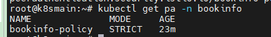


然后再次请求 productpage 服务，可以使用以下命令制作大量的模拟请求。

```bash
for i in `seq 1 1000`; do curl -s -o /dev/null http://192.168.3.150:30666/productpage; done
```


然后在 kiali 面板中的 Display 选项中下拉选择 Security。


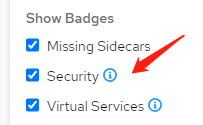

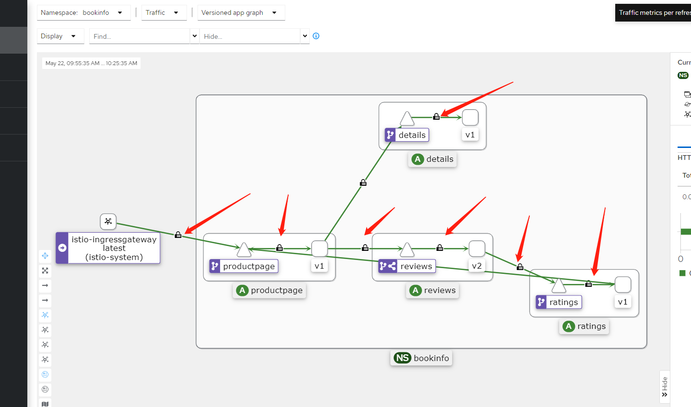

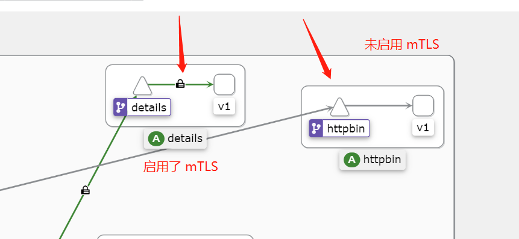


### RequestAuthencation

Istio 的 RequestAuthentication 是一种安全策略，用于验证和授权客户端访问Istio服务网格中的服务。

RequestAuthencation 需要搭配一个 AuthorizationPolicy来 使用。RequestAuthentication 和 AuthorizationPolicy 这两个策略用于验证和授权客户端访问服务网格中的服务。

RequestAuthentication 负责验证客户端提供的 JWT，而 AuthorizationPolicy 负责基于角色的访问控制（RBAC），允许定义细粒度的权限以限制对特定服务、方法和路径的访问。


#### RequestAuthencation 的定义

下面是一个完整的 RequestAuthentication 示例：

```
apiVersion: security.istio.io/v1beta1  
kind: RequestAuthentication  
metadata:  
  name: my-request-authentication  
  namespace: my-namespace  
spec:  
  jwtRules:  
  - issuer: "https://accounts.google.com"  
    audiences:  
    - "my-audience-1"  
    - "my-audience-2"  
    jwksUri: "https://www.googleapis.com/oauth2/v3/certs"  
    jwtHeaders:  
    - "x-jwt-assertion"  
    - "x-jwt-assertion-original"  
    jwtParams:  
    - "access_token"  
    forward: true  
```

> 如果只针对命名空间中的部分应用，可以使用：
>
> ```
>   selector:  
>     matchLabels:  
>       app: my-app  
> ```
>


在 RequestAuthentication 中，jwtRules 是一个配置项，用于定义如何验证和处理 JWT。

一个典型的 jwtRules 配置可能包括以下几个部分：

* `issuer`: 发行者，表示JWT的发行方，例如：`https://accounts.google.com`。这个字段用于验证JWT的iss（发行者）声明。
* `audiences`: 受众列表，表示接受JWT的一组实体。这个字段用于验证JWT的aud（受众）声明。例如：`["my-audience-1", "my-audience-2"]`。
* `jwksUri`: JSON Web Key Set（JWKS）的URL，用于获取JWT签名公钥。Istio会从这个URL下载公钥，用于验证JWT的签名。例如：`https://www.googleapis.com/oauth2/v3/certs`。
* `jwtHeaders`: 一个字符串数组，表示可以从HTTP请求头中获取JWT的头名称。默认情况下，Istio会从"Authorization"头中获取令牌。例如：`["x-jwt-assertion", "x-jwt-assertion-original"]`。
* `jwtParams`: 一个字符串数组，表示可以从HTTP请求参数中获取JWT的参数名称。例如：`["access_token"]`。
* `forward`: 一个布尔值，表示是否将JWT转发给上游服务。默认值为`false`，表示JWT令牌不会转发给上游服务。如果设置为`true`，则Istio会将令牌添加到请求头中，并转发给上游服务。


通过正确配置 jwtRules，Istio 可以对请求中的 JWT 进行验证，确保客户端访问服务网格中的服务时具有适当的授权。


#### AuthorizationPolicy 的定义

Istio 的 AuthorizationPolicy 是一种安全策略，用于控制在Istio服务网格中谁可以访问哪些服务。它提供了基于角色的访问控制（RBAC），允许定义细粒度的权限，以限制对特定服务、方法和路径的访问。AuthorizationPolicy 使用 Istio 的 Envoy 代理拦截并检查传入的请求，以确保它们满足定义的访问策略。


AuthorizationPolicy 的示例如下：

```yaml
apiVersion: security.istio.io/v1
kind: AuthorizationPolicy
metadata:
  name: httpbin-policy
  namespace: bookinfo
spec:
  selector:
    matchLabels:
      app: httpbin
  action: ALLOW
  rules:
  - to:
    - operation:
        paths: ["/delay/*"]
```


AuthorizationPolicy 的主要属性包括：

- `action`: 定义在规则匹配时要执行的操作。它可以是`ALLOW`（允许访问），`DENY`（拒绝访问）或`CUSTOM`（自定义操作，与自定义扩展插件一起使用）。
- `rules`: 定义一组访问策略规则。每个规则可以包括以下属性：
  - `from`: 包含一个或多个源规范，用于定义允许访问的来源。可以包括`principals`（发起请求的主体，例如用户或服务帐户）和`namespaces`（发起请求的命名空间）。
  - `to`: 包含一个或多个目标规范，用于定义允许访问的操作。可以包括`methods`（允许的HTTP方法，例如GET或POST）和`paths`（允许访问的路径，可以是精确路径或通配符路径）。
  - `when`: 包含一组条件，用于定义规则生效的附加约束。例如，您可以使用`key`和`values`定义请求头匹配。


#### 实验

RequestAuthentication 的作用对象是 Kubernetes Service，主要有两种形式，一种是绑定 ingressgateway。

```yaml
apiVersion: security.istio.io/v1beta1
kind: RequestAuthentication
metadata:
  name: ingress-jwt
  namespace: bookinnfo
spec:
  selector:
    matchLabels:
      istio: ingressgateway
  jwtRules:
  - issuer: "testing@secure.istio.io"
    jwksUri: "https://raw.githubusercontent.com/istio/istio/release-1.17/security/tools/jwt/samples/jwks.json"
```

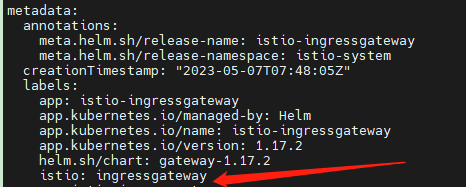


一种是绑定 Pod。

```yaml
apiVersion: security.istio.io/v1beta1
kind: RequestAuthentication
metadata:
 name: frontend
 namespace: default
spec:
  selector:
    matchLabels:
      app: frontend
  jwtRules:
  - issuer: "testing@secure.istio.io"
    jwksUri: "https://raw.githubusercontent.com/istio/istio/release-1.5/security/tools/jwt/samples/jwks.json"
```


考虑到一般不会在 istio-ingressgateway 这个入口网关上操作，所以下面我们使用第二种形式做实验。


#### 提供 jwksjson

首先是这个 YAML 文件中的 `jwksUri`，里面包含了一个 jwksjson 地址，里面包含了用于验证 token 是否有效的公钥。

在 C# 中，可以这样生成一个 jwksjson。

```csharp
using System;  
using System.IO;  
using System.Security.Cryptography;
using Microsoft.IdentityModel.Tokens;
using Newtonsoft.Json;


namespace JWKSGenerator
{
	class Program
	{
		static void Main(string[] args)
		{
			using var rsa = RSA.Create(2048);
			var jwk = new RsaSecurityKey(rsa);
			jwk.KeyId = Guid.NewGuid().ToString();
			var jsonWebKey = JsonWebKeyConverter.ConvertFromRSASecurityKey(jwk);
			var jwkJson = JsonConvert.SerializeObject(jsonWebKey);

			var jwksJson = "{\"keys\": [" + jwkJson + "]}";
			Console.WriteLine(jwksJson);
		}
	}
}
```


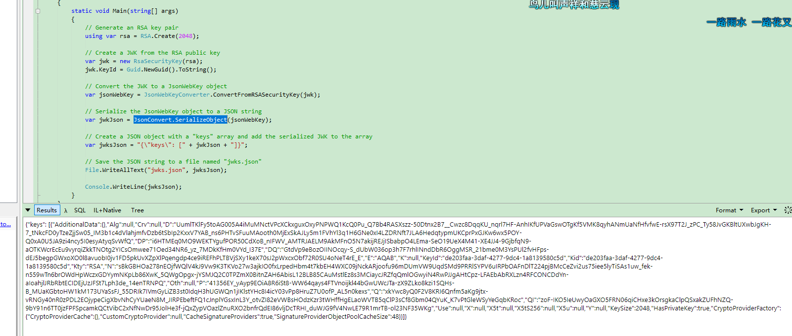


#### 创建 RequestAuthentication

考虑到官网示例中给出的 jwks.json 需要翻墙才能访问，我们可以直接将 jwks.json 放在 YAML 文件中。

```yaml
apiVersion: security.istio.io/v1beta1  
kind: RequestAuthentication  
metadata:  
name: httpbin-jwt  
namespace: bookinfo  
spec:  
selector:  
 matchLabels:  
   app: httpbin  
jwtRules:
  - issuer: "testing@secure.istio.io"
    forwardOriginalToken: true
    jwks: |  
      {  
          "keys": [  
              {  
                  "e": "AQAB",  
                  "kid": "DHFbpoIUqrY8t2zpA2qXfCmr5VO5ZEr4RzHU_-envvQ",  
                  "kty": "RSA",  
                  "n": "xAE7eB6qugXyCAG3yhh7pkDkT65pHymX-P7KfIupjf59vsdo91bSP9C8H07pSAGQO1MV_xFj9VswgsCg4R6otmg5PV2He95lZdHtOcU5DXIg_pbhLdKXbi66GlVeK6ABZOUW3WYtnNHD-91gVuoeJT_DwtGGcp4ignkgXfkiEm4sw-4sfb4qdt5oLbyVpmW6x9cfa7vs2WTfURiCrBoUqgBo_-4WTiULmmHSGZHOjzwa8WtrtOQGsAFjIbno85jp6MnGGGZPYZbDAa_b3y5u-YpW7ypZrvD8BgtKVjgtQgZhLAGezMt0ua3DRrWnKqTZ0BJ_EyxOGuHJrLsn00fnMQ"  
              }  
          ]  
      }
```


或者继续使用官方的 jwksUri。

```yaml
apiVersion: security.istio.io/v1beta1
kind: RequestAuthentication
metadata:
 name: httpbin-jwt
 namespace: bookinfo
spec:
  selector:
    matchLabels:
      app: httpbin
  jwtRules:
  - issuer: "testing@secure.istio.io"
    forwardOriginalToken: true
    jwksUri: "https://raw.githubusercontent.com/istio/istio/release-1.5/security/tools/jwt/samples/jwks.json"
```

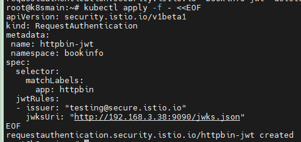


然后部署一个 AuthorizationPolicy，对 `/delay/*` 地址进行全放通，那么其它地址都需要进行验证才能放行。


```yaml
apiVersion: security.istio.io/v1
kind: AuthorizationPolicy
metadata:
  name: httpbin-policy
  namespace: bookinfo
spec:
  selector:
    matchLabels:
      app: httpbin
  action: ALLOW
  rules:
  - to:
    - operation:
        paths: ["/delay/*"]
```

> 执行命令之后，你可以使用以下命令查看是否正常：
>
> ```
> kubectl logs -n istio-system -l app=istiod  
> ```
>
> 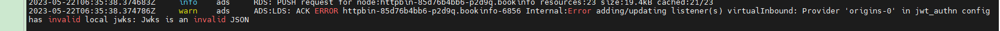


然后查看策略规则对象：

```bash
kubectl get requestauthentication -n bookinfo  
kubectl get authorizationpolicy -n bookinfo  
```

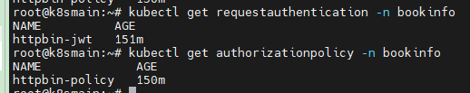


最后通过 istio-ingressgateway 的节点端口来访问 `/status` 和 `/delay` ，会发现 `/status` 在没有 token 的情况下返回 403，而 `/delay` 可以正常访问。


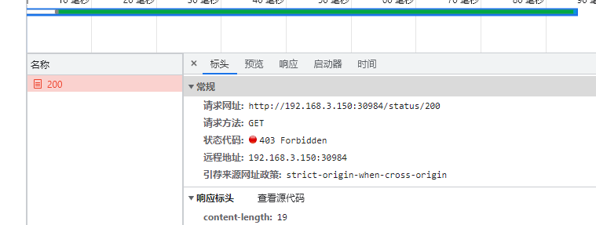

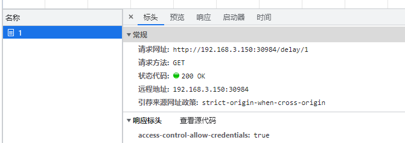


如果我们需要验证，当 token 中的 issuer 为 example-issuer 才能访问时，可以使用：

```yaml
apiVersion: security.istio.io/v1
kind: AuthorizationPolicy
metadata:
  name: httpbin-policy
  namespace: bookinfo
spec:
  selector:
    matchLabels:
      app: httpbin
  action: ALLOW
  rules:
  - to:
    - operation:
        paths: ["/delay/*"]
    when:  
    - key: request.auth.claims[iss]  
      values: ["example-issuer"]  
```

> AuthorizationPolicy 的规则有很多，可以通过这些规则限制不同服务的访问策略。
>
> 请参考官方文档：https://istio.io/latest/zh/docs/concepts/security/#authorization-policies


所以 istio 这里一般做验证 jwt 是否有效，或者做路由地址的策略访问，但是如果有数十个上百个路由，使用 istio 配置就会好麻烦。但是依然不是我们想要的，因为在 istio 中配置不同应用访问权限和检验 token 比较繁琐，而且业务系统大多数情况下需要给用户单独配置各种 API 的访问权限。